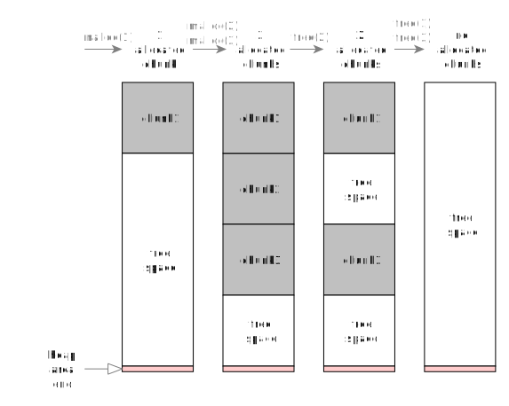

# Cross-Platform System Programming Guide for UNIX & Windows: Level 1

> by Simon Zolin, Mar 2023

In this tutorial we'll learn how to write cross-platform code in C using the system functions on popular OS (Windows, Linux/Android, macOS & FreeBSD): file management functions and file I/O, console I/O, pipes (unnamed), execution of the new processes.
We're going to write our own small helper functions on top of low-level userspace system API and use them so that our main code can run on any OS without modifications.
This tutorial is Level 1, the easiest.
I split the difficult stuff into parts so the code samples here shouldn't be overwhelming for those who have just started to program in C.
We'll discuss the differences between the system API and how to create a cross-platform programming interface that hides all those differences from the user.

*I've been writing cross-platform software in C for a long time already, and I want to share my experience with the others.
I do it with the hope that this tutorial will be useful, helping you to learn the system programming or perhaps to port an existing app from one OS to another.*

Contents:

* [Intro](#intro)
* [Main Problems of Programming for Multiple OS](#main-problems-of-programming-for-multiple-os)
* [About the examples](#about-the-examples)
* [Memory Allocation](#memory-allocation)
	* [Stack memory](#stack-memory)
	* [Heap memory](#heap-memory)
	* [Out-Of-Memory](#out-of-memory)
	* [Using Heap Buffer](#using-heap-buffer)
	* [Heap functions on Windows](#heap-functions-on-windows)
	* [Heap functions on UNIX](#heap-functions-on-unix)
	* [Objects allocation on heap](#objects-allocation-on-heap)
	* [Buffer reallocation](#buffer-reallocation)
* [Compiler-Time Detections](#compiler-time-detections)
* [Standard I/O](#standard-io)
	* [Simple echo program](#simple-echo-program)
	* [Standard I/O on UNIX](#standard-io-on-unix)
	* [Standard I/O on Windows](#standard-io-on-windows)
	* [Standard I/O: redirection](#standard-io-redirection)
* [Data-Encoding & Conversion](#data-encoding--conversion)
* [File I/O: Simple file echo program](#file-io-simple-file-echo-program)
	* [File I/O on UNIX](#file-io-on-unix)
	* [File I/O on Windows](#file-io-on-windows)
	* [I/O Functions and Cursors](#io-functions-and-cursors)
	* [File Seek/Truncate](#file-seek-truncate)
	* [File Seek/Truncate on UNIX](#file-seek-truncate-on-unix)
	* [File Seek/Truncate on Windows](#file-seek-truncate-on-windows)
* [System Errors](#system-errors)
	* [System Errors on UNIX](#system-errors-on-unix)
	* [System Errors on Windows](#system-errors-on-windows)
	* [Setting the Last System Error](#setting-the-last-system-error)
	* [Common System Error Codes](#common-system-error-codes)
* [File Management](#file-management)
	* [Create/rename/delete files and directories](#createrenamedelete-files-and-directories)
	* [Create/rename/delete files and directories on UNIX](#createrenamedelete-files-and-directories-on-unix)
	* [Create/rename/delete files and directories on Windows](#createrenamedelete-files-and-directories-on-windows)
* [File Properties](#file-properties)
	* [File properties on UNIX](#file-properties-on-unix)
	* [File properties on Windows](#file-properties-on-windows)
* [Directory Listing](#directory-listing)
	* [Directory Listing on UNIX](#directory-listing-on-unix)
	* [Directory Listing on Windows](#directory-listing-on-windows)
* [Unnamed Pipes](#unnamed-pipes)
	* [Unnamed Pipes on UNIX](#unnamed-pipes-on-unix)
	* [Unnamed Pipes on Windows](#unnamed-pipes-on-windows)
* [Executing Other Programs](#executing-other-programs)
	* [Executing Other Programs on UNIX](#executing-other-programs-on-unix)
	* [Executing Other Programs on Windows](#executing-other-programs-on-windows)
* [Executing Other Programs and Reading Their Output](#executing-other-programs-and-reading-their-output)
* [Getting Current Date/Time](#getting-current-datetime)
* [Suspending Program Execution](#suspending-program-execution)


## Intro

One of the most inconvenient things in C programming is the requirement to support multiple OS because each OS has a different system API.
For example, if we want our app to run on Linux and Windows, then we'd need to write 2 different programs in C.
To overcome this problem we may:

* Switch to a different language (Go, Python, Java, etc.) which provides us with (almost) complete cross-platform system library.
Even so, it's not the right solution for all possible scenarios.
What if we want to write a high-performance server software such as nginx?
We absolutely need C.
What if we need to build our program logic around several low-level C libraries?
Although we can write the necessary library bindings for another language by ourselves, but instead we can just use C.
What if we want our app to run on embedded systems with limited hardware resources (CPU, memory)?
Again, we need C.

* Use `#if` preprocessor branches in our code so that the compiler uses the appropriate logic for each OS.
The main problem with this approach is that the code looks a little bit ugly.
When all functions in our code have multiple `#ifdef` branches inside, the code becomes too hard to read and maintain.
And it's more likely that each modification may break something else where we expect it the least.
Yes, sometimes preprocessor branch is an absolute saviour, but we should never overuse them - it's one of those things where we need to keep the balance.

* Use a **library which hides from us the fundamental differences between system API**.
In other words, we use a library which provides us with one easy-to-use cross-platform interface.
And the user code, built on top of this library, works on multiple OS.
This is the topic of this tutorial.


## Main Problems of Programming for Multiple OS

First thing we should discuss here is how system API on different OS actually differ and what problems we have to solve when writing code for multiple OS.

* Most importantly, Linux, macOS and FreeBSD - all are UNIX systems.
In most cases they provide similar API (i.e. POSIX) which greatly reduces the time needed to port C code between them.
Unfortunately, sometimes system functions with the same name (e.g. `sendfile()`) have different parameters.
Sometimes the flags which we pass to functions have a different behaviour (e.g. `O_NONBLOCK` for sockets).
Sometimes, the code written for Linux can't be easily ported to another OS just because Linux has many Linux-specific syscalls which are just not available on macOS (e.g. `sem_timedwait()`).
We have to be very careful when using system functions directly in our code.
Also, keeping in mind all this stuff is hard, so it's always good to leave remarks somewhere in your code to help you quickly remember it some time later.
Thus, we need a thin layer between our application code and the system API.
A cross-platform library is exactly this layer which will address the issues I've just described.
However, while hiding from us the implementation details for each OS, a good library should also describe those differences in its documentation for you to understand how exactly it will operate on a particular OS.
Otherwise we may end up with the code that performs poorly or unexpectedly on some systems.

* Continuing on the above API-compatibility issue, suppose that our app already uses a Linux-only function, but we also want it to run on macOS.
We're now at the point when we have to decide: 1) should we write a similar function manually for macOS or 2) should we rethink our approach at a higher level.
Going with #1 is nice, but we have to be careful here: for example, if we try to implement our own `sem_timedwait()` for macOS, we'll probably use `pthread_cond_timedwait()` to emulate that, but then we have to be sure that everything else (including UNIX signal handling) works similarly to Linux implementation.
And even so, what about named semaphores, will our function support them?
This stuff is always very hard to maintain...
I think sometimes it's just better to redesign an application and go with some alternative solution, if possible.

* Now let's talk about Windows.
Of course, Windows isn't UNIX, its API is completely different in almost all aspects, including (but not limited to) files, sockets, timers, processes, etc.
Although Microsoft provides the functions (e.g. `_open()`) that are similar to POSIX via the C runtime library, their behaviour might not be completely equal to UNIX.
Just be aware that you may end up with some unexpected problems unless you read 100% documentation from Microsoft Docs and understand exactly how such functions work inside.
In theory, `_open()` should be just a very thin wrapper around `CreateFileW()`, but I won't be sure of that unless I see the code.
But why trying to learn how to correctly use all these wrapper functions in the first place, when we already have a very well-explained and precise documentation for all lower-level WinAPI functions (e.g. `CreateFileW()`)?
That's why for my work I'm always trying to use WinAPI functions directly, if possible, and not some wrappers around them.

* UNIX systems use `/` character for file paths, but Windows normally uses `\`.
However, most WinAPI functions also accept `/` in paths and work correctly.
So we can say that Windows supports both `\` and `/` as path divisor character, but just remember that `/` may not work in some rare cases.

* There's a chance for name conflict when compiling code for different platforms.
Sometimes your perfectly correct code doesn't compile on another OS due to a very strange compilation error, which is quite hard to understand at first.
That's when you use some variable or function name in your code but the same name is already used in one of the system header files you `#include`.
The problem gets even harder if this declaration is a preprocessor definition - in this case compiler can go crazy and its error messages don't help much.
To prevent this problem from happening, I recommend you to always use a prefix which is unique to your project.
Some time ago I started using a prefix `ff` for all names in my library's code, and I don't remember if I had a single name-conflict since then.
nginx, for example, uses `ngx_` prefix everywhere, so it's a common practice for C projects.
Note also, that C++ namespaces don't help much with the problem above, because you still can't use what is already `#define`-d in a system header file - you need to `#undef` it first anyway.

	It's worth saying that if you compile your code for Windows with MinGW, remember that MinGW's include files are not identical to those bundled with Microsoft Visual Studio.
	Keep in mind that there may be additional conflicts around the global names - it depends on what include files are used.

* Another difference between Windows and UNIX system functions is the text encoding.
When I want to open a file with a name containing non-latin characters, I need to use the correct text encoding, otherwise the system won't understand me and either open a wrong file or return with a `file not found` error.
By default, UNIX systems normally use UTF-8 encoding, while Windows uses UTF-16LE.
And this difference alone stops us from conveniently using API functions directly from our code.
If we would try it, we'll end up with many `#ifdef` inside our functions.
So our library must not only handle the names and parameters of system API functions, but also automatically convert text to the correct encoding for them.
I use UTF-8 for my projects, and I recommend everybody doing so.
UTF-16LE is inconvenient in many aspects, including the fact that it's a far less popular choice for the text documents you may find on the Internet.
UTF-8 is almost always a better and also a more popular choice.

* One more difference of UNIX and Windows is the userspace libraries that we use for accessing the system.
On UNIX systems the most important userspace library is C library (libc).
On Linux the most widely used libc is *glibc*, but there are actually other implementations (e.g. *musl libc*).
libc is a layer between our code and the kernel.
In this tutorial all UNIX system functions that we use are implemented inside libc.
Usually libc passes our requests to the kernel, but sometimes it handles them by itself.
Without libc we would be forced to write much more code for each OS (executing syscalls by ourselves), and that would be very hard, time-consuming and won't give us any real benefits.
This is the point where we decide our cross-platform thin layer should be placed, and we don't need to go deeper.

	On Windows there's `kernel32.dll` library which provides the functions for us to access the system.
	kernel32 is a bridge between userspace and kernel.
	As with libc for UNIX, without kernel32 we'd need to write much more code (on top of `ntdll.dll`), and normally we don't want to do that.

So in general it's quite a lot for us to handle at once when writing cross-platform software.
Using helper functions or libraries is necessary to avoid overcomplex code with many ifdef-s in application code.
Thus, we need to find a good library or write our own.
But in any case we have to completely understand what's going on under the hood and how our application code interacts with the system, what syscalls we use and how.
When we do, we grow in knowledge and we also write better quality software.


## About the examples

Before we start diving into the process, here's a few words about the code examples which we're gonna discuss throughout this document.

* We write code in `main()` function just once and it works on all OS.
This is the key idea.
* The code in `main()` uses wrapper functions for each OS family - that's where the complexity and system API difference are handled.
* Those wrapper functions are deliberately reduced in size and complexity for this tutorial - I only include the minimum that is necessary for a particular example, nothing more.
* The examples I provide here are not by any means the real and production-ready code.
I keep them simple and straight to the point.
My idea is that first you need to understand the key mechanism of how to work with system functions and how to manage cross-platform code.
You'd have to read much more code and it would be harder for me to explain everything at once if I had chosen another approach.
* To build the example files on UNIX, just run `make`.
The binary files will be created in the same directory.
You need to install `make` and `gcc` or `clang`.
On Windows you have to download MinGW package and install it, then run `mingw64-make.exe`.
* In case you want to analyze the complete implementation of each wrapper function we discuss here, you can always view/clone my libraries [ffbase](https://github.com/stsaz/ffbase) & [ffsys](https://github.com/stsaz/ffsys), they are absolutely free.
For your convenience, there's a direct link to their code placed after each section in this tutorial.
* When reading the examples, I advise you also read the official documentation for each function.
For UNIX systems there are man-pages, and for Windows there's Microsoft Docs site.


## Memory Allocation

The most important thing that we need when writing programs - allocate the memory for our variables and arrays.
We can use a stack memory for small operating data or we can dynamically allocate large memory regions using heap memory allocators.
libc provides an easy interface to do that and we'll learn how to use it.
But before that we should understand how stack memory is different from heap memory.

### Stack memory

Stack memory is the buffer allocated by the kernel for our program before it starts executing.
A C program reserves ("allocates") a memory region from the stack like so:

```C
	int i; // reserve +4 bytes on stack
	char buffer[100]; // reserve +100 bytes on stack
```

During the compilation process, the complier reserves some stack space needed for the function to run correctly.
It puts a couple of CPU instructions at the beginning of each function.
These instructions just subtract the needed number of bytes from the pointer to stack region (the stack pointer).
The compiler also puts some instructions that restore stack pointer to the previous state when our function exits - that way we free the stack area reserved by our function so the same region can be used by some other function after us.
This means that our function can't reliably return pointers to stack buffer, because the same area may be reused/overwritten.

Suppose we have a program like this:

```C
void bar()
{
	int b;
	return;
}

void foo()
{
	int f;
	bar();
	return;
}

void main()
{
	int m;
	foo();
}
```

For the above program there are 5 states of how our stack memory will look like (very simplified, of course) during the program execution:


1. We're inside `main()` function at line `foo();`.
The compiler has already reserved the stack memory for our `m` variable, it's shown in grey.
The green line is the current stack pointer which moves down when we reserve some more bytes on stack, and moves up when we free those reserved regions.
We call `foo()`.
2. We're inside `foo()` function, and more stack space is reserved for our `f` variable.
All data reserved by `main()` is kept in the stack region above ours.
We call `bar()`.
3. Inside `bar()`, even more stack space is used to hold our `b` variable.
The regions reserved by all parent functions are preserved.
We `return` from the function.
At this point the stack area reserved for `b` variable gets discarded and now may be reused by another function.
4. We're back in `foo()` and `return` from it.
The same thing happens now with the stack region of `foo()` - the area reserved for our `f` is discarded.
5. We're back in `main()`.
Only the area for `m` variable is still valid on stack.

The stack memory is limited, and its size is quite low (several megabytes at most).
If you'd reserve a very large number of bytes on stack, your program may just crash when you'll try to access the area allocated outside stack buffer boundaries (i.e. the area below the red line).
And we can't add some more stack space while our program is running.
Also, using stack for arrays and strings carelessly may lead to severe security issues (stack overflow condition, when exploited by an attacker, can easily result in arbitrary code execution).

### Heap memory

What we want is a mechanism which allows us to dynamically allocate large memory buffers and resize them - this is what heap memory for.
How heap memory is different from stack:

* We can safely allocate a large buffer on heap, as long as there's enough system resources.
* We can resize heap buffer at any time.
* Our function can safely return the pointer to any heap buffer, and this area won't be automatically reused/overwritten by the next executing function.

3 steps how to use heap memory:

* We ask libc to allocate some memory for us.
libc, in turn, asks OS to reserve memory area from RAM or swap file.
* Then we can use this buffer as long as we need.
* When we don't need it anymore, we free this memory area by notifying libc.
It returns the buffer back to OS so it can give the same memory area to some other process.

libc's algorithm is usually clever and it won't annoy the kernel each time we allocate or free heap buffers.
Instead, it can reserve a large buffer and split it into chunks, then return those chunks separately to us.
Also, when our program frees a small buffer, it doesn't necessarily mean that it's returned back to the kernel, it stays cached inside libc.

Suppose we have a code like this:

```C
#include <stdlib.h>

void main()
{
	void *m1 = malloc(1);
	void *m2 = malloc(2);
	void *m3 = malloc(3);
	free(m2);
	free(m1);
	free(m3);
}
```

Here's how the actual heap memory region may look like (very simplified):



1. When we allocate a new block, libc asks the OS to allocate a memory region for us.
Then libc reserves the needed amount of space and returns the pointer to this chunk to us.
2. When we ask for more heap buffers, libc finds free chunks inside the heap region and returns new memory pointers to us.
libc won't ask the OS to allocate more memory for us until it's really necessary.
3. When we ask to free a buffer, libc just marks it as "free".
The other buffers stay as is.
4. After all buffers are freed, libc may return the memory area back to OS (but not necessarily).

How libc allocates or dealocates the buffers, how it finds a free chunk, etc. - this doesn't really matter to us, we just have a simple interface that hides all the complexity from us.

### Out-Of-Memory

When we ask OS to allocate for us the amount of memory which is larger than physically available at the moment, OS may return an error to us, indicating that our request for a buffer this large can't be fulfilled.
In this situation, if we're writing a good user-friendly app, we should probably print a nice error message about that and prompt the user what to do next.
However, in reality this happens so rarely and it takes too much effort to correctly handle the cases of insufficient memory, that usually the apps just print an error message and then crash.
However, it would be extremely unfortunate if the user loses hours of unsaved work (e.g. an unsaved text file) when using our app.
We should be careful about that.

When Linux reserves a memory region for us, it doesn't immediately reserve the same amount of physical memory.
You can see that the amount of real memory consumed by the process which has just allocated 4GB heap buffer doesn't change much.
Linux assumes that although our process may request a large buffer, in reality we may not need that much space.
Unless we actually write data into that memory region, the physical memory blocks won't be allocated for us.
This means that multiple processes running on the system in parallel may request large memory blocks, and all their requests will be satisfied, even if there's not enough physical memory to hold all their data.
What will happen then if all processes start writing actual data into their buffers at once?
Out-Of-Memory (OOM) subsystem running inside the kernel will just kill one of them when the physical memory limit is reached.
So what does it mean to us?
Just remember that when we allocate large buffers on Linux, our process sometimes can get killed when we'll try to fill those buffers with data.
Normally, our apps must be nice to all other apps running on the user's system, and if we require very large amount of memory for our work, we should be careful to avoid such OOM situations, especially if the user has some unsaved work.

### Using Heap Buffer

OK, now let's have a look at the example which allocates a buffer on heap and then immediately frees it.

[heap-mem.c](samples-sys/heap-mem.c)

Scroll down to our `main()` function.
Here's the statement that allocates a 8MB heap buffer:

```C
	void *buf = heap_alloc(8*1024*1024);
```

We call our own `heap_alloc()` function (we'll discuss its implementation soon) with the single parameter - the amount of bytes we want it to allocate on heap.
The result is the pointer to the beginning of this buffer.
This means that we have a memory region of 8MB `[buf..buf+8M)` available for reading and writing.
Normally, this pointer is already aligned to at least 4 or 8 bytes (depending on CPU architecture).
For example, we can directly unreference `short*` or `int*` pointers at this address even on 32-bit ARM:

```C
	int *array = heap_alloc(8*1024*1024);
	array[0] = 123; // should work fine on ARM
```

One more important thing: there's no one to stop us from reading or even writing some data past the buffer's boundaries.
For example, in our example here we actually can try to write more than 8MB of data into that buffer and most likely we will succeed in doing so.
However, disaster may happen at any moment, because we accidentally may overwrite the data of our other heap buffers.
The whole heap memory region may become corrupted after that.
If we try to access the data even further, we may pass the critical line where an unmapped memory space begins.
In this case CPU will trigger an exception and our program will crash.
So this means that when working with buffers in C we should always pass their capacity as a function parameter (or in `struct`) so that none of our functions will access the data past the buffer end.
If you're writing a program and you experience sudden crashes, most likely your code has accidentally overwritten a heap or stack buffer somewhere.
If that's the case, you may try compiling your app with `-fsanitize=address` option which will print a nice message about where you made a mistake.
It usually helps.

Next line:

```C
	assert(buf != NULL);
```

This statement will crash our program if the system memory is not enough and our buffer hasn't been allocated.
In simple programs we have really nothing more to do, we absolutely needed that buffer...
However, in a server software, we shouldn't crash in this case, but instead write a warning about this situation into a log file and then just continue normal operation.
In the end, we decide what to do.
C programs are very flexible when some unexpected things happen, our program has nearly absolute control over resources.
Many other programming languages don't provide such flexibility, they will just terminate the process without having the chance to save user's work or do some other important things before exit.

Now suppose that we use our buffer for some time and do some important work (there's nothing to do actually in our example here).
And then we free the buffer, returning the allocated memory region back to libc.
If we don't free the allocated heap buffers, then OS frees it automatically for us when our process exits.
Because of this, for simple C programs you're not really required to free all heap pointers.
But if you're writing a serious program, and the memory usage for your app will keep growing, the user won't be happy with that.
Also, most likely your app will crash after some time because of OOM.
**Freeing the allocated heap buffers is a must for normal software.**  Sometimes it seems very overwhelming to keep track on each pointer you allocate, but it's the price we pay for 100% control over our software.
Because of this, C programs can work on systems with very limited amount of available memory, programs in other languages can't withstand such conditions.
I assume you already know the technique with `goto end` in C or `auto_ptr<>` in C++ to effectively handle buffer freeing without any problem.

That's it for our application code!
Now let's discuss platform-dependant code for UNIX and Windows.
First, note how I split the code with `#ifdef-#else` branches:

```C
#ifdef _WIN32

static inline void func()
{
	...Windows-specific code...
}

#else // UNIX:

static inline void func()
{
	...UNIX-specific code...
}

#endif
```

I use the same approach in all sample files here.
During several years I tried many different approaches on how to manage cross-platform code...
Now my latest decision is actually the most simple and straightforward: I just use static inline functions (so they won't compile into a binary file unless used) and define them in a file split by 1 top-level `#ifdef` branch.
I want each example to be a complete single file without unnecessary `#include` directives and at the same time keep the code inside `main()` without any preprocessor branches.

`_WIN32` preprocessor definition is set automatically when we're compiling for Windows - that's how the compiler knows which branch to select and which branch to ignore.

### Heap functions on Windows

OK, now scroll up to `#ifdef _WIN32` branch.

```C
#include <windows.h>
```

This is a single top-level include-file for Windows system API (it includes many other files inside, but that's not our problem).
Almost all necessary functions and definitions are declared by including `windows.h`.
Not very effective way in terms of compilation performance (for each compilation unit the preprocessor analyzes tens of Windows-include files), but it's very simple and hard to forget - it may save some time for programmers when writing the code.
So in the end, maybe that's actually a huge advantage?

Now here's the heap allocation function for Windows:

```C
void* heap_alloc(size_t size)
{
	return HeapAlloc(GetProcessHeap(), 0, size);
}
```

`HeapAlloc()` allocates a memory region of the required size and returns a pointer to the beginning of the buffer.
The first parameter is the heap handle (i.e. heap ID).
Usually, we just use `GetProcessHeap()` which returns the default heap descriptor for our process.
Note that `size` parameter must be of `size_t` type and not `int` because on 64-bit systems we may want to allocate a huge memory region of >4GB.
32-bit integer type isn't enough for that, hence the `size_t`.

This is how we free our buffer:

```C
void heap_free(void *ptr)
{
	HeapFree(GetProcessHeap(), 0, ptr);
}
```

The pointer we pass to `HeapFree()` must be exactly what `HeapAlloc()` function has initially returned to us.
Don't do any arithmetic operations on heap buffer pointers, because once you lose it, you won't be able to properly free it.
If you need to increment this pointer, do it with a copy (or store the original one somewhere).
If you'll try to free an invalid pointer, the program may crash.

> As you can see, the names for our functions almost the same as Windows functions.
> I follow the same rule everywhere: each function starts with its context (in our case - `heap_`), then follows the verb which defines what we do with the context.
> In C it's very convenient to rely on automatic hints that our code-editors show while we're writing code.
> When I want something to do with heap memory, I'm writing `heap` and immediately my code-editor shows me all functions which start with it.
> Microsoft has actually the same logic here and they have correct names for both `HeapAlloc()/HeapFree()` functions.
> But unfortunately, this is just an exception.

### Heap functions on UNIX

Now let's see how to work with heap on UNIX.

```C
#include <stdlib.h>
```

On UNIX systems there's no a single include file.
This file provides declarations for heap memory functions as well as some fundamental types (`size_t`).

Memory allocation is plain and simple:

```C
void* heap_alloc(size_t size)
{
	return malloc(size);
}
```

The function returns `NULL` on error, but don't always rely on this behaviour on Linux, because your app may crash when writing actual data to the buffer returned by `malloc()`.

Freeing the heap buffer pointer:

```C
void heap_free(void *ptr)
{
	free(ptr);
}
```

As on Windows, trying to free an invalid pointer may result in a process crash.
Trying to free a `NULL` pointer is a no-op, it's absolutely harmless.

> As you can see, the names of functions in UNIX are quite different from those on Windows.
> They don't use camel-case, they are often very short (too short, sometimes), they don't even share same prefix or suffix.
> In my opinion, we must bring some rules and logic in here...
> So I think my function names starting with a prefix are better and more clear to me and also to those who read my code.
> That's why I chose this naming scheme for all my functions, structures and other declarations - everything follows the same rule.

### Objects allocation on heap

When we allocate arrays of plain data on heap we usually don't care if they contain some garbage data, because we also have a separately stored variable for array index/length which is always 0 (array doesn't yet have any valid elements).
Then, while we populate the array, we increase the index appropriately, like so:

```C
	int *arr = heap_alloc(100 * sizeof(int));
	size_t arr_len = 0;
	arr[arr_len++] = 0x1234;
```

It doesn't bother us that at this time our array has 99 unused elements containing garbage.
However, when we allocate new structure objects, it may become a problem:

```C
struct s {
	void *ptr;
};
...

	struct s *o = heap_alloc(sizeof(struct s));
	...
	// Careful, don't accidentally use `o->ptr` as it currently contains garbage!
	...
	o->ptr = ...;
```

It might look not so important at the first glance, but in the real and complex code it's a very very annoying issue - accidentally using some not yet initialized data inside a C object.
To neutralize this potential problem we can use the functionality that automatically clears the memory buffers for us:

```C
#ifdef _WIN32

void* heap_zalloc(size_t n, size_t elsize)
{
	return HeapAlloc(GetProcessHeap(), HEAP_ZERO_MEMORY, n * elsize);
}

#else

void* heap_zalloc(size_t n, size_t elsize)
{
	return calloc(n, elsize);
}

#endif
```

The 1st parameter is the number of objects we want to allocate, and the 2nd parameter is the size of 1 object.
We use `HEAP_ZERO_MEMORY` flag on Windows which orders the OS to initialize the buffer contents with `0x00` before returning it to us.

Now we can use our function to allocate an object and immediately zero its contents:

```C
	struct s *o = heap_zalloc(1, sizeof(struct s));
	...
	// If we accidentally access `o->ptr`, the program will either crash or do nothing.
```

Believe me, it doesn't hurt to automatically initialize with zeroes the contents of **all** C objects you allocate on stack or on heap, and this little trick can save you the hours of debugging and protect your code from potential security issues.

### Buffer reallocation

It's sometimes necessary to put some more elements into an array allocated on heap, i.e. we want our array to grow.
But if we try doing that right away without asking libc's permission, we may access the contents of our sibling buffers, which will result in a crash (in the best case).
So the first thing we should do is asking libc to provide us with a new buffer pointer which is large enough to store all data we want.
We need `heap_realloc()` function which takes 2 parameters: the pointer to our existing array we want to enlarge and its new size.

```C
#ifdef _WIN32

void* heap_realloc(void *ptr, size_t new_size)
{
	if (ptr == NULL)
		return HeapAlloc(GetProcessHeap(), 0, new_size);
	return HeapReAlloc(GetProcessHeap(), 0, ptr, new_size);
}

#else

void* heap_realloc(void *ptr, size_t new_size)
{
	return realloc(ptr, new_size);
}

#endif
```

libc preserves our old data in range `[0..new_size)` even if it needs to internally copy the data from one place to another.
Note that our function also supports the case when `ptr == NULL` which means that just a new buffer will be allocated.

A common mistake when using `realloc()` is to replace the buffer pointer in one statement like so:

```C
	void *old = heap_alloc(...);
	old = heap_realloc(old, new_size);
	// ERROR, what if old == NULL now?
```

In the code above we have a memory leak, because `heap_realloc()` function has returned an error and `NULL` pointer.
But the buffer referenced by `old` pointer is still allocated inside libc, and now there's no one who can free it because we've just set the pointer to `NULL`.
This is the correct code of using memory realloc function:

```C
	void *old = heap_alloc(...);
	void *new_ptr = heap_realloc(old, new_size);
	if (new_ptr == NULL) {
		// handle error
		return;
	}
	old = new_ptr;
```

Looks a little clumsy, but this is safe.

### Result

So we wrote several functions which provide cross-platform interface for working with heap buffers, and we used them to write our code in `main()` for both Windows and UNIX without `#ifdef`-s.
You've learned how to allocate a buffer on heap memory, reallocate and free it - these are the most important things for every program.

Reference: `ffmem_*()` functions in [ffbase/base.h](https://github.com/stsaz/ffbase/master/ffbase/base.h)


## Compiler-Time Detections

In the previous example we used `_WIN32` preprocessor definition to branch between Windows and UNIX.
Here's the table for some more internal compile-time constants which allow us to detect the target CPU and OS.

Detect target CPU:

	Test             Code
	=================================
	CPU is AMD64?    #ifdef __amd64__
	CPU is x86?      #ifdef __i386__
	CPU is ARM64?    #ifdef __aarch64__
	CPU is ARM?      #ifdef __arm__

Detect target OS:

	Test             Code
	=================================
	OS is Windows?   #ifdef _WIN32
	OS is macOS?     #if defined __APPLE__ && defined __MACH__
	OS is Linux?     #ifdef __linux__
	OS is Android?   #if defined __linux__ && defined ANDROID
	OS is any UNIX?  #ifdef __unix__


## Standard I/O

For console applications it's common to use libc functions such as `puts()` and `printf()` for writing text to console.
These functions pass our data to the system (e.g. via `write()` on UNIX), and the system transfers the data to another process which is responsible for rendering the text on screen.
Reading and writing data from/to console is performed via standard descriptors.
By default, for each process there are 3 of them:

* standard input descriptor (stdin) - used for reading some input data;
* standard output descriptor (stdout) - used for writing some output data;
* standard error descriptor (stderr) - used for writing some output data (usually, warning or error messages).

There's no need to prepare them before using.
When our program is started, the descriptors are ready for use.

### Simple echo program

This is a very simple program which reads some text from the user, and then it prints the same text back to him.
To close the running program user can press `Ctrl+C`.

[std-echo.c](samples-sys/std-echo.c)

Scroll down to `main()`.
First, we read some text from the user:

```C
	char buf[1000];
	ssize_t r = stdin_read(buf, sizeof(buf));
	if (r <= 0)
		return;
```

We have a buffer on stack and we pass it to `stdin_read()` which is our cross-platform function for reading from stdin.
Our function returns the number of bytes read, `0` when all input data is consumed, or `-1` on error.
When the user presses `Ctrl+C` while we're waiting for his input, the function will return an error.
If the user presses `Ctrl+D`, the function will return `0`.
Also, it's OK to test for error with `<0`, rather than `==-1`, because it's impossible to force an underlying `read()` function to return any other negative number.

Now we just print the same data back to the user by writing it to stdout:

```C
	const char *d = ...;
	while (r != 0) {
		ssize_t w = stdout_write(d, r);
```

The function returns the number of bytes written or `-1` on error.
Note that when `stdout_write()` returns with less bytes written than we initially requested, we must repeat the procedure again until we write all bytes from our buffer `buf`.
That's why we need a loop here.

Now let's discuss the implementation of our helper functions.

### Standard I/O on UNIX

Scroll to the UNIX branch.
The code is extremely straightforward on UNIX systems:

```C
ssize_t stdin_read(void *buf, size_t cap)
{
	return read(STDIN_FILENO, buf, cap);
}

ssize_t stdout_write(const void *data, size_t len)
{
	return write(STDOUT_FILENO, data, len);
}
```

We use 2 syscalls here: `read()` and `write()` with the first parameter being a standard descriptor stdin or stdout.
stderr  is `STDERR_FILENO`, though it isn't covered in our example.

### Standard I/O on Windows

Now scroll up to the Windows branch.
As you can see, the code for Windows isn't that small as on UNIX.
That's because on Windows we have to manually handle text-encoding conversion - we want our program to behave correctly when the user enters Unicode text.
In our `stdin_read()` implementation first thing we need is to get the standard input descriptor:

```C
	HANDLE h = GetStdHandle(STD_INPUT_HANDLE);
```

Then we need a separate wide-character buffer to read Unicode data from the user:

```C
	DWORD r;
	wchar_t w[1000];
	if (!ReadConsoleW(h, w, 1000, &r, NULL))
		// error reading from console
```

I use hardcoded value for the capacity of our buffer here and I don't even use a constant - that's just for simplicity.
In real code we would probably use a macro (evaluated as `sizeof(w) / sizeof(*w)`) which returns the number of wide-characters in our buffer.
Due to the fact that `ReadConsoleW()` function operates with wide charaters and not bytes, we pass the capacity of our buffer in wide charaters (not bytes), thus `sizeof(w)` alone would be a mistake.
On return, the function fills in our buffer with user's data and sets the number of wide-characters read.
(More info about wide characters on Windows is in the next chapter.)  If the function fails, it returns `0`.

On Windows some functions such as `ReadConsoleW()` use an incorrect data type for the user's buffer capacity - `DWORD`, i.e. `unsigned long`.
It's incorrect on 64-bit systems, because the type's size is just 32-bit.
Why is this a problem?
Because if we allocate a large memory region, e.g. exactly 4GB, then when we pass this number to `ReadConsoleW()`, the compiler will just truncate our value to `0`.
As a result, our code won't work at all in some cases - it depends on the buffer capacity, which is a thing we sometimes don't fully control at runtime.
Therefore, when we pass the number of bytes available in our buffer to a Windows function, and if the parameter type is `DWORD` and not `size_t`, we should always use `min(cap, 0xffffffff)` notation to avoid any trouble.
I think just a few people actually care about it in reality, but if we're writing a library we must be prepared to all kinds of scenarios and not just rely on our luck.
As for another advice: don't use `long` type in your code, because it's not cross-platform.
For buffer size there's always `size_t` which is 32-bit (i.e. `unsigned int`) or 64-bit (i.e. `unsigned long long`) depending on CPU, no matter the OS.

The next step is to convert the text returned by `ReadConsoleW()`, which is `wchar_t[]`, to our format `char[]`.
We can use a Windows function for this, we are not required to write the conversion code by ourselves.

```C
	WideCharToMultiByte(CP_UTF8, 0, w, r, buf, cap, NULL, NULL);
```

We pass our wide-character buffer filled with user data to this function.
We also pass the buffer we have allocated previously in our `main()` function - this buffer is where we want `WideCharToMultiByte()` to write the text with correct encoding.
The function returns the number of bytes written or `0` on error.
This function is explained in more detail later.

Now consider the function `stdout_write()`.
The algorithm is that first we convert user's UTF-8 data to UTF-16 inside a separate buffer, then we call the console writing function to print it on screen.
But before that we must obtain the necessary descriptors from the system.
To get stdout we do:

```C
	HANDLE h = GetStdHandle(STD_OUTPUT_HANDLE);
```

And this is for stderr (not covered in this example):

```C
	HANDLE h = GetStdHandle(STD_ERROR_HANDLE);
```

We convert the UTF-8 data to a wide-character format like so:

```C
	wchar_t w[1000];
	int r = MultiByteToWideChar(CP_UTF8, 0, data, len, w, 1000);
```

And pass the wide-character data to the system:

```C
	DWORD written;
	if (!WriteConsoleW(h, w, r, &written, NULL))
		// error writing to console
```

But why do we ignore `written` value?
Because it would be somehwat problematic for us to use this value in case `WriteConsoleW()` returns before writing all our data.
We can't quickly get the position in our UTF-8 text at any particular number of wide-characters.
However, in practice, the system won't return from this function unless it successfully transferred all our data.
Our `stdout_write()` function's design isn't correct for this case anyway.
So in the end I think it's quite safe to assume this and just ignore `written` value.


### Standard I/O: redirection

Now look at our implementation of `stdin_read()` and `stdout_write()` for Windows once again - we have not discussed some code yet.
It's needed to correctly handle the redirection of standard descriptors.
Let me explain how this mechanism works at high level on UNIX.

First, let's compile and run our example:

	./std-echo

The program is waiting for our input.
We enter `hello!` and press Enter:

	hello!
	hello!

We see that the program has immediately printed to us the same line we've just entered.
Everything's great so far.
But sometimes we want to connect two programs together so one can pass some text to another.
In this case we use `|` operator like this:

	$ echo hello | ./std-echo
	hello

Here we execute 2 programs, and the first one (`echo hello`) passes the text `hello` to our program, which will print it to console.
Our program doesn't read input from the user, but instead reads it from another program.
The diagram shows how the data gets actually redirected:

	                             [bash]
	                    -> pipe(W) -> pipe(R) -
	      [echo]       /                       \     [std-echo]
	"hello" -> stdout -                         -> stdin -> "hello"

bash is a shell program which uses a pipe to transfer data from `echo` to our `std-echo`.
We don't yet know anything about pipes, they will be explained later.

Now a more complex example with 3 programs connected together:

	$ echo hello | ./std-echo | cat
	hello

This time our program won't print text to console itself, but instead its output will be redirected to another program (`cat`).

When standard descriptors are redirected, the they refer to a pipe and not a console.
On UNIX this doesn't bother us, because our code works for all cases automatically.
However, on Windows we have to perform text conversion to support Unicode when the standard descriptor is a console, but we don't need to perform any text conversion when the standard descriptor is a pipe.
Here's the algorithm:

* when stdin is a console - we use `ReadConsoleW()`
* when stdin is a pipe - we use `ReadFile()`
* when stdout/stderr is a console - we use `WriteConsoleW()`
* when stdout/stderr is a pipe - we use `WriteFile()`

Although this requries some additional code from us, all this stuff is hidden from user in our library anyway, so in the end it's not a big problem.
This is how we check if the descriptor is console or not:

```C
	DWORD r;
	HANDLE h = GetStdHandle(...);
	if (GetConsoleMode(h, &r))
		// this is a console descriptor
```

The function `GetConsoleMode()` returns `1` if we pass a console descriptor to it, and `0` when the descriptor is a pipe.
After the function confirms that it's a console, we proceed by calling `ReadConsoleW()` as I described above in detail.
But when our stdin descriptor is a pipe, we must use another function:

```C
	void *buf = ...;
	size_t cap = ...;
	DWORD read;
	if (!ReadFile(h, buf, cap, &read, 0))
		// error reading from a pipe
```

`ReadFile()` is a general function which reads some data from any file (or pipe) descriptor, it will correctly transfer user's UTF-8 file data to our program.
The function sets the number of bytes actually read and returns `1` on success or `0` on error.

Here's how we write to stdout/stderr in case they refer to a pipe:

```C
	const void *data = ...;
	size_t len = ...;
	DWORD written;
	if (!WriteFile(h, data, len, &written, 0))
		// error writing to a pipe
```

`WriteFile()` is a general function which writes some data to any file (or pipe) descriptor without any text-encoding conversion.
In other words, if we pass UTF-8 data to it, this data will be correctly written to the target, e.g. a UTF-8 file or a pipe.
The function sets the number of bytes actually written and returns `1` on success or `0` on error.

### Result

We've learned how to use standard descriptors to read or write data to/from console or other programs.

Reference: [ffsys/std.h](https://github.com/stsaz/ffsys/blob/main/ffsys/std.h)


## Data-Encoding & Conversion

As you already know, the default text-encoding on Windows is UTF-16LE, while on UNIX it's usually UTF-8 which is much better.
For better or worse, we still need to have an identical and cross-platform interface.
So on Windows we have to write some code to convert text into/from UTF-16LE inside **every** function which operates with text.

> If we would allocate a new heap memory buffer for each call to our library's functions, the performance may slightly drop due to excessive use of the libc heap allocation.
> So to reduce the footprint in my ffsys library I first try to use a small buffer on stack and then, if it's not enough, I allocate a buffer of the required size on heap.
> You can analyze this mechanism if you want, but for now we don't care about the performance, and thus our examples are very simple - we just use buffers on stack and don't care if they are enough to hold all data or not.

OK, so what is UTF-16LE exactly?
It's an encoding where each character takes 2 or 4 bytes of space.
`LE` postfix means that it's low-endian.
Low-endian number means that low 8 bits is written to the first byte, and high 8 bits - to the second byte (e.g. a space character's code is `0x20`, or `0x0020`, and in UTF-16LE it will be represented as `0x20 0x00`).
Clearly, this encoding doesn't map to UTF-8 as-is so we need a convertor.
For simplicity, we will use the functions that Windows provides out of the box.

This code converts our UTF-8 text to UTF-16LE:

```C
	char *utf8_data = ...;
	unsigned int utf8_data_len = ...;
	wchar_t w[1000];
	int wide_chars = MultiByteToWideChar(CP_UTF8, 0, utf8_data, utf8_data_len, w, 1000);
```

We reserve a wide-character buffer on stack and ask Windows to convert our UTF-8 encoded data `utf8_data` of length `utf8_data_len`.
The result will be stored in buffer `w` of capacity equal to `1000` wide characters.
The return value is the actual number of characters the function has written or `0` on error.

Be careful: bytes, characters and wide-character buffers are different terms:

* For UTF-8 `char` type is used, but it just represents a single byte, not a full character.
* A UTF-8 character consists of 1..7 bytes (although, when converting from UTF-16, max. UTF-8 number is just 4 bytes long).
* UTF-16 character is 2 or 4 bytes.
* `wchar_t` is a C type called "wide character": on Linux its size is 4 bytes, on Windows - 2 bytes.
`wchar_t` is irrelevant to UTF-16 or any text-encoding - it's just a type for accessing the data.

Now, this code performs reverse conversion, Windows's UTF-16LE text to UTF-8:

```C
	wchar_t w[1000];
	unsigned int w_len = SomeWindowsFunctionW(..., w, 1000);
	char *utf8_buf[1000 * 4];
	int bytes = WideCharToMultiByte(CP_UTF8, 0, w, w_len, utf8_buf, sizeof(utf8_buf), NULL, NULL);
```

We:
* Reserve a wide-character buffer on stack.
* Call some Windows function which will write some data to this buffer; the functions usually return the number of wide-characters actually written, we store it in `w_len`.
* Reserve a UTF-8 buffer which can hold up to 1000 characters from UTF-16.
* Then we convert UTF-16LE to UTF-8: `w` of length `w_len` into buffer `utf8_buf`.
The return value is the actual number of bytes the function has written or `0` on error.

It's sometimes convenient to operate on NULL-terminated strings without the need to determine their length in advance.
Both `WideCharToMultiByte()` and `MultiByteToWideChar()` functions support this.
Whenever we want them to convert NULL-terminated strings, we just pass `-1` instead of the actual string length, and they will automatically stop the processing after a NULL-character is written.
In this case the return value will also include a NULL-character.

### Result

You've learned how to properly handle Unicode text on Windows and convert it to/from UTF-8.

Reference: [ffbase/unicode.h](https://github.com/stsaz/ffbase/master/ffbase/unicode.h)


## File I/O: Simple file echo program

File is an object containing some data stored in a file system.
File system (FS) is a pool of file data and meta data (file properties, access permissions, file time, etc.) stored usually on some disk.
The most popular FS for Linux is ext4, for Windows - NTFS.
However, this doesn't matter much for us, because we use the system API functions that are identical for all FS.
Files can be of different types: regular files, directories, symbolic and hard links.
We can create/remove files, perform read/write operations on them, get/set their properties, change their names...
Directories are special files that contain a set of other file ID numbers; we can't perform I/O on directories.

Here's very simple program which reads some data from a file, then writes the same data into that file.
The user is supposed to create a small text file, and our program will append the same text to it, like so:

	$ echo hello! >file-echo.log
	$ ./file-echo
	$ cat file-echo.log
	hello!
	hello!

[file-echo.c](samples-sys/file-echo.c)

Scroll down to `main()`.
The first step is to open the existing file for reading and writing:

```C
	file f = file_open("file-echo.log", FILE_READWRITE);
	assert(f != FILE_NULL);
```

Our function has 2 parameters: file path (or just name) for the file we want to open and how we want to open it (i.e. for reading and writing).
The function returns a file descriptor which we're going to use for I/O, or `FILE_NULL` constant on error (we'll talk about system errors in the next chapter).
Note that if we'll try to execute `file-echo` without creating a `file-echo.log` file previously, the assertion will be triggerred.

Next, we read some data from this file.
I/O on files is practically the same as standard I/O.

```C
	char buf[1000];
	ssize_t r = file_read(f, buf, sizeof(buf));
```

The function returns the number of bytes actually read or `-1` on error.
The function returns `0` if the file end is reached and no more data is available for reading.
Note that we use a small buffer and perform a single call to the reading function.
This is OK for our small example, but in reality we should be prepared to handle the files larger than 1000 bytes.

Then we write data to the same file:

```C
	size_t buf_len = ...;
	ssize_t r = file_write(f, buf, buf_len);
```

After we're done working with file descriptor, we close it, so the system can free the allocated resources:

```C
	file_close(f);
```

After we've closed the file descriptor, we can no longer use it.
If we try, the system functions will return an error.

### File I/O on UNIX

This is very easy.
First, we declare our own cross-platform type for a file descriptor:

```C
typedef int file;
```

Yes, on UNIX it's just an integer, starting at `0` and it's usually just incremented by 1 with each new file descriptor (values `0..2` are usually reserved for the 3 standard descriptors).
Once we close some of the opened descriptors, their values may be reused later, but we don't control it - OS decides which number to use.
All functions that create a new descriptor return `-1` on error.
That's why we need a special constant for this:

```C
#define FILE_NULL  (-1)
```

The function that opens a file on UNIX is `open()`.
The first parameter is file path (absolute or relative to the current working directory).
The second parameter is a set of flags determining how we want to open the file.
For this example we want to open the file for reading and writing, thus we use `O_RDWR` value.
I don't like short names of system flags in UNIX, so I try to use the naming which is clearer to understand for an average programmer.

```C
#define FILE_READWRITE  O_RDWR

file file_open(const char *name, unsigned int flags)
{
	return open(name, flags, 0666);
}
```

Remember that in this example file opening function won't create a new file if it doesn't exist.
Creating a file is discussed in the next chapter.

The rest of the code is straightforward:

```C
int file_close(file f)
{
	return close(f);
}

ssize_t file_read(file f, void *buf, size_t cap)
{
	return read(f, buf, cap);
}

ssize_t file_write(file f, const void *data, size_t len)
{
	return write(f, data, len);
}
```

### File I/O on Windows

We have some more code in each function for Windows, as usual.
The real-world `file_open()` implementation on Windows is a little larger than this.
First, we create a new type for file descriptors:

```C
typedef HANDLE file;
```

The values for file descriptors on Windows aren't small increasing numbers as on UNIX, think of `HANDLE` type as a pointer that uniquely identifies our file descriptor.

When a file opening function fails, it returns the special value indicating the error - `INVALID_HANDLE_VALUE`.
Internally, this is `-1` casted to a pointer type so don't confuse it with `NULL` which is `0`.
We redefine it as follows:

```C
#define FILE_NULL  INVALID_HANDLE_VALUE
```

Here's the function that opens an existing file on Windows:

```C
#define FILE_READWRITE  (GENERIC_READ | GENERIC_WRITE)

file file_open(const char *name, unsigned int flags)
{
	wchar_t w[1000];
	if (!MultiByteToWideChar(CP_UTF8, 0, name, -1, w, 1000))
		return FILE_NULL;

	unsigned int creation = OPEN_EXISTING;
	unsigned int access = flags & (GENERIC_READ | GENERIC_WRITE);
	return CreateFileW(w, access, 0, NULL, creation, FILE_ATTRIBUTE_NORMAL, NULL);
}
```

Because we use UTF-8 encoding for file names, we need to convert them to UTF-16 before passing to Windows.
So we convert text from `name` to a new buffer `w` which we then pass to Windows.
`OPEN_EXISTING` flag means that we want to open existing file and not create a new one.
`access` value specifies how we want to access the file.
Note that to open a file for both reading and writing, we need to combine 2 flags together.
So we take the masked value from user's `flags` parameter.

We already know how `ReadFile/WriteFile` on Windows work, so there's really nothing to explain here:

```C
int file_close(file f)
{
	return !CloseHandle(f);
}

ssize_t file_read(file f, void *buf, size_t cap)
{
	DWORD rd;
	if (!ReadFile(f, buf, cap, &rd, 0))
		return -1;
	return rd;
}

ssize_t file_write(file f, const void *data, size_t len)
{
	DWORD wr;
	if (!WriteFile(f, data, len, &wr, 0))
		return -1;
	return wr;
}
```

### I/O Functions and Cursors

We have to understand how system I/O functions keep track of the current position for each opened file descriptor.
Suppose we have a file with the contents `Hello!` and execute our `std-echo`.
We read 6 bytes from it with `file_read()` and after we've written the same data with `file_write()` our file data becomes `Hello!Hello!`.
Why was new data appended to the end and we didn't just overwrite "hello" with the same data?
That's because the kernel maintains a cursor for our file descriptor internally.
When we read or write from/to a file, this cursor always moves forward by the number of bytes transferred.
In other words, if we read by just 1 byte from a file, the file cursor will move by 1 byte after each operation.
Thus, we can read the whole file one byte by one in a loop, although it would be very ineffective, this pattern works.
And the same applies to writing to a file: with each write operation the cursor moves forward by the number of bytes written.
The position of the cursor is called *file offset* and it's just a 64-bit unsigned integer.
We can set the offset to whatever position we need, if we want to.

After we open a file which contains data `Hello!`, its cursor position is initially `0`, which means we're at the file beginning and the cursor points to `H` byte:

	Hello!
	^

If we would read e.g. 2 bytes, the cursor will move forward by 2 and point to `l` byte:

	Hello!
	  ^

We read some more data and finally we reach the end of file where the cursor is `6` and it points to an empty space:

	Hello!
	      ^

At this point reading from a file will always result in `0` return code - we can't read more data because there's no more data.
After we write some data to this file, the cursor also moves forward with us:

	Hello!Hello!
	            ^

Now suppose we told the system to set the cursor back to position `2` again:

	Hello!Hello!
	  ^

And write the same `Hello!` once again:

	HeHello!llo!
	        ^

See that the file cursor is updated accordingly and we have just overwritten old data with the new data.
So when working with files, we think of it as one very large line where we can move the current cursor position back and forth, read and write data from any offset, overwriting the old data if we want to.
When we write data to file, the kernel does its best to keep up with us and actually update the file contents on a physical storage device (our data is not necessarily transferred to disk the same moment we call writing functions but is cached for a while inside the kernel).

There's a similar but slightly different situation for standard I/O or pipe descriptors, though.
Similarly to files, after we've read some data from the console or pipe, our next read operation won't return the old data to us, because the system moves the internal cursor forward after each I/O.
However, after we've read from a standard descriptor or a pipe, we can't move the cursor back as we could with files, because that data is already consumed, we can't read it again.
The same applies for writing to stdout/stderr or a pipe: once we've written some data, we can't move the cursor back and change it, because it has already been transferred.
Suppose the user has entered "Hello!" and pressed Enter.
The internal buffer (in kernel) associated with our descriptor will look like this with the cursor at position `0`:

	Hello!<LF>
	^

When we read 2 bytes with e.g. our `stdin_read()`, the cursor also moves 2 bytes forward, but unlike with files, the read data becomes invalidated so we can't re-read it again.

	..llo!<LF>
	  ^

As with files, once the cursor reaches the end, stdin reading function returns `0` to us, indicating that there's no more data:

	.......
	       ^

When the user decides to enter some more text, more data in this buffer will become available to us, but the cursor we read from won't change, of course (because we haven't read this new data yet).

	.......Some new text<LF>
	       ^

For us, userlevel programmers, this internal buffer is like an unlimited line with the cursor always moving forward as we read letters from it.
For the kernel, obviously, the buffer has a certain limit and most likely is implemented as ring buffer, which means that once the cursor reaches the end of buffer, it's reset to the buffer beginning.

### File Seek/Truncate

Now that we understand how file offsets work, we're ready for a new code example.
It is slightly different from the previous example: we're going to overwrite some of the existing data in a file and truncate the file so its size will become less than before.
For example, suppose we have a file with `Hello!` data.
We read it into our buffer, then move the cursor back to the beginning and overwrite the data with the second half, i.e. `lo!`.
Then we call a system function to truncate the file for us.
As a result, the rest of data in our file will be discarded.

[file-echo-trunc.c](samples-sys/file-echo-trunc.c)

Scroll to `main()` and skip the code for `file_open()` and `file_read()` as we already know how they work.
Here's the code that moves file cursor to the beginning of the file:

```C
	long long offset = file_seek(f, 0, FILE_SEEK_BEGIN);
	assert(offset >= 0);
```

The first parameter is file descriptor, then follows the absolute offset number and `FILE_SEEK_BEGIN` flag which means that we want to set an absolute position from the file beginning.
We can also change the file offset relatively to the current value, or from the file end, but they aren't covered in this example (I even think that using these approaches is bad design decision).
The function returns the new absolute file offset or `-1` on error.

Next, we write data to file and truncate it with:

```C
	long long offset = ...;
	assert(0 == file_trunc(f, offset));
```

The function discards all file data after this offset, keeping only `[0..offset)` bytes.
New file size is set accordingly.
If the offset is larger than the current file size, the file is expanded.
The function is also useful when you know in advance the file size before actually writing the file contents - this may help FS to better optimize I/O in some cases.

> When I'm writing data to a new file and I don't know its size in advance, I usually preallocate the space by the factor of 2 - this trick minimized file fragmentation for me when writing to NTFS on spinning disk (on Windows).

### File Seek/Truncate on UNIX

Changing the file offset is called "seeking" on a file, here's the function:

```C
#define FILE_SEEK_BEGIN  SEEK_SET

long long file_seek(file f, unsigned long long pos, int method)
{
	return lseek(f, pos, method);
}
```

It's possible if you set a position beyond file size here, but it's rarely needed.

Truncation is also pretty simple:

```C
int file_trunc(file f, unsigned long long len)
{
	return ftruncate(f, len);
}
```

### File Seek/Truncate on Windows

File seek function for Windows:

```C
#define FILE_SEEK_BEGIN  FILE_BEGIN

long long file_seek(file f, unsigned long long pos, int method)
{
	long long r;
	if (!SetFilePointerEx(f, *(LARGE_INTEGER*)&pos, (LARGE_INTEGER*)&r, method))
		return -1;
	return r;
}
```

`SetFilePointerEx()` wants `LARGE_INTEGER` values as parameters which casts to 64-bit integer without any problem.

The truncation function is a little bit complex and won't work reliably if used carelessly (in multithreaded environment).
That's why I always say that you must completely understand how the things work inside before blindly using them.

```C
int file_trunc(file f, unsigned long long len)
{
	long long pos = file_seek(f, 0, FILE_CURRENT); // get current offset
	if (pos < 0)
		return -1;
	if (0 > file_seek(f, len, FILE_BEGIN)) // seek to the specified offset
		return -1;

	int r = !SetEndOfFile(f);

	if (0 > file_seek(f, pos, FILE_BEGIN)) // restore current offset
		r = -1;
	return r;
}
```

The function consists of 4 steps:

* Get the current file offset
* Set file cursor to the user's specified position
* Truncate the file at the current position
* Restore the previous file offset

For `SetEndOfFile()` to work we must first seek to the specified offset.
But upon returning from our function, the current file offset must not be changed for user code, which is expected behaviour.
Note that it takes us 4 context switches to perform this operation, thus it isn't safe to use this function from multiple threads if they use the same file descriptor.

### Result

We've learned how to open files and perform read/write/seek/truncate operations on them.

Reference: [ffsys/file.h](https://github.com/stsaz/ffsys/blob/main/ffsys/file.h)


## System Errors

Many system functions may fail at runtime for different reasons that we can't control.
When they fail, they usually set an error code so that we can determine why exactly it has failed.
In real world applications handling the errors correctly and showing an error/warning message to the user is the least we can do.
In the following example we force the system to return error code to us, then we get the error message and show it to the user.

[err.c](samples-sys/err.c)

First, this is how we can force the system function to return an error to us.

```C
	int r = file_close(FILE_NULL);
	DIE(r != 0);
```

We deliberately use an invalid file descriptor and try to operate with it.
Obviously, the function fails and returns a non-zero value.
Upon returning, the function also sets an error number in a global variable.
Our `DIE()` macro checks error condition, and if so, it reads the last error number from the global variabl, prints the error message and terminates the process.
To retrieve the error message, we must first get the last error number:

```C
	int e = err_last();
```

The function returns the *last* error number set by the *last* system function we have called (the next system function we call may overwrite the error number).
Next, we translate error number to a human-readable text:

```C
	const char *err = err_strptr(e);
```

Our function returns the pointer to a statically allocated buffer which we must not modify.
The text contains error message, and we show it to the user along with other useful information (function name, source file name and line).

### System Errors on UNIX

To get the last error message we just return the value of `errno` global variable:

```C
#include <errno.h>

int err_last()
{
	return errno;
}
```

And to get the error message:

```C
#include <string.h>

const char* err_strptr(int code)
{
	return strerror(code);
}
```

### System Errors on Windows

We can't access the global error variable on Windows directly.
Instead, we use a function to read it:

```C
int err_last()
{
	return GetLastError();
}
```

To get the error message, we must convert it to UTF-8:

```C
const char* err_strptr(int code)
{
	static char buf[1000];

	wchar_t w[250];
	unsigned int flags = FORMAT_MESSAGE_FROM_SYSTEM | FORMAT_MESSAGE_IGNORE_INSERTS | FORMAT_MESSAGE_MAX_WIDTH_MASK;
	int n = FormatMessageW(flags, 0, code, 0, w, 250, 0);
	if (n == 0) {
		buf[0] = '\0';
		return buf;
	}

	WideCharToMultiByte(CP_UTF8, 0, w, -1, buf, sizeof(buf), NULL, NULL);
	return buf;
}
```

Note that although for our example using a `static` buffer is perfectly fine, this implementation won't work reliably in multi-threaded applications, so use it with care.

### Setting the Last System Error

Sometimes we need to manually set or modify the last error number.
We may need this for example when passing an error number to the parent function.
When a child function meets some error condition, it may choose to handle this particular error itself and set a different error number for the parent.
Then, when parent function sees this error number, it may perform some specific operations or maybe just print an error message and continue normal work.
Also, we may want to use our own app-specific error codes - why not use the same global variable we already have by default?

This is how we set the error code on UNIX:

```C
void err_set(int code)
{
	errno = code;
}
```

And here's the same for Windows:

```C
void err_set(int code)
{
	SetLastError(code);
}
```

### Common System Error Codes

Here's a small table for the most important system error codes, in case you need to specifically handle them in your code:

	UNIX        Windows                  Meaning
	=================================================================
	EINVAL      ERROR_INVALID_PARAMETER  You've specified an invalid parameter to a function
	EBADF       ERROR_INVALID_HANDLE     You've specified an invalid file descriptor
	EACCES      ERROR_ACCESS_DENIED      You don't have permission to perform the operation
	ENOENT      ERROR_FILE_NOT_FOUND     The file/dir doesn't exist or the path is invalid
	            ERROR_PATH_NOT_FOUND
	            ERROR_INVALID_NAME
	            ERROR_NOT_READY
	EEXIST      ERROR_FILE_EXISTS        The file/dir already exists
	            ERROR_ALREADY_EXISTS
	EAGAIN      WSAEWOULDBLOCK           The operation can't complete immediately
	EWOULDBLOCK

On UNIX you may list all common error numbers by executing `man errno`.
To see what error numbers may return a particular UNIX function execute `man FUNCTION_NAME` and scroll to section `ERRORS`.

### Result

We've learned how to get and set the system error code and how to obtain an error description message for a given error number.

Reference: [ffsys/error.h](https://github.com/stsaz/ffsys/blob/main/ffsys/error.h)


## File Management

In this chapter we'll learn how to:

* create a new file
* create a new directory
* get file properties
* set file properties
* rename file
* list files in a directory
* delete file
* delete directory

### Create/rename/delete files and directories

In this example we create a directory, create a file within, rename the file, then delete both file and the directory.

[file-man.c](samples-sys/file-man.c)

Scroll down to `main()`.
First, we create a new directory:

```C
	int r = dir_make("file-man-dir");
	assert(r == 0);
```

Create a new empty file:

```C
	file f = file_open("file-man-dir/file.tmp", _FILE_CREATE | FILE_WRITE);
	assert(f != FILE_NULL);
	file_close(f);
```

We use `_FILE_CREATE` flag so the system will create the file if it doesn't exist; and if the file exists already, we will open it.
It's sometimes useful when creating a file to fail if this file already exists.
For example, we want to make sure that we don't suddenly overwrite another important file on user's computer.
I'll show this in the next example.
`FILE_WRITE` means that we want to only write to this file.
If we try to perform reading operations, they will fail.
Although in this example we don't actually write data to file, but still, to be able to create a file we must use `FILE_WRITE` flag, otherwise OS will return an error.

Rename file:

```C
	int r = file_rename("file-man-dir/file.tmp", "file-man-dir/newfile.tmp");
	assert(r == 0);
```

Delete file:

```C
	int r = file_remove("file-man-dir/newfile.tmp");
	assert(r == 0);
```

Delete directory:

```C
	int r = dir_remove("file-man-dir");
	assert(r == 0);
```

### Returning 0 on success is better

All the functions above return `0` on success, except `file_open()`, because it needs to return a file descriptor.
Returning `0` on success and `!=0` on error is a better approach compared to returning `1` on success and `0` on error (i.e. boolean return value).
First advantage - this is how the most UNIX functions are designed.
Second - we may upgrade our function at any time so it may return several different error codes, and the parent function may need this information.
Third - we may even use 3-value return code sometimes useful in loops where we want to either continue iterating or stop:

```C
	for (;;) {
		int r = func();

		if (r < 0) {
			// error
			break;

		} else if (r > 0) {
			// success
			break;
		}

		// r == 0: keep iterating
	}
```

* Return `0` on success: we continue the iteration
* Return `1` (or any `>0` value) on successful operation completion: we exit the loop
* Return `-1` (or any `<0` value) on error: we exit the loop
* As a result, the logic is simple: we continue the iteration while the function keeps returning `0`, or we break the loop otherwise.

### Create/rename/delete files and directories on UNIX

To create a file we use `O_CREAT` flag for `open()`.
Without it, the function will fail unless the file already exists.
We pass `0666` as default file mode for a new file, which means that the file stored on disk will be available for reading and writing to every user account on the system.
However, if user file-creation mode is e.g. `0002` (returned by `umask` on my Linux installation), the resulting mode for our file will be `0664`, which means that only my user account and the users from my group can write to this file.
Others may only read it.
These permissions are enforced by FS.
Finally, `O_WRONLY` flag means that we want to open the file for writing only.

```C
#define _FILE_CREATE  O_CREAT
#define FILE_WRITE  O_WRONLY

file file_open(const char *name, unsigned int flags)
{
	return open(name, flags, 0666);
}
```

The rest is pretty straightforward:

```C
int file_rename(const char *oldpath, const char *newpath)
{
	return rename(oldpath, newpath);
}

int file_remove(const char *name)
{
	return unlink(name);
}

int dir_make(const char *name)
{
	return mkdir(name, 0777);
}

int dir_remove(const char *name)
{
	return rmdir(name);
}
```

Note that `mkdir()` also needs file mode parameter.
We use `0777` so that everyone can read, write, enter this directory and list its contents.
For `umask` value of `0002` the resulting mode for our directory will be `0775` - other users may only read the directory contents, but can't create new files inside the directory, for example.

### Create/rename/delete files and directories on Windows

To create a file in case it doesn't exist we use `OPEN_ALWAYS` flag.
Note that we've improved our `file_open()` function from the last time: now we read low 4 bits from user's `flags`, and if the value is `0`, we use `OPEN_EXISTING` to open only those files that already exist.
This emulates UNIX behaviour.
For example, if we call `file_open(..., FILE_WRITE)` - this means we just want to open an existing file.
If we call `file_open(..., _FILE_CREATE | FILE_WRITE)` - this means that we also create a file if it doesn't exist.

```C
#define _FILE_CREATE  OPEN_ALWAYS
#define FILE_WRITE  GENERIC_WRITE

file file_open(const char *name, unsigned int flags)
{
	wchar_t w[1000];
	if (!MultiByteToWideChar(CP_UTF8, 0, name, -1, w, 1000))
		return FILE_NULL;

	unsigned int creation = flags & 0x0f;
	if (creation == 0)
		creation = OPEN_EXISTING;

	unsigned int access = flags & (GENERIC_READ | GENERIC_WRITE);
	return CreateFileW(w, access, 0, NULL, creation, FILE_ATTRIBUTE_NORMAL, NULL);
}
```

For the rest of the code there's the same pattern: convert UTF-8 file names to UTF-16 and pass the wide-character strings to Windows.
It's worth explaining only `MOVEFILE_REPLACE_EXISTING` flag for `MoveFileExW()`.
When we're renaming a file, if the target file already exists, normally the function returns with an error.
But this flag forces Windows to silently overwite the target file.
This emulates UNIX behaviour.

```C
int file_rename(const char *oldpath, const char *newpath)
{
	wchar_t w_old[1000];
	if (!MultiByteToWideChar(CP_UTF8, 0, oldpath, -1, w_old, 1000))
		return -1;

	wchar_t w_new[1000];
	if (!MultiByteToWideChar(CP_UTF8, 0, newpath, -1, w_new, 1000))
		return -1;

	return !MoveFileExW(w_old, w_new, MOVEFILE_REPLACE_EXISTING);
}

int file_remove(const char *name)
{
	wchar_t w[1000];
	if (!MultiByteToWideChar(CP_UTF8, 0, name, -1, w, 1000))
		return -1;

	return !DeleteFileW(w);
}

int dir_make(const char *name)
{
	wchar_t w[1000];
	if (!MultiByteToWideChar(CP_UTF8, 0, name, -1, w, 1000))
		return -1;

	return !CreateDirectoryW(w, NULL);
}

int dir_remove(const char *name)
{
	wchar_t w[1000];
	if (!MultiByteToWideChar(CP_UTF8, 0, name, -1, w, 1000))
		return -1;

	return !RemoveDirectoryW(w);
}
```

### Result

Nice!  We've learned how to perform basic file/directory operations.

Reference: [ffsys/file.h](https://github.com/stsaz/ffsys/blob/main/ffsys/file.h), [ffsys/dir.h](https://github.com/stsaz/ffsys/blob/main/ffsys/dir.h)


### File Properties

In this example we create a new file, get its meta data then update file modification time and attributes.

[file-props.c](samples-sys/file-props.c)

Scroll down to `main()` function.
We create a new file here, but unlike in the previous example, we don't want to overwrite it if it already exists.
If the file already exists, OS will return an error to us.
We force this behaviour by using `FILE_CREATENEW` flag.

```C
	file f = file_open("file-props.tmp", FILE_CREATENEW | FILE_WRITE);
```

Now get the file properties: size, modification time, attributes.
We need our own structure to hold these properties - `fileinfo`.
We pass this object to our `file_info()` which will fill it with the data and return `0` on success.

```C
	fileinfo fi = {};
	assert(0 == file_info(f, &fi));
```

Then we use `fileinfo_*()` functions to get the properties.
Remember that we shouldn't access its fields directly (to maintain cross-platform interface), so we need to get file properties using the small helper functions.
To get file size:

```C
	unsigned long long file_size = fileinfo_size(&fi);
```

To be able to work with timestamp we also need our own cross-platform object, let's call it `datetime`.
It has 2 separate fields: one for the number of seconds since year 1 and the other is nanoseconds number.

```C
typedef struct {
	long long sec;
	unsigned int nsec;
} datetime;
```

Here's how we get file last modification time:

```C
	datetime t = fileinfo_mtime(&fi);
```

Attributes (or file mode):

```C
	unsigned int attr = fileinfo_attr(&fi);
```

To check if the file is a directory or not:

```C
	unsigned int its_a_directory = file_isdir(attr);
```

To update last file modification time:

```C
	datetime t = ...;
	assert(0 == file_set_mtime(f, t));
```

File attributes on UNIX and Windows are two completely different things.
That's why the actual attribute numbers must be set inside preprocessor branches.
We set `0600` mode on UNIX which means that we restrict access to this file for everybody but us (our user account).
And we set `read-only` flag on Windows.
I repeat: these are not the same things, this is just for example.

```C
	unsigned int attr = ...;
	assert(0 == file_set_attr(f, attr));
```

### File properties on UNIX

This is how we define our `FILE_CREATENEW` flag on UNIX:

```C
#define FILE_CREATENEW  (O_CREAT | O_EXCL)
```

Our `fileinfo` is an alias to `struct stat`.
And `fstat()` is the function which fills it with data for the specified file path.

```C
#include <sys/stat.h>

typedef struct stat fileinfo;

int file_info(file f, fileinfo *fi)
{
	return fstat(f, fi);
}
```

To get file size and attributes (mode):

```C
unsigned long long fileinfo_size(const fileinfo *fi)
{
	return fi->st_size;
}

unsigned int fileinfo_attr(const fileinfo *fi)
{
	return fi->st_mode;
}

int file_isdir(unsigned int file_attr)
{
	return ((file_attr & S_IFMT) == S_IFDIR);
}
```

Getting file modification time is a little bit tricky, because on macOS the field has a different name than on Linux.

```C
#define TIME_1970_SECONDS  62135596800ULL

datetime datetime_from_timespec(struct timespec ts)
{
	datetime t = {
		.sec = TIME_1970_SECONDS + ts.tv_sec,
		.nsec = (unsigned int)ts.tv_nsec,
	};
	return t;
}

datetime fileinfo_mtime(const fileinfo *fi)
{
#if defined __APPLE__ && defined __MACH__
	return datetime_from_timespec(fi->st_mtimespec);
#else
	return datetime_from_timespec(fi->st_mtim);
#endif
}
```

Here we also use a helper function `datetime_from_timespec()` to convert between UNIX time representation and our own.
UNIX timestamp is the number of seconds passed since Jan 1 1970 with a separate field for nanoseconds number.
We convert this to our timestamp which is the number of seconds since year 1.
Nanoseconds number is the same for us.

Setting modification time for a file descriptor requires a reverse time-conversion function (from year 1 to year 1970):

```C
struct timeval datetime_to_timeval(datetime t)
{
	struct timeval tv = {
		.tv_sec = t.sec - TIME_1970_SECONDS,
		.tv_usec = t.nsec / 1000,
	};
	return tv;
}

int file_set_mtime(file f, datetime last_write)
{
	struct timeval tv[2];
	tv[0] = datetime_to_timeval(last_write);
	tv[1] = datetime_to_timeval(last_write);
	return futimes(f, tv);
}
```

`futimes()` takes 2 timestamp values: the array of 2 timeval objects, with the first being file access time, and the second - file modification time.
Here we just update both of them at the same time.
But if you want to leave access time as it is, you may need to create a new function, e.g. `file_set_amtime(file f, datetime access, datetime last_write)`.

Finally, setting file attributes:

```C
int file_set_attr(file f, unsigned int mode)
{
	return fchmod(f, mode);
}
```

You can see all possible values that `fchmod()` supports by executing `man fchmod` on your UNIX installation.

### File properties on Windows

To create a new file on Windows we use `CREATE_NEW` flag:

```C
#define FILE_CREATENEW  CREATE_NEW
```

To get file properties by file descriptor:

```C
typedef BY_HANDLE_FILE_INFORMATION fileinfo;

int file_info(file f, fileinfo *fi)
{
	return !GetFileInformationByHandle(f, fi);
}
```

Getting file size by combining two 32-bit values together:

```C
unsigned long long fileinfo_size(const fileinfo *fi)
{
	return ((unsigned long long)fi->nFileSizeHigh << 32) | fi->nFileSizeLow;
}
```

Getting file attributes and checking whether it's a directory:

```C
unsigned int fileinfo_attr(const fileinfo *fi)
{
	return fi->dwFileAttributes;
}

int file_isdir(unsigned int file_attr)
{
	return ((file_attr & FILE_ATTRIBUTE_DIRECTORY) != 0);
}
```

Setting file attributes:

```C
int file_set_attr(file f, unsigned int attr)
{
	FILE_BASIC_INFO i = {};
	i.FileAttributes = attr;
	return !SetFileInformationByHandle(f, FileBasicInfo, &i, sizeof(FILE_BASIC_INFO));
}
```

Getting file last modification time is somewhat complex, because the internal timestamp is 100-nanoseconds interval since year 1600.
We have to convert this format to our `datetime`.

```C
#define TIME_100NS  116444736000000000ULL // 100-ns intervals within 1600..1970

datetime datetime_from_filetime(FILETIME ft)
{
	datetime t = {};
	unsigned long long i = ((unsigned long long)ft.dwHighDateTime << 32) | ft.dwLowDateTime;
	if (i > TIME_100NS) {
		i -= TIME_100NS;
		t.sec = TIME_1970_SECONDS + i / (1000000 * 10);
		t.nsec = (i % (1000000 * 10)) * 100;
	}
	return t;
}

datetime fileinfo_mtime(const fileinfo *fi)
{
	return datetime_from_winftime(fi->ftLastWriteTime);
}
```

Setting last modification time is a reverse action:

```C
FILETIME datetime_to_filetime(datetime t)
{
	t.sec -= TIME_1970_SECONDS;
	unsigned long long d = t.sec * 1000000 * 10 + t.nsec / 100 + TIME_100NS;
	FILETIME ft = {
		.dwLowDateTime = (unsigned int)d,
		.dwHighDateTime = (unsigned int)(d >> 32),
	};
	return ft;
}

int file_set_mtime(file f, datetime last_write)
{
	FILETIME ft = datetime_to_filetime(last_write);
	return !SetFileTime(f, NULL, &ft, &ft);
}
```

The 3rd and 4th parameters to `SetFileTime()` are a new file access time and last modification time.
If we wouldn't want to change access time, we could just set the parameter to `NULL` (but this will be incorrect because `file_set_mtime()` for UNIX doesn't support such behaviour).

### Result

We've learned how to get file properties and update some of them.

Reference: [ffsys/file.h](https://github.com/stsaz/ffsys/blob/main/ffsys/file.h)


## Directory Listing

In this example we open the current directory for listing its contents and print all files/directories it contains.

[dir-list.c](samples-sys/dir-list.c)

Scroll down to `main()`.
To open a directory we use a structure object of type `dirscan`.
The object holds some data needed for directory listing.
Think of it as our own directory-listing descriptor.
The second parameter is the directory path (absolute or relative).
The function returns `0` on success.

```C
	dirscan ds = {};
	assert(0 == dirscan_open(&ds, "."));
```

### Different design approaches

We could've design our `dirscan_open()` to return `dirscan` object copy, but in this case the compiler may generate ineffective code because object data copy must be performed, and the pointers inside `dirscan` may become invalidated:

```C
// BAD (data copy; inconvenient to return an error)
dirscan dirscan_open(const char *path) { ... }
```

We also could've dynamically allocate `dirscan*` pointer inside the function and return it, but in this case we don't allow the user to decide in which memory region the data must be stored:

```C
// BAD (user can't decide what memory region to use)
dirscan* dirscan_open(const char *path) { ... }
```

So the approach I choose is the user's object as a parameter, because there's no data copy, and it's a flexible solution for memory management:

```C
int dirscan_open(dirscan *d, const char *path) { ... }
```

The only requirement is when using this pattern, we need to clear the memory region by zeroing it first.
`dirscan d = {};` does this automatically for us at the time of object creation.
However, if we want to reuse it later, then we need to manually clear its data with `memset()` (either after each `dirscan_close()` or before each `dirscan_open()`):

```C
	// use the `d` object for the first time
	dirscan d = {};
	dirscan_open(&d, ...);
	dirscan_close(&d);

	// We need to reset the data inside `d` before passing it to dirscan_open()
	// Inconvenient, but can be easily replaced with MEM_ZERO_OBJ(&d) macro
	memset(&d, 0, sizeof(d));
	
	// use the same `d` object again
	dirscan_open(&d, ...);
	dirscan_close(&d);
```

This way we avoid potential problems and unintended information leaks.
In my library's code I usually assume that the input object is already prepared this way, otherwise I'd have to use `memset()` at the beginning of every function like `dirscan_open()`.
But it wouldn't always work, because sometimes I want to prepare some fields in my object first, before passing it to function:

```C
typedef struct {
	int some_option;
} dirscan;

int dirscan_open(dirscan *d, const char *path)
{
	memset(d, 0, sizeof(*d)); // INCORRECT (user can't configure the input dirscan object)
	...
}

void main()
{
	// use the `d` object without initializing it with 0
	dirscan d;
	d.some_option = 1; // DOESN'T WORK because the setting will be reset inside `dirscan_open()`
	dirscan_open(&d, ...);
	...
}
```

We could solve the above problem by using a separate configuration structure:

```C
struct dirscan_conf {
	int some_option;
};

int dirscan_open(dirscan *d, const struct dirscan_conf *conf, const char *path)
{
	memset(d, 0, sizeof(*d));
	...
}

void main()
{
	// Note: `d = {}` is needed anyway,
	//  otherwise it will contain garbage until we call dirscan_open()
	dirscan d = {};

	struct dirscan_conf dconf = {
		.some_option = 1,
	};
	dirscan_open(&d, &dconf, ...);
	...
}
```

Although this is a good solution, I don't like having 2 structures instead of just 1.
I also wouldn't want my object to contain garbage (I could mistakenly access its data and then have a hard time during debugging).
Therefore, `dirscan d = {};` is still a requirement.
But anyway, I've just shown you several approaches of how to design the functions - *you* choose what's best for your use-case, don't listen to anyone.

### Directory Listing (continuation)

Let's return to our sample code.
The next step is to read file names from the directory one by one and print them to stdout:

```C
	const char *name;
	while (NULL != (name = dirscan_next(&ds))) {
		puts(name);
	}
```

After our `dirscan_next()` returns `NULL` which means that either it has successfully finished directory traversal or there was an error during the process, we check which case it is by comparing the last system error to our special error code `ERR_NOMOREFILES`:

```C
	assert(err_last() == ERR_NOMOREFILES);
```

Finally, close our descriptor:

```C
	dirscan_close(&ds);
	// memset(&d, 0, sizeof(d)); // we may want to reset it here
```

You may choose to clear the data inside `ds` right after closing it, thus eliminating the requirement to do that before reusing the object with `dirscan_open()` again.

### Directory Listing on UNIX

First we need to declare our own C-structure to hold the directory descriptor:

```C
#include <dirent.h>

typedef struct {
	DIR *dir;
} dirscan;
```

Our `dirscan_open()` implementation returns `0` on success and stores the `DIR*` pointer inside our object:

```C
int dirscan_open(dirscan *d, const char *path)
{
	DIR *dir = opendir(path);
	if (dir == NULL)
		return -1;
	d->dir = dir;
	return 0;
}
```

When we call `dirscan_next()` we expect it to return `NULL` to indicate that the traversal (i.e. the loop in user's code) must be stopped.
`readdir()` function will update `errno` if it has failed due to an error.
Otherwise, `errno` will be left unchanged, which is `0` in our case - this means that there are no more entries to return.
`struct dirent` contains several fields, but we're interested in just one - `d_name` which is a NULL-terminated file name (without path).
The actual text data for a file name is allocated inside libc, and we must not use it after closing our directory descriptor.

```C
#define ERR_NOMOREFILES  0

const char* dirscan_next(dirscan *d)
{
	const struct dirent *de;
	errno = ERR_NOMOREFILES;
	if (NULL == (de = readdir(d->dir)))
		return NULL;
	return de->d_name;
}
```

Close the descriptor at which point libc frees its internal buffers allocated for us:

```C
void dirscan_close(dirscan *d)
{
	closedir(d->dir);
	d->dir = NULL;
}
```

Notice how we reset the pointer to `NULL` after closing it.
This is required because usually a close-function must correctly  work if the user calls it multiple times.
In our example, if the user calls our function more than once, nothing will break.
Otherwise, upon the next call to it we will try to free the same `DIR*` pointer twice which may result in a crash.

One more thing about the pattern of using structure objects.
We may want to protect ourselves from invalid use of our functions, such as when the user calls the functions with a bad object pointer or `NULL` object.
You may include `assert(d != NULL);` into each function so they will print an error message before crashing:

```C
int dirscan_open(dirscan *d, const char *path)
{
	assert(d != NULL);
	...
}
```

However, it won't help when the user calls us with a garbage pointer.
So in the end I think these asserts everywhere in our code wouldn't be very helpful, but you should do what you think is right for you.

### Directory Listing on Windows

This is how we declare our structure for directory-listing:

```C
typedef struct {
	HANDLE dir;
	WIN32_FIND_DATAW data;
	char name[260 * 4];
	unsigned next;
} dirscan;
```

`dir` is a directory-listing system descriptor.
`data` is the object that Windows fills for us with the information about each file/directory.
Our `name` buffer must hold the file name from `WIN32_FIND_DATAW` but in UTF-8 encoding.

The opening function is logically divided into 2 steps:

* Prepare a wide-character string holding the directory path with `\*` at the end.
By doing so we tell Windows to include all files in the listing (`*` wildcard mask).

```C
	wchar_t w[1000];
	int r = MultiByteToWideChar(CP_UTF8, 0, path, -1, w, 1000 - 2);
	if (r == 0)
		return -1;
	r--;
	w[r++] = '\\';
	w[r++] = '*';
	w[r] = '\0';
```

Remember that `MultiByteToWideChar()`, when called with `-1` input text size, returns the number of wide-characters including the last NULL, that's why we need `r--` after it.

* Call `FindFirstFileW()` to open directory-listing.
The funciion fills our `d->data` with the information for the first entry.

```C
	HANDLE dir = FindFirstFileW(w, &d->data);
	if (dir == INVALID_HANDLE_VALUE && GetLastError() != ERROR_FILE_NOT_FOUND)
		return -1;

	d->dir = dir;
	return 0;
```

`FindFirstFileW()` returns with an error `ERROR_FILE_NOT_FOUND` in case there are no files inside the directory.
We must not fail here in our function to emulate UNIX behaviour, so we handle this case.

OK, we've opened a directory and now we already have the first entry ready to be returned to the user.
We enter this branch, which checks the above error-case with `ERROR_FILE_NOT_FOUND`, and return `NULL` to the user.
We set the flag so we won't enter this branch the next time.

```C
	if (!d->next) {
		if (d->dir == INVALID_HANDLE_VALUE) {
			SetLastError(ERROR_NO_MORE_FILES);
			return NULL;
		}
		d->next = 1;
	}
```

Now we just convert the file name into UTF-8 and return it to the user.

```C
	if (0 == WideCharToMultiByte(CP_UTF8, 0, d->data.cFileName, -1, d->name, sizeof(d->name), NULL, NULL))
		return NULL;
	return d->name;
```

Next time the user calls our function, we enter the second branch which calls `FindNextFileW()` so that Windows fills our `data` object with the information for the next entry.
When there are no more entries, it returns `0` and sets `ERROR_NO_MORE_FILES` error code.
After that we expect from the user that `FindClose()` will be called at some point.

```C
	if (!d->next) {
		...
	} else {
		if (!FindNextFileW(d->dir, &d->data))
			return NULL;
	}
```

### Result

We've learned how to list all files inside the directory.

Reference: [ffsys/dirscan.h](https://github.com/stsaz/ffsys/blob/main/ffsys/dirscan.h)


## Unnamed Pipes

Remember when we talked about redirection of standard I/O descriptors?
The redirection process is actually implemented via pipes.
A pipe is an object that we can use for reading data from another process, or writing the data to it.
Of course we don't know yet about system processes, so we just use both ends of a pipe by ourselves in the next example.

[pipe.c](samples-sys/pipe.c)

Scroll down to `main()`.
First, we need to create a new pipe and get its descriptor.
Each pipe has two ends: the one we (or another process) read from and the one we (or another process) write to.
Our function returns `0` on success and assigns both read & write descriptors to our variables.

```C
	pipe_t r, w;
	assert(0 == pipe_create(&r, &w));
```

Our pipe is ready and we continue by writing some data to it.
The writing function, as usual, returns the number of bytes written or `-1` on error.
When we write to a pipe, we must understand that our data doesn't become magically visible to another process.
The OS copies our data to its internal buffer (of limited size) and then the function returns to us.
We may call the writing function multiple times and it will always return immediately, unless the internal buffer is completely full.
Then, when another process reads from a pipe, the data from internal buffer is copied to the reader's buffer and the cursor is shifted forward accordingly.
If the reader doesn't read data from pipe, but the writer wants to write more, at some moment the writing function will block (won't return) until the internal buffer has some free space.

```C
	ssize_t n = pipe_write(w, "hello!", 6);
	assert(n >= 0);
```

Let's assume that we don't want to write any more data to the pipe, so we just close the write descriptor because we don't need it anymore.

```C
	pipe_close(w);
```

Now we read some data from the pipe, using the read descriptor.
Remember that in real programs we don't know how many bytes the function will return to us, so we normally need to perform the reading in a loop.
Also, when there's no more data to read at the moment, the function will block our process (the function won't return) until either some data is available to read or a system signal is received.
But for this simple example we don't bother about that.
We're not yet ready to write perfect code, we're just learning the functions, so for now just remember about those issues.

```C
	char buf[100];
	ssize_t n = pipe_read(r, buf, sizeof(buf));
	assert(n >= 0);
```

In our case here the function will actually return the same number of bytes we have written previously, and our buffer will contain the same data we've written (because we've written less bytes than the capacity of the reading buffer).
But let's try to read some more bytes.

```C
	n = pipe_read(r, buf, sizeof(buf));
	assert(n == 0);
```

Now the function will return `0` to us, which means that there's no more data in the pipe, and there won't be any more data ever for this descriptor.
This is because we have closed the write descriptor previously.
OS remembers that and passes this knowledge to the process which reads from pipe.

### Unnamed Pipes on UNIX

A pipe descriptor in UNIX is also an integer, just like file descriptors.
We use the same I/O functions for pipes that we used before.
It's just worth saying that the system function `pipe()` actually takes one argument which is an array of two integers.
I don't like this design, because I forget which one is read-descriptor and which is write-descriptor.
So I use separate values.

```C
typedef int pipe_t;
#define FFPIPE_NULL  (-1)

int pipe_create(pipe_t *rd, pipe_t *wr)
{
	pipe_t p[2];
	if (0 != pipe(p))
		return -1;
	*rd = p[0];
	*wr = p[1];
	return 0;
}

void pipe_close(pipe_t p)
{
	close(p);
}

ssize_t pipe_read(pipe_t p, void *buf, size_t size)
{
	return read(p, buf, size);
}

ssize_t pipe_write(pipe_t p, const void *buf, size_t size)
{
	return write(p, buf, size);
}
```

### Unnamed Pipes on Windows

A pipe descriptor is of the same type as file descriptors.
I/O functions are similar to files with one exception: we have to emulate UNIX behaviour in our reading function and return `0` when the pipe's write-descriptor is closed.
In this case `ReadFile()` returns with `ERROR_BROKEN_PIPE` error code.

```C
typedef HANDLE pipe_t;
#define FFPIPE_NULL  INVALID_HANDLE_VALUE

int pipe_create(pipe_t *rd, pipe_t *wr)
{
	return !CreatePipe(rd, wr, NULL, 0);
}

void pipe_close(pipe_t p)
{
	CloseHandle(p);
}

ssize_t pipe_read(pipe_t p, void *buf, size_t cap)
{
	DWORD rd;
	if (!ReadFile(p, buf, cap, &rd, 0)) {
		if (GetLastError() == ERROR_BROKEN_PIPE)
			return 0;
		return -1;
	}
	return rd;
}

ssize_t pipe_write(pipe_t p, const void *data, size_t size)
{
	DWORD wr;
	if (!WriteFile(p, data, size, &wr, 0))
		return -1;
	return wr;
}
```

### Result

We've learned how to create pipes, read and write from/to them.

Reference: [ffsys/pipe.h](https://github.com/stsaz/ffsys/blob/main/ffsys/pipe.h)


## Executing Other Programs

I think this will be quite interesting stuff for you - we'll learn how to execute other programs.
When we execute a new process, it's commonly said that we're becoming the *parent process* for it and the new process is the *child process* for us.
In the next example we will execute our `dir-list` binary file.

[ps-exec.c](samples-sys/ps-exec.c)

Scroll down to `main()`.
Because we refer to different applications, we use preprocessor branch to set the executable file path (`path`) and the first command-line argument `arg0` which will be seen as `argv[0]` in the newly created process.

```C
	const char *path = ..., *arg0 = ...;
	const char *args[] = {
		arg0,
		NULL,
	};
	ps p = ps_exec(path, args);
	assert(p != PS_NULL);
```

The first argument is the full file path to executable file.
OS will open this file, perfom the binary file loading process and then execute it for us.
The second argument is an array of command-line arguments for the new process.
The first element is always the name of executable file, and the last element must always be `NULL`.
The function returns a process descriptor or `PS_NULL` on error.

Once the new process is created, we can use this descriptor to send a signal to it or wait until it's finished.
In our example here we actually don't care about it, so we just close the process descriptor to avoid memory leak:

```C
	ps_close(p);
```

## Executing Other Programs on UNIX

First, we declare the external global variable for our process's environment:

```C
extern char **environ;
```

This is an array of `key=value` strings, each pair is terminated by `NULL` byte.
The last string pointer is also `NULL`.
For example:

	key1=value1 \0
	key2=value2 \0
	\0

By default there are many environment variables set for each process executed in the system and some programs rely on them during their work.
So the first thing that we must understand when trying to execute other programs - we need to pass (usually) the same set of environment variables as our process has been executed with.
Otherwise some programs may not behave correctly.

And this is how we create new processes on UNIX:

```C
typedef int ps;
#define PS_NULL  (-1)

ps ps_exec(const char *filename, const char **argv)
{
	pid_t p = vfork();
	if (p != 0)
		return p;

	execve(filename, (char**)argv, environ);
	_exit(255);
	return 0;
}
```

The concept of executing other programs via process forking:

	Parent process      OS                        Child process
	===============================================================
	...
	Calling vfork() -->
	[frozen]            OS creates and
	                     executes new process -->
	                                              vfork() returns 0
	                                              execve(...)
	[unfrozen]
	vfork() returns PID:
	  pid = vfork()

The first function, `vfork()`, makes a fast copy of our currently running process and returns new process ID number (PID) back to us.
On the other hand, the function returns `0` for our clone-process.
The programmer writes 2 code branches using this returned value like I show in the code above.
In other words, after `vfork()` is called in the parent process, it gets locked (freezed in time) until the child process unlocks it.
At the same time the child process takes over execution with `vfork()` returning `0` to it.

Now we are inside the child process and we call `execve()` to pass the parameters for the new executable file: file path, command-line arguments and environment variables.
Normally, this function doesn't return to the caller because the new executable gets loaded into memory and takes over the execution control, there's nothing we can do anymore.
However, if something goes wrong, we call `_exit()` to exit our child process with an error.
When the system has transferred the control of our child process to another executable, our parent process, freezed in time and waiting for `vfork()` to return, finally wakes up, receives child PID and continues its work.
Obviously, PID can never be `0`.

It's not actually required to close process descriptor (PID) returned by `vfork()` on UNIX, but we still need to do so for Windows, so we just use an empty function for that here:

```C
void ps_close(ps p)
{
	(void)p;
}
```

`(void)p` notation is necessary to suppress compiler's warning about `unused parameter`.

## Executing Other Programs on Windows

First, we create an alias for process descriptor type and declare the constant value indicating an invalid descriptor:

```C
typedef HANDLE ps;
#define _PS_NULL  INVALID_HANDLE_VALUE
```

In our `ps_exec()` we must convert to UTF-16 not only a file path to executable file, but also all command-line arguments.
Also, Windows accepts command-line arguments not as array but as a single string.
So we must convert an array to string.
After the preparation is complete, we may proceed by calling `CreateProcessW()`:

```C
	STARTUPINFOW si = {};
	si.cb = sizeof(STARTUPINFO);

	PROCESS_INFORMATION info;
	if (!CreateProcessW(wfn, wargs, NULL, NULL, 0
		, 0, NULL, NULL, &si, &info))
		return _PS_NULL;
```

The 7th argument is the pointer to environment variables array.
We use `NULL` so the new process will automatically inherit the environment of our process.
The 9th argument is `STARTUPINFOW` object which allows us to define some additional options.
We don't need them now, so we just initialize its size (`cb` field) and that's all.
The last parameter is `PROCESS_INFORMATION` object where the function sets the new process descriptor for us - `hProcess` - which we return to the user.

```C
	CloseHandle(info.hThread);
	return info.hProcess;
```

The function also sets `hThread` field - thread descriptor for the new process.
But we don't need it, so to avoid memory leaks, we just close it.

### Result

We've learned how to execute native binary files.
Of course, you may change file paths in our little program here and add/modify command-line arguments.
As long as you don't use very large strings, everything should work as expected.

Reference: [ffsys/process.h](https://github.com/stsaz/ffsys/blob/main/ffsys/process.h)


## Executing Other Programs and Reading Their Output

Now for the final example in Level 1 tutorial, I want to show at least something cool.
Let's improve our previous example so that we create a new process and read its output by ourselves, but let it interact with the user console directly.
This time we will execute our `std-echo` binary file.
After we've read some data from the child process, we may do whatever we want with it, but here we just print the data to stdout.

[ps-exec-out.c](samples-sys/ps-exec-out.c)

Scroll to `main()`.
First, we create a pipe which will act as a bridge between our process and the child process.
We already know how it works.

```C
	pipe_t r, w;
	assert(0 == pipe_create(&r, &w));
```

Now we create a new process which will use our pipe for stdout/stderr.
We can't use our previous `ps_exec()` function, because it lacks the proper interface.
So we create a new function with a new parameter we use for specifying input properties.
In our case, it's the write-descriptor of our pipe.
We set `.in = PIPE_NULL` because we want the child process to inherit our console stdin - our function will specifically handle this case.

```C
typedef struct {
	const char **argv;
	file in, out, err;
} ps_execinfo;

...

	const char *args[] = {
		arg0,
		NULL,
	};
	ps_execinfo info = {
		args,
		.in = PIPE_NULL,
		.out = w,
		.err = w,
	};
	ps p = ps_exec_info(path, &info);
	assert(p != _PS_NULL);
```

Now that the child process is running or has already exited, we may read some data from our pipe and pass it as-is to our stdout.
Remember that may hang inside `pipe_read()` unless the child process writes something to its stdout or stderr.

```C
	char buf[1000];
	ssize_t n = pipe_read(r, buf, sizeof(buf));
	assert(n >= 0);

	stdout_write(buf, n);
```

Note that if you'd remove the line with `stdout_write()`, nothing will be printed, because, unlike in the previous example, the child process no longer has direct access to console output.

### Executing Other Programs and Reading Their Output on UNIX

The improved function `ps_exec_info()` looks like this:

```C
ps ps_exec_info(const char *filename, ps_execinfo *info)
{
	pid_t p = vfork();
	if (p != 0)
		return p;

	if (info->in != -1)
		dup2(info->in, 0);
	if (info->out != -1)
		dup2(info->out, 1);
	if (info->err != -1)
		dup2(info->err, 2);

	execve(filename, (char**)info->argv, environ);
	_exit(255);
	return 0;
}
```

After the child process takes control, it needs to make some preparations before calling `execve()`, because we need to set up the redirection of standard descriptors if the parent code has ordered to do so.
In our case the parent function supplies the same pipe descriptor for both stdout and stderr - this means that when the child writes to its stdout/stderr, the data will actually be written to our pipe's internal buffer.
As you already know, on UNIX systems the descriptor value for stdout is `1`, and `2` for stderr.
By using `dup2()` function, we tell OS to substitute the old descriptor with the new desciptor - the one we supply.
For example, the line `dup2(info->out, 1)` means that OS closes the old descriptor `1` and assigns it to `info->out` descriptor which is our pipe.
This way the child thinks that it writes to stdout, even that in reality it writes to our pipe descriptor.

### Executing Other Programs and Reading Their Output on Windows

Inside our `ps_exec_info()` implementation we must set the values for several fields of `STARTUPINFOW` object.
OS connects our pipe descriptor to the standard descriptors of the child process.
If we set the value for at least one descriptor, we must also set `STARTF_USESTDHANDLES` flag, otherwise OS will just ignore those fields.
We must also call `SetHandleInformation()` with `HANDLE_FLAG_INHERIT` flag for each descriptor - the child process won't be able to use our descriptors otherwise.

```C
ps ps_exec_info(const char *filename, ps_execinfo *ei)
{
	...
	STARTUPINFOW si = {};
	si.cb = sizeof(STARTUPINFO);
	if (ei->in != INVALID_HANDLE_VALUE || ei->out != INVALID_HANDLE_VALUE || ei->err != INVALID_HANDLE_VALUE) {
		si.hStdInput = GetStdHandle(STD_INPUT_HANDLE);
		si.hStdOutput = GetStdHandle(STD_OUTPUT_HANDLE);
		si.hStdError = GetStdHandle(STD_ERROR_HANDLE);
		si.dwFlags |= STARTF_USESTDHANDLES;

		if (ei->in != INVALID_HANDLE_VALUE) {
			si.hStdInput = ei->in;
			SetHandleInformation(ei->in, HANDLE_FLAG_INHERIT, 1);
		}
		if (ei->out != INVALID_HANDLE_VALUE) {
			si.hStdOutput = ei->out;
			SetHandleInformation(ei->out, HANDLE_FLAG_INHERIT, 1);
		}
		if (ei->err != INVALID_HANDLE_VALUE) {
			si.hStdError = ei->err;
			SetHandleInformation(ei->err, HANDLE_FLAG_INHERIT, 1);
		}
	}

	PROCESS_INFORMATION info;
	if (!CreateProcessW(wfn, wargs, NULL, NULL, /*inherit handles*/ 1
		, 0, /*environment*/ NULL, NULL, &si, &info))
		return _PS_NULL;
```

The parameter "inherit handles" is set to `1` for the child process to correctly inherit our descriptors.

### Result

We've learned how to execute new programs and read what they print to stdout and stderr.
As long as the output isn't too large, our program will work just fine.

Reference: [ffsys/process.h](https://github.com/stsaz/ffsys/blob/main/ffsys/process.h)


## Getting Current Date/Time

One more important thing - getting the current system date and time.
Here's the implementation of `time_now()` which returns the UTC timestamp.

```C
#ifdef _WIN32

#define TIME_100NS  116444736000000000ULL // 100-ns intervals within 1600..1970

datetime datetime_from_filetime(FILETIME ft)
{
	datetime t = {};
	unsigned long long i = ((unsigned long long)ft.dwHighDateTime << 32) | ft.dwLowDateTime;
	if (i > TIME_100NS) {
		i -= TIME_100NS;
		t.sec = TIME_1970_SECONDS + i / (1000000 * 10);
		t.nsec = (i % (1000000 * 10)) * 100;
	}
	return t;
}

datetime time_now()
{
	FILETIME ft;
	GetSystemTimePreciseAsFileTime(&ft);
	return datetime_from_filetime(ft);
}

#else

datetime datetime_from_timespec(struct timespec ts)
{
	datetime t = {
		.sec = TIME_1970_SECONDS + ts.tv_sec,
		.nsec = (unsigned int)ts.tv_nsec,
	};
	return t;
}

/** Get UTC time */
datetime time_now()
{
	struct timespec ts = {};
	clock_gettime(CLOCK_REALTIME, &ts);
	return fftime_from_timespec(&ts);
}

#endif
```

We're already familiar with `datetime_from_*()` functions (see section [File Properties](#file-properties)), so let's focus on how `time_now()` works.
On UNIX we call `clock_gettime()` with `CLOCK_REALTIME` flag.
On Windows we call `GetSystemTimePreciseAsFileTime()`.
Both functions will return the UTC time configured on our PC.
UTC time is best used for program logic or for storing the timestamp in database.
Because this timestamp is universal, it doesn't change no matter where (geographically) our program is running right now.
However, when we're printing the time to the user, most likely it would be more convenient for him if we print the local time.

### Getting local time zone information

Here's how we can get local time zone offset (UTC+XX):

```C
#include <time.h>

typedef struct {
	int real_offset; // offset (seconds) considering DST
} time_zone;

#ifdef _WIN32

void time_local(time_zone *tz)
{
	time_t gt = time(NULL);
	struct tm tm;
	gmtime_s(&tm, &gt);
	time_t lt = mktime(&tm);
	tz->real_offset = gt - lt;
}

#else // UNIX:

/** Get local timezone */
void time_local(time_zone *tz)
{
	time_t gt = time(NULL);
	struct tm tm;
	gmtime_r(&gt, &tm);
	time_t lt = mktime(&tm);
	tz->real_offset = gt - lt;
}

#endif
```

The idea of this code is that we get UTC timestamp and local timestamp and then compute their difference:

* Get UTC time (`time()`)
* Get local time object (`gmtime_*()`)
* Convert it to local timestamp (`mktime()`)
* Subtract timestamps and we now have the local time zone offset

Now, to convert UTC to local time, we take UTC time and add the time zone offset to it.
For example, if it's `2:00` in UTC and our time zone is CET (`UTC+01`, 1 hour ahead when DST is not active), the local time is `3:00`.

### Result

We've learned how to get system time and how to get the current local time offset.

Reference: [ffsys/time.h](https://github.com/stsaz/ffsys/blob/main/ffsys/time.h)


## Suspending Program Execution

It's sometimes useful to suspend the execution of our program for some time before the control gets to the next statement in our code.
For example, you may want to print a status information to the user of your program each second.
Here's how you can achieve that:

```C
	for (;;) {
		const char *status = do_something();
		puts(status);
		thread_sleep(1000);
	}
```

We may implement `thread_sleep()` as follows:

```C
#ifdef _WIN32

void thread_sleep(unsigned int msec)
{
	Sleep(msec);
}

#else

void thread_sleep(unsigned int msec)
{
	usleep(msec * 1000);
}

#endif
```

Both system functions work similar: they block execution of our program until the specified amount of time (in milliseconds) passes.
Note that these functions are not precise.
They may be slightly late, because the only thing they guarantee is that at least N milliseconds must pass before waking up our process.
But a little bit more time may actually pass before our program will receive the control.
Keep that in mind.

### Result

We've learned how to suspend our program for some time.
However, more complex applications don't normally use this approach, but instead use kernel queue object that wakes up the program each time an important event needs to be processed.
Using `thread_sleep()` is a bad design decision, but we can't do anything better at this moment, so for now it's OK if you use it for your small programs.
However, if you think that you're a C guru already and you want to test your skills in advanced system programming, go ahead and try my another tutorial `Kernel Queue: The Complete Guide On The Most Essential Technology For High-Performance I/O`.


## Conclusion

That's it for Level 1 tutorial.
I really hope you have learned something interesting and new.
There's still much stuff that we haven't covered yet, and I'll do my best to write the next, Level 2, tutorial where we will discuss more difficult topics of cross-platform system programming.
