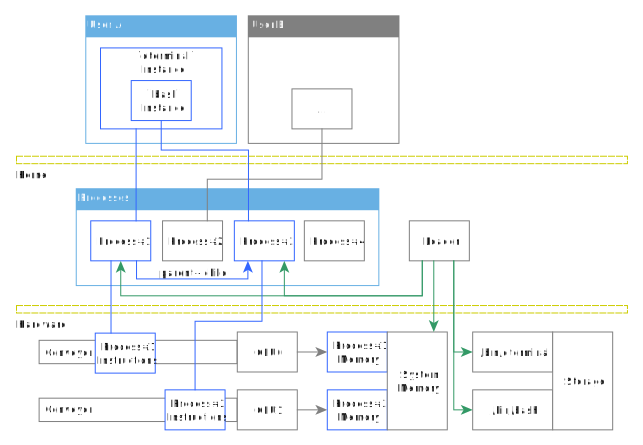
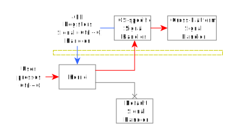
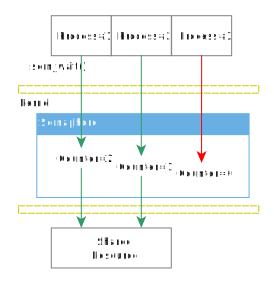
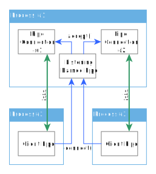

# Cross-Platform System Programming Guide for UNIX & Windows: Level 2

> by Simon Zolin, Jul 2024

The topic of Level-2 tutorial is user-space processes and their interaction with each other.
We'll learn about **processes, signals and exceptions, semaphores, named pipes, file mappings and dynamic libraries** and how to use them in cross-platform programs for **Linux/Android/macOS/FreeBSD and Windows**.

Contents:

* [About System Processes](#about-system-processes)
	* [Process security and policy](#process-security-and-policy)
	* [Process interaction](#process-interaction)
* [Execute a new program and wait for its termination](#execute-a-new-program-and-wait-for-its-termination)
	* [Execute a new program and wait for its termination: UNIX](#execute-a-new-program-and-wait-for-its-termination-unix)
	* [Execute a new program and wait for its termination: Windows](#execute-a-new-program-and-wait-for-its-termination-windows)
* [Print the current process's info](#print-the-current-processs-info)
	* [Print the current process's info: UNIX](#print-the-current-processs-info-unix)
	* [Print the current process's info: Windows](#print-the-current-processs-info-windows)
* [Processes: results](#processes-results)
* [Handling an interrupt signal](#handling-an-interrupt-signal)
	* [Handling an interrupt signal: UNIX](#handling-an-interrupt-signal-unix)
	* [Handling an interrupt signal: Windows](#handling-an-interrupt-signal-windows)
	* [Handling an interrupt signal: results](#handling-an-interrupt-signal-results)
* [Handling CPU exceptions](#handling-cpu-exceptions)
	* [Handling CPU exceptions: practice](#handling-cpu-exceptions-practice)
	* [Handling CPU exceptions: UNIX](#handling-cpu-exceptions-unix)
	* [Handling CPU exceptions: Windows](#handling-cpu-exceptions-windows)
	* [Handling CPU exceptions: results](#handling-cpu-exceptions-results)
* [Semaphores](#semaphores)
	* [Semaphores: UNIX](#semaphores-unix)
	* [Semaphores: Windows](#semaphores-windows)
	* [Semaphores: results](#semaphores-results)
* [Named Pipes](#named-pipes)
	* [Named Pipes: UNIX](#named-pipes-unix)
	* [Named Pipes: Windows](#named-pipes-windows)
* [File Mappings](#file-mappings)
	* [File Mappings: UNIX](#file-mappings-unix)
	* [File Mappings: Windows](#file-mappings-windows)
	* [File Mappings: results](#file-mappings-results)
* [Dynamically Loaded Libraries](#dynamically-loaded-libraries)
	* [Dynamically Loaded Libraries: practice](#dynamically-loaded-libraries-practice)
	* [Dynamically Loaded Libraries: UNIX](#dynamically-loaded-libraries-unix)
	* [Dynamically Loaded Libraries: Windows](#dynamically-loaded-libraries-windows)
	* [Dynamically Loaded Libraries: results](#dynamically-loaded-libraries-results)


## About System Processes

A *process* is a kernel object which uniquely *identifies an instance of a running application*.
You can see all processes, which are currently running on your computer, with `ps aux` command on UNIX or by navigating to "Processes" tab in Task Manager on Windows.
Each application within the system usually runs inside its own process.
Of course, you may start several instances of the same application, and there will be several processes running in parallel.
The purpose of an application is to translate user input into something useful; the purpose of a system process is to hold the application's things inside a single box, thus helping the kernel to make that happen without breaking other applications running on the same system.
In other words, a *process is like a box where the kernel stores private things of a particular application instance*.

OS quickly operates with all those boxes one by one - it puts the box of each process onto the conveyor (i.e. giving it some CPU time to perform its instructions) in quick succession, so it seems to us that all processes in the system run in parallel.
The kernel mechanism that does this work is a complex algorithm called *the scheduler* - it decides which process will be given CPU time.
Note that when a process is blocking on I/O (e.g. after calling `write()`), the scheduler doesn't give this process any CPU time at all until this I/O operation is complete.
This means that there may be many processes performing I/O simultaneously, and they won't consume all available CPU time while doing so, and thus in normal conditions *the number of processes does not increase the overall CPU usage* (i.e. system power consumption) unless all of them are fighting with each other over a single hardware resource (CPU, memory, storage, network).
However, keep in mind that in reality it's not so unusual for the poorly written software to keep consuming some CPU time even when sitting in background, doing nothing useful, just waiting for user input...

When we start an application, e.g. a text editor or a music player (by executing them via console or double-clicking an icon in GUI), OS creates a new process, loads the application code into it and prepares memory regions for it.
After OS has finished preparing the process, it transfers execution control (sets CPU execution pointer) to the application's code, so it may start doing its job.
Apps receive and handle different events, including those that come from hardware.
For example, when we move the mouse or press keys on our keyboard, all those signals generated by the hardware are handled first by the kernel and then passed through to all the userspace processes that have previously subscribed to those events.
When an application is being closed by the user, it notifies OS about this, and the kernel stops providing CPU time for this process and frees the memory regions allocated for it.



> TODO Explain the diagram


### Process security and policy

In general, every process running inside the system is protected by the kernel policies.
For example, we can't just take another process and start reading or writing from/into its private memory regions - this is because those regions are not mapped into any other process's memory space automatically.
Of course, the system provides the means for us to debug and control other programs, but those programs must run under the same user account as our debugger.
In other words, a process for user Bob can't access the contents of a process for user Alice unless Bob is the superuser (root or Administrator).

By default the kernel distributes equal rights and resources among all processes.
Each process is allowed to use memory, CPU time and other hardware resources such as network or storage.
If a process tries to allocate more memory than it's allowed, its request will be denied or in some cases its process will be forcefully terminated by the kernel.
If a process has used up the whole CPU time frame that the kernel allowed it, it will be temporarily paused so that other processes can use their share of CPU time too.


### Process interaction

All processes running on the system may interact to each other in many different ways:

* Getting information (such as PID, CPU time, memory usage, etc.) about each other via various kernel mechanisms.
* Send/receive signals to each other.
* Send/receive data to each other via pipes/sockets.
* Share data via files and shared memory regions.
* Synchronize access to shared resources by using semaphores.

We already discussed some mechanisms (e.g. pipe and file I/O) previously.


## Execute a new program and wait for its termination

We already know how to execute programs, it was described in Level-1 tutorial.
Now let's take `ps-exec.c` program as a base and solve some new tasks.
When we start a new process, we usually want to wait until the child process finishes and receive its exit code.
Also, sometimes the processes hang (never exit) for some reason, and we want to have an ability to terminate them forcefully, even if they don't respond to any external requests.
In this example we try to read the child process's exit code, ensure that it's not yet exited, and then we just kill the process and get its exit code.

[ps-exec-wait.c](samples-sys/ps-exec-wait.c)

As you can see, the code executes our `std-echo` program.
I chose it because it doesn't immediately exit by itself - it reads user input.
Otherwise our `ps_wait()` function will immediately show us that the process has exited and we wouldn't be able to observe how the process termination mechanism works.

Although we don't need PID of our child process in this example, it's still a very useful property that we might want to show to the user or add to logs in real world apps.
We get the child PID by passing its descriptor to our `ps_id()` function which returns an integer:

```C
	ps p = ...;
	unsigned int pid = ps_id(p);
```

PID can never be `0` and it's usually a sequentially growing number showing the total number of processes that were executed since the system startup.
You can execute `ps` command on UNIX several times in quick succession and see that its PID number will grow by 1.

The most important function in this example is a waiting function that checks whether the process has exited or not.
The function returns `0` if the process has exited or if it was terminated by signal.
If the process has exited normally (e.g. with `_exit()`), our `code` variable will receive this exit code (positive integer value).
If the process has been terminated abnormally (e.g. with `kill()`), our `code` variable will receive the signal number (negative integer value).
The function returns `!=0` if the process is still running.

```C
	int code;
	int finished = (0 == ps_wait(p, /*block*/ 0, &code));
```

Our child process in this example won't exit automatically, and `ps_wait()` will always return non-zero and set `ERR_TIMEDOUT` error code.
We pass `block=0` so the function won't block us while the child is running.
Using this technique we may periodically check for the child's status for some time before making decisions about whether to terminate it.
For example, we may use `thread_sleep()` function, which I mentioned in Level-1 tutorial, to suspend our process execution for some time before waking up and checking the child's status again.
Although not the best way to achieve what we need, but it works alright.

Suppose that we're instructed by the user not to let the child programs run indefinitely, and so we must terminate them forcefully in some cases.
We do that with a single function call:

```C
	ps p = ...;
	ps_kill(p);
```

OS receives our request to terminate the specific process.
The kernel checks if we have the right to do so (for example, we can't kill the processes of other users, unless we are operating under root/administrator user), and the kernel then forcefully stops the program execution and destroys all its memory regions.
Under these circumstances, the program that is being killed can't do anything to prevent this.

And now after we've sent a termination signal to the child, we wait until its state is delivered to our process with the same waiting function:

```C
	ps_wait(p, /*block*/ 1, &code);
```

Note that we now pass `block=1` instead of `0` which means that we want to actually wait until the child is terminated, not just check its status and return with `ERR_TIMEDOUT` error if it's still running.
This time the function succeeds (returns `0`) and after terminating the child process with `ps_kill()`, its exit code will always be `-9` (by our design).

On Windows we may specify the timeout value in milliseconds for the underlying process waiting function to get the similar behaviour as with `thread_sleep()` function that I described earlier.
However, this can still be a bad decision because we can't handle any other events while we're blocked by the waiting function, and also it's not supported on UNIX.


### Execute a new program and wait for its termination: UNIX

The system function we use for checking the child's status is `waitid()`.
We pass the child process descriptor to it along with control flags.
If we pass `WNOHANG` flag, this means that we don't want the function to block our process in case the child is still running.

```C
#include <sys/wait.h>

int ps_wait(ps p, int block, int *exit_code)
{
	siginfo_t s = {};
	int f = (!block) ? WNOHANG : 0;
	int r = waitid(P_PID, (id_t)p, &s, WEXITED | f);
	if (r != 0)
		return -1;

	if (s.si_pid == 0) {
		errno = ETIMEDOUT;
		return -1;
	}

	if (exit_code != NULL) {
		if (s.si_code == CLD_EXITED)
			*exit_code = s.si_status;
		else
			*exit_code = -s.si_status;
	}
	return 0;
}
```

The function returns `0` on success and fills `siginfo_t` object.
`siginfo_t.si_pid` field is set to the child process PID that has exited; `0` means that it's still running.
`siginfo_t.si_code` field is set to `CLD_EXITED` when the child has exited normally via `_exit()`, and `siginfo_t.si_status` contains the exit code.
On the other hand, if `si_code` is set to another value, e.g. `CLD_KILLED`, this means that the child has been forcefully terminated by a system signal, and `si_status` contains the signal number.
We set a negative value for `exit_code` in this case for the user to be able to distinguish between the two cases.

In this example when we first call `waitid(WNOHANG)`, it returns immediately and sets `si_pid=0` indicating that the child hasn't yet exited.
Our child process `std-echo` won't exit without user's input, but we can imagine for a moment that it's hanging and doesn't respond to any input.
In this case we decide to terminate the process forcefully.
Here's how we kill a process on UNIX:

```C
#include <signal.h>

int ps_kill(ps p)
{
	return kill(p, SIGKILL);
}
```

The second parameter is the signal number that we want to pass to the target process.
`SIGKILL` is a signal which terminates the process forcefully.
`waitid()` function sets `si_code=CLD_KILLED` and `si_status=SIGKILL` for us in this case.
Note that `SIGKILL` value is actually `9`, that's why we expect `-9` in our code.


### Execute a new program and wait for its termination: Windows

`WaitForSingleObject()` function checks the process's status, and we can pass the amount of time in milliseconds for it to wait for the status change.
But in our example we use only two possible values: `0` if we just want to check the status and not wait at all; and `-1` if we want to wait for the status change as long as needed.
As I mentioned earlier, using another timeout value here is not portable, and it is still not the best way to write software, so let's not use this functionality at all.

```C
int ps_wait(ps p, int block, int *exit_code)
{
	unsigned int timeout_ms = (block) ? -1 : 0;
	int r = WaitForSingleObject(p, timeout_ms);
	if (r == WAIT_OBJECT_0) {
		if (exit_code != NULL)
			GetExitCodeProcess(p, (DWORD*)exit_code);
		CloseHandle(p);
		r = 0;

	} else if (r == WAIT_TIMEOUT) {
		SetLastError(WSAETIMEDOUT);
	}
	return r;
}
```

The function returns `WAIT_OBJECT_0` after the process has exited.
Then we can read its exit code with `GetExitCodeProcess()`.
Otherwise the function returns `WAIT_TIMEOUT` which means that the status of the process hasn't changed and it's still running.
In order to produce the expected behaviour for the user of our `ps_wait()`, we set the error code to `ERR_TIMEDOUT` in this case.

Remember that on Windows the process descriptor `p` is not just a PID number like on UNIX, but a pointer referring to a particular process object.
After the call to `WaitForSingleObject()` we need to properly close this descriptor with `CloseHandle()` to prevent the memory leak.
The user of our `ps_wait()` must not further call any other process functions using this descriptor.

Terminating the process is simple.
We just use the same `-9` value for the child process's exit code to emulate the behaviour we expect on UNIX.

```C
int ps_kill(ps p)
{
	return !TerminateProcess(p, -9);
}
```

And one more thing, this is how we translate the process descriptor pointer to an actual PID.
(We don't need this on UNIX since its system functions operate directly on PID.)

```C
unsigned int ps_id(ps p)
{
	return GetProcessId(p);
}
```

Why do we need PID on Windows and how it's different from a process descriptor?

* PID is a number, while process descriptor is a pointer (memory address).
* PID is a global identifier, while process descriptor is a temporary pointer valid only for our current process's context.
The user can easily find this process by its PID in Task Manager, but he can't do anything useful with a process descriptor.
* PID doesn't change while the associated process is running, but the process descriptor value is different each time.
For example, `OpenProcess()` function, used for obtaining process descriptor by PID number, may return different values every time for the same PID.


## Print the current process's info

The process may fetch the information about itself from the system: PID, executable file path, current directory.

[ps-info.c](samples-sys/ps-info.c)

Here's how we can get the executable file path:

```C
	char buf[1000];
	const char *fn = ps_filename(buf, sizeof(buf));
```

The function returns the pointer to our buffer on success or `NULL` on error.

And this is how to get the current directory:

```C
	char buf[1000];
	ps_curdir(buf, sizeof(buf));
```

Initially, the current directory for a new process is the directory it inherits from its parent process.
For example, if we are in `bash` session, and our current directory is `/tmp`, then each process we start from here will have its current directory set to `/tmp`, unless the process changes this directory by itself.
Reading the default current directory path is necessary in case we must obtain an absolute file path at runtime (e.g. user calls `our_app some_file` from within `/tmp` and `our_app` must get the absolute path of the argument `some_file` which is `/tmp/some_file`).

Finally, this is how we exit a process with a specific code:

```C
	ps_exit(33);
```

Note that usually we specify an exit code via `return N` statement from our `main()` function.
In that case, the C compiler automatically puts an "exit-process" syscall for us.
However, by directly using `ps_exit()` we may exit the process from any function, no matter how deep in the call stack it is, and sometimes it may be useful (e.g. when encountering a fatal error, we could print an error message and then call `ps_exit()`).


### Print the current process's info: UNIX

Get the current PID:

```C
unsigned int ps_curid()
{
	return getpid();
}
```

There's no portable way to obtain the executable file path on all UNIX systems, so we have a separate code for each OS family:

* Linux: read link `/proc/self/exe` to get its target.
* BSD: send `CTL_KERN.KERN_PROC.KERN_PROC_PATHNAME` system message, or read the links `/proc/curproc/file` or `/proc/curproc/exe`.
* macOS: call `_NSGetExecutablePath()`

Linux version:

```C
// Linux
const char* ps_filename(char *name, size_t cap)
{
	int n = readlink("/proc/self/exe", name, cap);
	if (n < 0)
		return NULL;
	name[n] = '\0';
	return name;
}
```

`readlink()` function translates symbolic link to the target file path and returns the number of bytes written.
Note: if `/proc` FS isn't mounted, the function will always fail.

BSD version:

```C
// BSD
const char* ps_filename(char *name, size_t cap)
{
#ifdef KERN_PROC_PATHNAME
	static const int sysctl_pathname[] = { CTL_KERN, KERN_PROC, KERN_PROC_PATHNAME, /*PID=*/ -1 };
	size_t namelen = cap;
	if (0 == sysctl(sysctl_pathname, 4, name, &namelen, NULL, 0))
		return name;
#endif

	int n = readlink("/proc/curproc/file", name, cap);
	if (n >= 0) {
		name[n] = '\0';
		return name;
	}

	n = readlink("/proc/curproc/exe", name, cap);
	if (n >= 0) {
		name[n] = '\0';
		return name;
	}

	return NULL;
}
```

macOS version:

```C
#include <mach-o/dyld.h>

// macOS
const char* ps_filename(char *name, size_t cap)
{
	unsigned int n = cap;
	if (0 == _NSGetExecutablePath(name, &n))
		return name;

	return NULL;
}
```

Here's how to get the current process directory:

```C
int ps_curdir(char *buf, size_t cap)
{
	return (NULL == getcwd(buf, cap));
}
```

And exit the current process with a specific code:

```C
void ps_exit(int code)
{
	_exit(code);
}
```


### Print the current process's info: Windows

Get current PID:

```C
unsigned int ps_curid()
{
	return GetCurrentProcessId();
}
```

To get the executable file path of the current process we, as usual, call the system function which returns a wide string to us, then we convert wide text to UTF-8.

> Note that for the sake of readability of the example code, my approach here for converting wide text to UTF-8 is not 100% correct.
> I use the static wide string buffer that can not hold longer file paths (otherwise the function will just fail) - my goal here is just to show you the idea.

```C
const char* ps_filename(char *name, size_t cap)
{
	wchar_t w[1000];
	size_t n = GetModuleFileNameW(NULL, w, 1000);
	if (n == 0 || n == 1000)
		return NULL;

	if (!WideCharToMultiByte(CP_UTF8, 0, w, -1, name, cap, NULL, NULL))
		return NULL;

	return name;
}
```

Get the current directory path:

```C
int ps_curdir(char *buf, size_t cap)
{
	wchar_t w[1000];
	size_t n = GetCurrentDirectoryW(1000, w);
	if (n == 0)
		return -1;

	if (!WideCharToMultiByte(CP_UTF8, 0, w, -1, buf, cap, NULL, NULL))
		return -1;
	return 0;
}
```

Exit the current process with code:

```C
void ps_exit(int code)
{
	ExitProcess(code);
}
```


## Processes: results

We've learned how to use the processes: execute, get status, wait for exit, terminate, get current process information.

Q&A:

* Why do we need processes in OS?
	> Processes allow running the programs within OS environment.
* Do processes consume system memory?
	> Yes, each process has a set of its own private memory regions allocated by kernel.
* Do processes consume CPU time?
	> Yes, the process is allowed to execute (and thus consume CPU time) when the kernel scheduler decides so.
* Why doesn't the kernel allow the process of user A to access process's private memory of user B?
	> Because otherwise the user B's privacy would suffer.
* Does the kernel allow the process to control and access the private memory of other processes?
	> Yes (this is mostly for debugging), but only if all processes are running under the same user (or if the debugger is running under superuser).
* What is a PID?
	> It's a process ID number which uniquely identifies a particular process in OS.
* Why do we need PID?
	> We use PID to obtain the process descriptor so we can send a signal to it or get the process's current status.
* When do we want to use `WNOHANG` flag for `waitid()` or `0` timeout value for `WaitForSingleObject()`?
	> When we want to just check the status of a child, without waiting for it to exit.
* Can the process, which is being terminated by `SIGKILL`, prevent its termination?
	> No, because the process may be misbehaving, and the user may want to forcefully stop it.
* Why would a process want to obtain its current directory path?
	> To translate a relative file name to an absolute file path.


## Handling an interrupt signal

When we develop console applications, we usually want to give the user an ability to interrupt our running process when he wants.
For example, our program is processing some large amount of data in a loop, but the user is tired of waiting and decides to stop us.
Of course he can open a Task Manager and send a termination signal to our process, but there's an easier way: the user just presses `Ctrl+C` inside the terminal with our app running, and when the kernel receives this signal, it terminates our process.
This behaviour is similar on UNIX (bash) and Windows (cmd.exe) and so is very convenient.
However, sometimes we want our program to catch this signal and handle it the right way.
For example, after we've processed some data, we receive an interrupt signal from the user, and we must catch it in order to print the current result we've reached so far.
And then we may gracefully exit our app.
The next sample program registers an interrupt signal handler in the system, catches the signal and then gracefully finishes its work.

First, let's consider a hypothetical code that calls a function that does some large amount of work, returning the final result after it completes.

```C
	int r = do_something();
	printf("Result: %d", r);
```

Our goal here is to allow the user to interrupt us at some point and still get the current result (yes, not the final result, but at least something).
To achieve this, we modify our function so it splits its work into smaller parts and updates the result variable after each iteration.

```C
	int r;
	while (do_something_once(&r)) {}
	printf("Result: %d", r);
```

Now the function requires us to call it again and again until it returns `0`, which means for us that it has finished its job.
Much better, but the problem here is that when the user presses `Ctrl+C`, the process gets immediately killed, and thus we don't have a chance to print the currently computed result to the user.
Again, the whole computational work will be wasted.
So we introduce a new variable `quit` which will be set by the user's signal, and in that case we can exit our loop and print the current result!

```C
	int quit = 0;
	int r;
	while (!quit) {
		do_something_once(&r);
	}
	printf("Result: %d", r);
```

The only thing that's left is that we need to set `quit` to `1` somewhere.
That's the purpose of this next example.



[signal-interrupt.c](samples-sys/signal-interrupt.c)

As you can see, our main code subscribes for receiving an interrupt signal with `sig_int_subscribe()` before it starts the loop.
We pass the name of the function we want to handle the signal when it arrives - `ctrlc_handler`.
Inside the signal handling function we set `quit=1` so that we can break the main loop on the next iteration.
It's all quite simple.

```C
int quit;

void ctrlc_handler()
{
	quit = 1;
}

...
	sig_int_subscribe(ctrlc_handler);
```

A few notes about interrupt signal handling function:

* It can be called at any time after we have subscribed to it.
* While our signal handling function is executing, the main function is suspended, execution of code inside `main()` is paused.
* We can unsubscribe from receiving the signal and restore the default behaviour.
* Not all system functions are allowed to be called from inside signal handling functions.

Here's what happens at runtime:

```C
	int r = 0;
	while (!quit) {
		r++;
// [User presses Ctrl+C]
					// Interrupt signal is received by the kernel.
					// Main code execution is paused.
					// The signal handling function is called.
					ctrlc_handler()
					{
						quit = 1;
					}
					// The signal handling function has exited.
					// Main code execution is unpaused.
	}
	printf("Result: %d", r);
```

In general, I don't recommend writing complex code inside a signal handler, because if something goes wrong, it will be harder for you to debug.
The correct approach should be to do as little as possible inside the signal handler, e.g. just set some flags and global variables, then exit the function and let the main code to catch up and adapt to the new situation.
Then, if the main code decides to exit the process, it can do so normally.
Unless your main program loop is trying to count all stars in the Universe in a single non-interruptable loop, the approach I suggest should work just fine.


### Handling an interrupt signal: UNIX

```C
#include <signal.h>

typedef void (*sig_handler_t)();
sig_handler_t sig_userhandler;

void sig_handler(int signo)
{
	assert(signo == SIGINT);
	sig_userhandler();
}

int sig_int_subscribe(sig_handler_t handler)
{
	sig_userhandler = handler;

	struct sigaction sa = {};
	sa.sa_handler = sig_handler;
	return sigaction(SIGINT, &sa, NULL);
}
```

The first thing we must do inside our `sig_int_subscribe()` is to store our signal handling function pointer in a global namespace - we'll need to call it from inside the lower-level signal handler `sig_handler()`.
We register it in the system via `sigaction()` by setting `struct sigaction.sa_handler` field and specifying the signal number we want to catch - `SIGINT` in our case.
This signal number will be passed to `_sig_handler()` at runtime so that we may use the same handler for many different signals.

To **unregister signal handler** we use the same function `sigaction()` with `sa_handler = SIG_DFL` which means that we want to reset to the default behaviour.
After that our previously registered function won't be called for this signal.
There's another useful option to automatically restore to the default - with `struct sigaction.sa_flags = SA_RESETHAND`.
If we do so, our handler function will be called only once.
This may be useful when the user first presses `Ctrl+C`, which our program has caught and tried to handle, but still our program won't exit for some reason.
Without `SA_RESETHAND` the user won't be able to stop our program in this case, but with the default behaviour restored, the second time he presses `Ctrl+C`, the program will be terminated by the kernel.


### Handling an interrupt signal: Windows

On Windows the terminology is different, there is no such thing as process signal.
Instead, Windows provides a similar technique called console control handler, which means that it's capable of handling CTRL events from console.

```C
typedef void (*sig_handler_t)();
sig_handler_t sig_userhandler;

BOOL WINAPI sig_ctrl_handler(DWORD ctrl)
{
	if (ctrl == CTRL_C_EVENT) {
		sig_userhandler();
		return 1;
	}
	return 0;
}

int sig_int_subscribe(sig_handler_t handler)
{
	sig_userhandler = handler;
	SetConsoleCtrlHandler(sig_ctrl_handler, 1);
	return 0;
}
```

First, we store our interrupt signal handling function inside a global variable that will be called from the Windows console control handler.
Then we just call `SetConsoleCtrlHandler()` to register the handler in the system.
When Windows calls our `sig_ctrl_handler()` on receiving `Ctrl+C` event, we ensure if it's the right one (`==CTRL_C_EVENT`) and call the user handler.
We return `1` which means for the kernel that we have processed this event by ourselves.

To **unregister the control handler**, pass `0` instead of `1` as the second parameter to `SetConsoleCtrlHandler()`, and the default behaviour will be restored.


### Handling an interrupt signal: results

We've learned how to catch and handle `Ctrl+C` signal and gracefully exit our program in this case.

Q&A:

* Why do we want to catch `Ctrl+C` events and process them?
	> To properly finalize the application's work or to print the current result before exiting.
* When may our signal handling function be called by the kernel?
	> At any time after we have registered the handler.
* After the signal handler has begun executing, does the main code continue its execution in parallel?
	> No, the main code is paused until our signal handler exits.
* Why may we want to unregister the signal handler after it signals or use `SA_RESETHAND` flag on UNIX?
	> To prevent the application from hanging in case it can't really handle the signal properly and exit the process.


## Handling CPU exceptions

Sometimes we also want our program to catch and process the exceptions that are generated during the execution of CPU instructions.
These signals are different from `Ctrl+C` signal because here the signals are raised not by the kernel but by CPU itself.
Consider this function that divides 2 integer numbers specified by the user code.

```C
int int_div(int num, int div_by)
{
	return num / div_by;
}
```

What if `div_by == 0`?
CPU can't divide by 0 and so it generates a "division by zero" exception.
The kernel receives this event, and because it was generated while performing instructions in the context of our program, this signal gets passed through to the associated process.
By default, this results in termination of the process.
But unlike `SIGKILL` signal, which the process can't catch or handle, CPU exceptions can be received and handled by the process.
What do applications do in this case?
They can print the current call stack, the information about current CPU register values, memory contents, etc. - everything that developers may need to find the root cause of this exception and fix it.
And if the process is currently being debugged, the debugger automatically receives such signals, which is very convenient, because CPU exceptions can happen quite often while our program is in the process of development.

Some of commonly raised CPU exceptions are:

* `SIGSEGV` - Invalid memory reference, or Segmentation Fault, or Access Violation - CPU tried to access an unmapped or protected memory region.
* `SIGILL` - Illegal Instruction - CPU encountered the instruction it doesn't understand.
* `SIGFPE` - Floating-point exception - CPU tried to perform an invalid arithmetic operation (including division by zero).

On Windows these signals have different names, but the meaning is similar.

How CPU exceptions are processed by user-level programs:

* CPU raises an exception while performing instructions within a particular process context.
* The kernel receives the exception event, converts it to a process signal and passes it through to the signal handling function registered for this process.
* If the default signal handling function has been changed by the program, it receives the signal and decides what to do next.
* The default signal handling function terminates the process and sometimes also writes the current process's status to storage (i.e. dumps core file for debugging purposes).


### Handling CPU exceptions: practice

[signal-cpu-exception.c](samples-sys/signal-cpu-exception.c)

To subscribe to CPU exceptions, we first put the signal identifiers that we want to catch into an array and then pass this array to our `sig_subscribe()`.

```C
void sig_handler(struct sig_info *i)
{...}

...
	unsigned int sigs[] = {
		CPSIG_SEGV, CPSIG_STACK, CPSIG_ILL, CPSIG_FPE
	};
	sig_subscribe(sig_handler, sigs, 4);
```

Inside the exception handling function we just print the information about the signal, e.g. at which address the Segmentation Fault signal was raised.

```C
struct sig_info {
	unsigned int sig; // enum CPSIG
	void *addr; // CPSIG_SEGV: the virtual address of the inaccessible data
	unsigned int flags; // Platform-specific flags related to the signal
};

void sig_handler(struct sig_info *i)
{
	printf("Signal:%x  Address:%p  Flags:%x\n"
		, i->sig, i->addr, i->flags);
}
```

And here's the function that will help us test our exception handling code:

```C
void sig_raise(int sig)
{
	switch (sig) {
	case CPSIG_STACK:
		sig_raise(sig);
		break;

	case CPSIG_SEGV: {
		void *addr = (void*)0x16;
		*(int*)addr = -1;
		break;
	}

	case CPSIG_FPE: {
		int i = 0;
		i = 10 / i;
		break;
	}
	}
}
```

For stack overflow test we just call our function again and again until the whole stack region is used.
For seg-fault test we try to access the memory region at address `0x16`, which is not mapped for our process.
And for FPE test we try to divide by zero.


### Handling CPU exceptions: UNIX

On UNIX we call `sigaction()` to register our signal handler in the system.
With `SA_SIGINFO` flag we declare that we expect the kernel to pass `siginfo_t` parameter to us so that we can get some more info about each signal.

```C
void _sig_exc_handler(int signo, siginfo_t *info, void *ucontext)
{...}

...
	struct sigaction sa = {};
	sa.sa_sigaction = _sig_exc_handler;
	sa.sa_flags = SA_SIGINFO | SA_RESETHAND;
	if (0 != sigaction(sigs[i], &sa, NULL))
		return -1;
```

For stack overflow signal the registration code is a little more complex, because first we need to allocate some memory that will act as stack for our signal handling function (this kind of stack memory is called *alternate stack* in Linux).

```C
	stack_t stack;
	stack.ss_sp = malloc(SIGSTKSZ);
	stack.ss_size = SIGSTKSZ;
	stack.ss_flags = 0;
	if (0 != sigaltstack(&stack, NULL))
		return -1;

	struct sigaction sa = {};
	sa.sa_sigaction = _sig_exc_handler;
	sa.sa_flags = SA_SIGINFO | SA_RESETHAND | SA_ONSTACK;
	if (0 != sigaction(SIGSEGV, &sa, NULL))
		return -1;
```

We use `sigaltstack()` to inform the kernel about the location of our stack memory region, and then we use `SA_ONSTACK` flag for `sigaction()` to inform the kernel that for this specific signal (`SIGSEGV` in our case) it must use the alternate stack.
The logical link between `sigaltstack()` and `sigaction()` with `SA_ONSTACK` isn't very clear, so just try to place these code blocks near to each other.

Inside our signal handling function we can convert system-specific parameters to our own cross-platform structure `struct sig_info`.

```C
void _sig_exc_handler(int signo, siginfo_t *info, void *ucontext)
{
	struct sig_info i = {};
	i.sig = (unsigned int)signo;
	i.addr = info->si_addr;
	i.flags = (unsigned int)info->si_code;
	_sig_userhandler(&i);
}
```

`si_addr` field is the address related to the signal, e.g. for `SIGSEGV` it's the address that CPU tried to access and failed, and for `SIGILL` and `SIGFPE` this is the address of the instruction at which the exception was raised.
This info could be very useful for the developers trying to fix the problem with their program.

`si_code` field helps to distinguish between different kinds of CPU exceptions, e.g.:
* For `SIGILL` it may be `ILL_ILLOPC` which means that CPU has encountered the opcode it doesn't understand.
* For `SIGFPE` it may be `FPE_INTDIV` - this means that integer division by zero has occurred.
* For `SIGSEGV` it may be `SEGV_MAPERR` - the address the CPU tried to access isn't mapped by the kernel for this process.

All of those codes are described in detail in `man sigaction`.


### Handling CPU exceptions: Windows

It's very easy to set up an exception handler in Windows with a call to `SetUnhandledExceptionFilter()` passing to it the exception handling function:

```C
LONG WINAPI _sig_exc_handler(struct _EXCEPTION_POINTERS *inf)
{...}

...
	SetUnhandledExceptionFilter(_sig_exc_handler);
```

Note that for stack overflow signals we don't need to do anything else here, because the system handles it automatically for us.
Inside the signal handler we must fill our cross-platform structure `struct sig_info` and call the user function that will handle the exception.

```C
LONG WINAPI _sig_exc_handler(struct _EXCEPTION_POINTERS *inf)
{
	SetUnhandledExceptionFilter(NULL);

	struct sig_info i = {};
	i.sig = inf->ExceptionRecord->ExceptionCode; // EXCEPTION_*

	switch (inf->ExceptionRecord->ExceptionCode) {
	case EXCEPTION_ACCESS_VIOLATION:
		i.flags = inf->ExceptionRecord->ExceptionInformation[0];
		i.addr = (void*)inf->ExceptionRecord->ExceptionInformation[1];
		break;
	}

	_sig_userhandler(&i);
	return EXCEPTION_CONTINUE_SEARCH;
}
```

`EXCEPTION_ACCESS_VIOLATION` is similar to `SIGSEGV` - the memory address is either not mapped or the operation violates memory region permissions.

`ExceptionCode` field is the exception code, e.g. it can be `EXCEPTION_INT_DIVIDE_BY_ZERO` for integer division by zero.
`ExceptionInformation` array contains the details specific to each exception, e.g. for `EXCEPTION_ACCESS_VIOLATION` signal if `ExceptionInformation[0] == 1`, then this means that CPU tried to write to a region that doesn't have writing permission; and `ExceptionInformation[1]` is the address of that memory region.
For details about all those codes please read `EXCEPTION_RECORD structure` document from Microsoft.

Note that, similar to using `SA_RESETHAND` flag on UNIX, we call `SetUnhandledExceptionFilter()` with `NULL` pointer to revert back to default behaviour once our handler has been called.


### Handling CPU exceptions: results

We've learned how to catch CPU exception signals and get some information about what actually happened.

Q&A:

* Why do we need to register our exception handling function before we can catch CPU exceptions?  
	> Because the kernel must know which user function to call when a signal is received from CPU.
* What happens if we don't register our exception handler?  
	> The default exception handlers initially set up by the kernel will do their job and terminate our process without our program noticing that.
* Must we always use `SA_RESETHAND` when registering the exception handler?  
	> No. We just use it here for additional safety to automatically revert back to the default behaviour in case something bad happens inside our handler.
* Must we always use alternate stack to catch stack-overflow signals on UNIX?  
	> Yes, without alt-stack our handler may not work properly because the main stack area is already fully used.


## Semaphores

Semaphore is a kernel object that restricts access to a shared resource across different system processes.
For the userspace programmers, semaphore is just an integer counter stored inside the kernel.
This counter represents the number of processes that can use the resource simultaneously.
A shared resource may be anything: shared memory region, disk device or a certain file on disk, sound card device, network link, and so on.
Every process that wants to use the resource calls a system function that decrements the counter by 1.
When the counter reaches 0, the next process that tries to gain access to the resource must wait until the counter is increased.
When the process finishes using the resource, it calls a system function that increments the counter by 1.



How to use semaphore objects:

* Create a semaphore and initialize its counter to the maximum number of simultaneous users that are allowed to access the shared resource.
* When a program wants to access the resource, it informs the kernel about this.
	The kernel either decreases the semaphore counter or puts the caller on hold (if the counter is `0`).
* When a program finishes using the resource, it informs the kernel about this.
	The kernel increases the counter.
* In the end, when we don't need it anymore, we destroy the semaphore object by calling a particular system function.

The simplest use-case of a semaphore is when the initial counter is set to 1 - in this case the semaphore operates just like a system-wide lock object, allowing only 1 process to access the resource at a time.
And while the lock is being held, all other processes must wait until the lock is released.

Now let's look at the example:

[semaphore.c](samples-sys/semaphore.c)

The main function calls are:

```C
	// create new named semaphore with initial count = 1 or open an existing semaphore
	cpsem s = cpsem_open("/name", CPSEM_CREATE, 1);

	// try to decrease the counter to enter the protected region
	cpsem_wait(s);

	// use the shared resource
	...

	// increase the counter on leaving the protected region
	cpsem_post(s);

	cpsem_close(s);

	cpsem_unlink("/name");
```

* `cpsem_open()`, if called without flags, attempts to open an existing semaphore, and if it exists, it returns the semaphore descriptor to us.
If there's no such object by that name, the function fails.
However, if we pass `CPSEM_CREATE` flag to it, it will create a new semaphore and set the initial counter to the value we specify.

* We call `cpsem_wait()` before trying to use the shared resource - we notify the kernel of this so it can decrease the semaphore counter.
In case many programs call this function at the same time on the same semaphore descriptor, the kernel guarantees that only the specified number of them will be allowed access (but in no particular order).
Others will be put on hold.
That's why the function is named "wait" - the caller must be prepared that the function may block for some time until the resource access is actually granted.

* After our program has finished using the shared resource, we call `cpsem_post()` so that the kernel knows about this, increments the counter and perhaps unblocks some other programs that are currently waiting for the access to the resource.

* When a program finishes, it calls `cpsem_close()` for the kernel to close the semaphore descriptor for the current process.
And finally, when we don't need our semaphore anymore (i.e. all programs that may use it are closing), we call `cpsem_unlink()` for the kernel to completely delete it.


### Semaphores: UNIX

There's not much to explain here, everything is very straightforward:

```C
#include <semaphore.h>
#include <fcntl.h>

typedef sem_t* cpsem;
#define CPSEM_NULL  SEM_FAILED
#define CPSEM_CREATE  O_CREAT

cpsem cpsem_open(const char *name, unsigned int flags, unsigned int value)
{
	return sem_open(name, flags, 0666, value);
}

void cpsem_close(cpsem sem)
{
	sem_close(sem);
}

int cpsem_unlink(const char *name)
{
	return sem_unlink(name);
}

int cpsem_wait(cpsem sem)
{
	return sem_wait(sem);
}

int cpsem_post(cpsem sem)
{
	return sem_post(sem);
}
```


### Semaphores: Windows

On Windows we have separate functions for semaphore creation and opening, but we combine them into a single UNIX-like function.
Note also that `cpsem_unlink()` is empty, because Windows deletes the semaphore automatically when its last descriptor is closed.

```C
typedef HANDLE cpsem;
#define CPSEM_NULL NULL
#define CPSEM_CREATE  1

cpsem cpsem_open(const char *name, unsigned int flags, unsigned int value)
{
	wchar_t wname[1000];
	if (0 == MultiByteToWideChar(CP_UTF8, 0, name, -1, wname, 1000))
		return NULL;

	if (flags == CPSEM_CREATE)
		return CreateSemaphoreW(NULL, value, 0xffff, wname);
	else if (flags == 0)
		return OpenSemaphoreW(SEMAPHORE_ALL_ACCESS, 0, wname);

	SetLastError(ERROR_INVALID_PARAMETER);
	return NULL;
}

void cpsem_close(cpsem sem)
{
	CloseHandle(sem);
}

int cpsem_wait(cpsem sem)
{
	int r = WaitForSingleObject(sem, -1);
	if (r == WAIT_OBJECT_0)
		r = 0;
	return r;
}

int cpsem_unlink(const char *name)
{
	(void)name;
	return 0;
}

int cpsem_post(cpsem sem)
{
	return !ReleaseSemaphore(sem, 1, NULL);
}
```


### Semaphores: results

We learned how to work with semaphores.

Q&A:

* Why semaphore is a kernel object and not a userspace object?  
	> Because the kernel takes the responsibility of managing the semaphore counter across many system processes.
* What happens when the semaphore counter becomes `0`?  
	> The kernel will suspend all new requests to decrease the counter until the counter is increased.
* Will the process that is waiting on a semaphore actively consume CPU?  
	> No, because while being blocked inside the semaphore waiting function, the kernel won't give any CPU time to the suspended process and will reactivate it only when the semaphore object signals.


## Named Pipes

Previously, we learned about unnamed pipes and how to use them.
Unnamed pipes are convenient when we pass their descriptors to a child process, but what if we want to establish a data connection between two separate unrelated processes?
How the second process will obtain the pipe descriptor that was created by the first process?
The solution is simple: the pipe should have a unique identifier (a name).
By using the same pipe name all other processes (clients) can establish connections with the first process (server) and pass data within these connections.
Note that each connection is private between two processes, for example `connection#1` between `client#1` and `server` do not share any data with `connection#2` between `client#2` and `server`.



This is the sample code:

[pipe-named.c](samples-sys/pipe-named.c)

It contains the code for Server and its Clients.
When a Client connects to Server, it just writes some data to the pipe connection, while Server just reads that data.

### Server

```C
	const char *name = "/tmp/cpspg.pipe";
#ifdef _WIN32
	name = PIPE_NAME_PREFIX "cpspg.pipe";
#endif

#ifndef _WIN32
	unlink(name);
#endif

	// create a pipe
	pipe_t listener = pipe_create_named(name);

	// wait for incoming connection
	pipe_t client = pipe_accept(listener);

	// read data
	char buf[100];
	ssize_t n = pipe_read(client, buf, sizeof(buf));

	pipe_peer_close(client);
	pipe_close(listener);
```

When we work with a named pipe, we need to specify its name.
Note that we can't do it in a truely cross-platform way, because:
* On UNIX, pipe name must be a unique name on the file system.
Thus, you can see the newly created pipe with `ls` command along with all other files.
That is why before creating a named pipe we must ensure that it doesn't exist.
* On Windows, pipe name must be a unique string with prefix `\\.\pipe\`.
It's not part of the file system so you won't be able to see it with Explorer.

As you can see, there are 2 different pipe descriptors here.  Why?
When we first create a named pipe, the descriptor is just a listener that we need to keep open so that we can accept incoming client connections.
This listening pipe descriptor is never used for real data I/O.
Once we have a listener, we call `pipe_accept()` that blocks execution until a client connection is established.
This function returns the client pipe descriptor that we can use for data I/O.
In this example we only read incoming data from client, but we can also write data - the pipe connection is full duplex by default.

When we are done with a single client connection, we close the client descriptor with `pipe_peer_close()`.
The descriptor becomes invalid after that, so don't try to perform further operations on it.

Now we can either call `pipe_accept()` again to accept another connection, or we can just close the listening descriptor with `pipe_close()`.
Note that `pipe_peer_close()` and `pipe_close()` are two different functions for closing client (peer) connection and listening descriptor accordingly, don't use them vice-versa.

### Client

Now let's look at the Client code:

```C
	const char *name = "/tmp/cpspg.pipe";
#ifdef _WIN32
	name = PIPE_NAME_PREFIX "cpspg.pipe";
#endif

	// connect to a pipe
	pipe_t p = pipe_connect(name);

	// write data
	ssize_t n = pipe_write(p, "hello!", 6);

	pipe_close(p);
```

The first step, as with Server side code, is to specify the pipe name.
It should be either hard-coded or received via some other channel, e.g. by user input, but remember that it must uniquely identify the listening pipe you want to connect to.
Things like the current system user ID should also be considered, because the server process may be executed by several users in parallel, but you probably want them each to own a separate pipe.
In this case you may just add a UID to your pipe name, e.g. `/tmp/cpspg.1000` for UID=1000.

The client code calls `pipe_connect()`, which blocks execution until the server accepts the incoming connection.
Now the client may send or receive data through this descriptor.


### Named Pipes: UNIX

On UNIX, the creation of the named pipe is a complex operation consisting of the preparation of a data structure and calling several system functions.
Note that named pipes on UNIX are often called *UNIX sockets*, but I believe that *named pipes* is a better cross-platform name, so I'll stick to it.
The resulting listening pipe descriptor is of `int` type, as all ordinary file descriptors, but you don't perform I/O on this descriptor - you just need it for `accept()`.

```C
typedef int pipe_t;
#define PIPE_NULL  (-1)

pipe_t pipe_create_named(const char *name)
{
	pipe_t p;
	struct sockaddr_un a = {};
#if (!defined __linux__ && defined __unix__) || (defined __APPLE__ && defined __MACH__)
	a.sun_len = sizeof(struct sockaddr_un);
#endif
	a.sun_family = AF_UNIX;
	size_t len = strlen(name);
	if (len + 1 > sizeof(a.sun_path)) {
		errno = EINVAL;
		return -1;
	}
	memcpy(a.sun_path, name, len + 1);

	if (-1 == (p = socket(AF_UNIX, SOCK_STREAM, 0)))
		return -1;

	if (0 != bind(p, (struct sockaddr*)&a, sizeof(struct sockaddr_un)))
		goto err;

	if (0 != listen(p, 0))
		goto err;

	return p;

err:
	close(p);
	return -1;
}

void pipe_close(pipe_t p)
{
	close(p);
}

pipe_t pipe_accept(pipe_t listen_pipe)
{
	return accept(listen_pipe, NULL, NULL);
}

void pipe_peer_close(pipe_t p)
{
	close(p);
}
```

`socket()` is the system function that creates the pipe descriptor for us.
In our case, we should pass `AF_UNIX` and `SOCK_STREAM` parameters to it so the kernel knows what descriptor type we want.

Now that we have a pipe descriptor, we need to configure it and set the name.
We fill in the `struct sockaddr_un` object's fields `sun_family` and `sun_path` and call `bind()`.
Note that for BSD systems and macOS we also need to specify `sun_len` field, which isn't available on Linux.
If the function succeeds, the kernel has successfully assigned the name - our pipe is almost ready.
We just need to call `listen()` for the kernel to start accepting the incoming connections from clients.

For the client side, the preparation of a pipe descriptor is the same, but instead of `bind/listen` we need to call `connect()` that will establish the outgoing connection.

```C
pipe_t pipe_connect(const char *name)
{
	pipe_t p;
	struct sockaddr_un a = {};
#if (!defined __linux__ && defined __unix__) || (defined __APPLE__ && defined __MACH__)
	a.sun_len = sizeof(struct sockaddr_un);
#endif
	a.sun_family = AF_UNIX;
	size_t len = strlen(name);
	if (len + 1 > sizeof(a.sun_path)) {
		errno = EINVAL;
		return -1;
	}
	memcpy(a.sun_path, name, len + 1);

	if (-1 == (p = socket(AF_UNIX, SOCK_STREAM, 0)))
		return -1;

	if (0 != connect(p, (struct sockaddr*)&a, sizeof(struct sockaddr_un))) {
		close(p);
		return -1;
	}

	return p;
}
```

While the client process is blocked within `connect()` call, the server process's `accept()` function returns with a new server-side client pipe descriptor, which is ready for I/O.
On the client side, the pipe is ready for I/O after `connect()` has returned with code `0`.

There is nothing specific to say about pipe I/O on UNIX, it's the same as file I/O:

```C
ssize_t pipe_read(pipe_t p, void *buf, size_t size)
{
	return read(p, buf, size);
}

ssize_t pipe_write(pipe_t p, const void *buf, size_t size)
{
	return write(p, buf, size);
}
```


### Named Pipes: Windows

The creation of a named pipe on Windows is slightly easier, we just need to call a single function and pass the pipe name to it.
As with UNIX, the pipe descriptor returned by `CreateNamedPipeW()` is not for I/O - it is just for passing it to `ConnectNamedPipe()` later to accept the actual client connections.
Don't mind the deceiving name of the function `ConnectNamedPipe()` - just read it as *accept incoming connection to a named pipe*.

```C
typedef HANDLE pipe_t;
#define PIPE_NULL  INVALID_HANDLE_VALUE
#define PIPE_NAME_PREFIX  "\\\\.\\pipe\\"

pipe_t pipe_create_named(const char *name)
{
	wchar_t w[1000];
	if (0 == MultiByteToWideChar(CP_UTF8, 0, name, -1, w, 1000))
		return INVALID_HANDLE_VALUE;

	return CreateNamedPipeW(w
		, PIPE_ACCESS_DUPLEX | FILE_FLAG_FIRST_PIPE_INSTANCE
		, PIPE_TYPE_BYTE | PIPE_READMODE_BYTE | PIPE_WAIT
		, PIPE_UNLIMITED_INSTANCES, 512, 512, 0, NULL);
}

void pipe_close(pipe_t p)
{
	CloseHandle(p);
}

pipe_t pipe_accept(pipe_t listen_pipe)
{
	BOOL b = ConnectNamedPipe(listen_pipe, NULL);
	if (!b) {
		if (GetLastError() == ERROR_PIPE_CONNECTED)
			return listen_pipe;
		return INVALID_HANDLE_VALUE;
	}
	return listen_pipe;
}

void pipe_peer_close(pipe_t p)
{
	DisconnectNamedPipe(p);
}
```

On the client side we call `CreateFileW()` to connect to a named pipe.
The underlying kernel code recognizes that the name we pass to it is a pipe and not a regular file on the file system because the pipe name is always prefixed with `\\.\pipe\`.

```C
pipe_t pipe_connect(const char *name)
{
	wchar_t w[1000];
	if (0 == MultiByteToWideChar(CP_UTF8, 0, name, -1, w, 1000))
		return INVALID_HANDLE_VALUE;

	return CreateFileW(w, GENERIC_READ | GENERIC_WRITE, FILE_SHARE_READ | FILE_SHARE_WRITE, NULL, OPEN_EXISTING, 0, NULL);
}
```

Pipe I/O is similar to regular file I/O, with one exception.
When `ReadFile()` returns with an error `ERROR_BROKEN_PIPE`, this means that the pipe is closed on the other side - there is no more data left for reading, and thus we just return `0` to emulate standard UNIX I/O behaviour.

```C
ssize_t pipe_read(pipe_t p, void *buf, size_t cap)
{
	DWORD rd;
	if (!ReadFile(p, buf, cap, &rd, 0)) {
		if (GetLastError() == ERROR_BROKEN_PIPE)
			return 0;
		return -1;
	}
	return rd;
}

ssize_t pipe_write(pipe_t p, const void *data, size_t size)
{
	DWORD wr;
	if (!WriteFile(p, data, size, &wr, 0))
		return -1;
	return wr;
}
```


## File Mappings

When several different processes want to continuously share data with each other, they may use file mapping mechanism.
Two or more processes map a memory region to a file, and when one process updates the region, another process will automatically see the newly updated data when it reads this region.
Of course, some inter-process synchronization is still required, because the writer must somehow signal the reader that it has finished writing new data into the buffer.
However, the signalling mechanism is much cheaper than, for example, pushing large amount of data via system pipes.
One more benefit of using file mappings is that the actual data will be also stored on disk, so each new process will always see the latest data, even after all processes were previously closed (or even after the system reboots).

Now let's see our example.

[file-mapping.c](samples-sys/file-mapping.c)

Here's how we will use it:

```
	Terminal #1          | Terminal #2
	=====================+======================================
	./file-mapping       |
	                     | ./file-mapping 'data from instance 2'
	<Enter>              |
	data from instance 2 |
```

* We open 2 separate terminal windows
* In the first terminal window we execute our example binary without additional arguments.
It will prepare a file and open a file mapping, and then it will wait for user input.
* In the second terminal window we execute the program and pass some text as a command-line argument.
It will open a file mapping on its side and write our data to it.
At this point we can read the file ourselves and see that it really contains our text.
* Now return to the instance #1 and press Enter so that the program continues execution.
It will display the text read from the file mapping region.

The key point here is that the first instance receives the data from the second instance *after* the moment the first instance opens the file mapping.
This proves the fact that this mechanism can be used to share data between different processes at runtime.

Main code uses 4kb buffer and either reads data from it or writes data to it depending on the user's command-line arguments:

```C
	// open/create file
	file f = file_open("fmap.txt", _FILE_CREATE | FILE_READWRITE);
	file_trunc(f, 4096);

	// get file mapping object
	filemap fm = fmap_create(f, 4096, FMAP_CREATE_READWRITE);

	// map file region to memory
	char *m = fmap_map(fm, 0, 4096, FMAP_READWRITE, FMAP_SHARED);

	if (argc > 1) {
		// write new data
		memcpy(m, argv[1], strlen(argv[1]));

	} else {
		// wait until the user presses Enter
		...

		// read and print the existing data from file mapping
		printf("%s\n", m);
	}

	// unmap file region
	fmap_unmap(m, 4096);
	
	fmap_close(fm);
	file_close(f);
```

* The first step is to obtain the file descriptor.
We must set the file size `>0`, or else what will we map to memory?
* `fmap_create()` creates the file mapping object using the input file descriptor.
`FMAP_CREATE_READWRITE` flag is for our cross-platform code.
* `fmap_map()` takes the file mapping descriptor and performs actual mapping to a memory buffer.
`FMAP_READWRITE` means that our process wants to perform both reading and writing operations, and it must match the previously used `FMAP_CREATE_READWRITE`.
* `fmap_unmap()` frees the mapped buffer; `fmap_close()` closes file mapping descriptor.


### File Mappings: UNIX

UNIX interface for file mappings is very simple, but we have to add some stuff so that our interface is cross-platform (compatible to Windows).

```C
#define FMAP_CREATE_READWRITE  0

/** Create file mapping */
filemap fmap_create(file f, unsigned long long max_size, int access)
{
	return f;
}

/** Close a file mapping object */
void fmap_close(filemap fmap)
{
}
```

And here's the real code:

```C
#include <sys/mman.h>

#define FMAP_READWRITE  (PROT_READ | PROT_WRITE)
#define FMAP_SHARED  MAP_SHARED

/** Map file region into memory
prot: FMAP_READWRITE
flags: FMAP_SHARED
Return NULL on error */
void* fmap_map(filemap f, unsigned long long offset, size_t size, int prot, int flags)
{
	void *h = mmap(NULL, size, prot, flags, f, offset);
	return (h != MAP_FAILED) ? h : NULL;
}

/** Unmap the previously mapped region */
int fmap_unmap(void *p, size_t sz)
{
	return munmap(p, sz);
}
```


### File Mappings: Windows

On Windows we must first create a file mapping object before we can open the actual file mapping, thus the functions `fmap_create()` and `fmap_close()` are not empty.

```C
#define FMAP_CREATE_READWRITE  PAGE_READWRITE

filemap fmap_create(file f, unsigned long long max_size, int access)
{
	return CreateFileMapping(f, NULL, access, (unsigned int)(max_size >> 32), (unsigned int)max_size, NULL);
}

void fmap_close(filemap fmap)
{
	CloseHandle(fmap);
}

#define FMAP_READWRITE  (FILE_MAP_READ | FILE_MAP_WRITE)
#define FMAP_SHARED  0

void* fmap_map(filemap fmap, unsigned long long offset, size_t size, int prot, int flags)
{
	return MapViewOfFile(fmap, prot, (unsigned int)(offset >> 32), (unsigned int)offset, size);
}

int fmap_unmap(void *p, size_t sz)
{
	return 0 == UnmapViewOfFile(p);
}
```

### File Mappings: results

We learned how to use file mappings for sharing data between several processes.

Q&A:

* How to pass the data from one process to another via file mappings?
	> After the first process writes some data to the file mapping region, the kernel takes the responsibility of storing this data on disk and making it visible to all other processes.
* Is file mapping an effective mechanism for transfering large amounts of data across many processes?
	> Yes, because it doesn't require us to perform syscalls when reading or writing large data regions.


## Dynamically Loaded Libraries

Almost all modern applications are built in such a way that they depend on one or several DLLs.
When a new process starts, the system loader looks for all those DLL files on disk and loads them recursively.
For example, all system functions that we use in this tutorial are actually implemented inside system DLLs, mainly `libc.so` on UNIX and `kernel32.dll` on Windows.
(Alternatively, a UNIX application may link `libc` library statically and thus eliminate the run-time dependency, but this rarely gives any benefits for normal user applications.)
Also, there are many examples when different applications from different authors depend on a single set of complex algorithms, such as cryptography and data compression that require an extensive knowledge in computer science to implement.
That's why it's better to just link our application with the libraries like openssl and zlib that will perform those algorithms on behalf of the application.
Without DLLs though, every app developer must compile the large code base of openssl into their executable binary files, making them a lot bigger in size - obviously, this is not a very optimal way.

The default Linux installation has many preinstalled libraries, and each application may link to them and execute their functions.
Normally, this is done via *static linking*, when the system loader does the hard work of finding the required libraries, loading them into process memory, finding the necessary functions and setting their actual addresses so that the application code may call them.
This approach, however, has a disadvantage - at least some of this work must be finished before the application code can begin execution, thus slowing down the app's startup time.
The more dependencies there are, the more time the loader must spend each time an app starts.
Also, an app may use external plugins from other vendors.
Imagine a media player that has 50 different plugins in total, but only a couple of them are used at a time.
It's not wise to load all 50 predefined plugins via static linking in this situation, and it's very difficult, if not impossible, to load third-party plugins.
So this is where *dynamic linking* can help.

Dynamic linking mechanism gives the programmer control over the loading of DLL files and getting addresses of library functions.
This is done in 3 steps:
* At any time, load the necessary DLL file by its path in file system.
* Get the address of the necessary function and assign it to a local or global variable.
Now the program may call the function from DLL by the pointer.
* When the loaded DLL is no longer needed, we may close its descriptor so the kernel can actually unload it from the memory.

### Dynamically Loaded Libraries: practice

Here's the code for DLL and for the executable that uses it:

[dylib.c](samples-sys/dylib.c),
[dylib-load.c](samples-sys/dylib-load.c)

The only thing that we are required to do when building a DLL is to mark all the functions we want to export, i.e. the functions that will be visible externally.
In this example this is done by our preprocessor definition `EXPORT`:

```C
EXPORT void func() {...}
```

Inside the main program, as explained above, we load the DLL, get the function address, call it and then close the DLL:

```C
	// open library file
	dl_t dl = dl_open("./dylib." DL_EXT, 0);

	// get address of the function exported by the library
	typedef void (*func_t)();
	func_t func = dl_addr(dl, "func");

	// call the function provided by dynamic library
	func();

	dl_close(dl);
```


### Dynamically Loaded Libraries: UNIX

In DLL code we just tell the compiler and linker to keep (not to remove) our function during optimization process and also to include it into an appropriate executable file section:

```C
#define EXPORT  __attribute__((visibility("default")))

EXPORT void func()
{
}
```

This is the loader code, which should be quite easy to understand:

```C
typedef void* dl_t;
#define DL_NULL  NULL

dl_t dl_open(const char *filename, unsigned int flags)
{
	return dlopen(filename, flags | RTLD_LAZY);
}

void dl_close(dl_t dl)
{
	dlclose(dl);
}

void* dl_addr(dl_t dl, const char *proc_name)
{
	return dlsym(dl, proc_name);
}
```


### Dynamically Loaded Libraries: Windows

The DLL code is similar to UNIX:

```C
#define EXPORT  __declspec(dllexport)

EXPORT void func()
{
}
```

The loader code:

```C
typedef HMODULE dl_t;
#define DL_NULL  NULL

dl_t dl_open(const char *filename, unsigned int flags)
{
	wchar_t w[1000];
	if (0 == MultiByteToWideChar(CP_UTF8, 0, filename, -1, w, 1000))
		return INVALID_HANDLE_VALUE;

	return LoadLibraryExW(w, NULL, flags);
}

void dl_close(dl_t dl)
{
	FreeLibrary(dl);
}

void* dl_addr(dl_t dl, const char *proc_name)
{
	return (void*)GetProcAddress(dl, proc_name);
}
```


### Dynamically Loaded Libraries: results

We learned how to write our own DLLs and how to execute functions from them.


## Conclusion

I hope I provided enough details to give you a quick start for using the system processes and the technologies to communicate between them.
Remember that real understanding comes only with practice, so I encourage you to not just read the example code provided here, but to actually write your own code and, while doing so, never be afraid to experiment.
And of course, you should read the official documentation, because no one can explain all details of each system function better.
