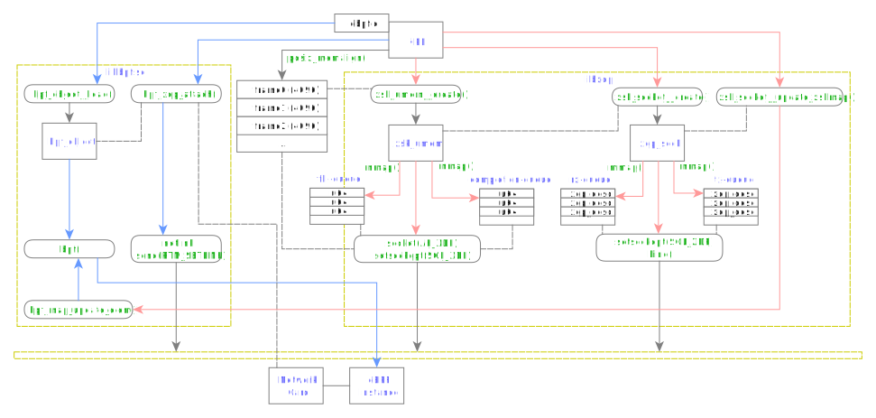
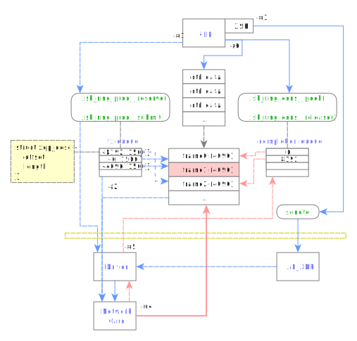
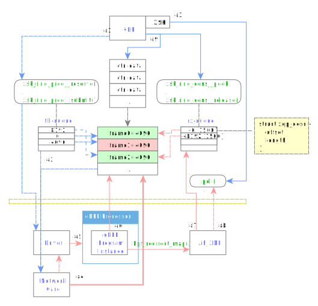

# Linux XDP/eBPF Programming Guide

> by Simon Zolin, Aug 2024

This tutorial explains how to perform network I/O operations using Linux XDP technology.
We'll learn BPF programming (in C language) and XDP sockets with the goal to create an ultra-fast ICMP ping program.
In the end, we'll discuss the BPF packet forwarding capabilities that we can utilize to redirect specific types of traffic to the userspace.

The XDP ping program that we're going to discuss here is a part of a larger project - [netmill](https://github.com/stsaz/netmill).
The most important files for us are `src/util/lxdp.h` and also those located inside `src/firewall` directory.
The (simplified) code parts in this tutorial are taken from there.
I think it's best if you find the relevant code parts in those files when reading this document -- most of the time real code is a little bit more complex than shown in the code fragments here.

**Warning!** Our program requires root privilieges, so you should either run it inside VM or be extra careful.

Contents:

* [XDP ping](#xdp-ping)
* [Write BPF program](#write-bpf-program)
* [Initialization](#initialization)
	* [Load BPF Program](#load-bpf-program)
	* [Set up XDP Socket](#set-up-xdp-socket)
* [Sending Data via XDP Socket](#sending-data-via-xdp-socket)
* [Receiving Data via XDP Socket](#receiving-data-via-xdp-socket)
* [XDP Socket I/O](#xdp-socket-io)
* [Crafting and Parsing ICMP Packets](#crafting-and-parsing-icmp-packets)
	* [Crafting](#crafting)
	* [Parsing](#parsing)
* [eBPF Program](#ebpf-program)
	* [Parsing packets inside eBPF program](#parsing-packets-inside-ebpf-program)
* [eBPF Forwarder](#ebpf-forwarder)
* [Conclusion](#conclusion)


## XDP ping

Simply speaking, *ping* is a utility that sends and receives ICMP echo request/reply packets.
You can exec `ping 127.0.0.1` on your PC and see how it works.
Normally it sends 1 packet per second and it is used to check whether remote machine is alive.
But we'll write a special version of ping that will be able to send many packets at once.
The algorithm of our ping program:
* Send multiple echo-request packets to the specified destination.
* Receive echo-reply packets and print their info to console.

An ICMP packet is a chunk of arbitrary data encapsulated into several layers of network protocols: Ethernet, IP, ICMP.
The key point here is that *we* are responsible for creating and parsing the whole packet with our own code - we put and get the packets directly to/from the network card.
And because we are bypassing the complex kernel networking subsystem, our program performs with maximum possible efficiency.
This is similar to using DPDK but here we use the actual Linux network card driver (or in other words, this is the same as using DPDK with XDP driver, only we do this manually with the purpose to learn and understand the underlying mechanics).
For ingress (RX) direction, however, this is not straightforward, because by default all network packets are processed by the kernel networking subsystem - and we want to avoid that.
And we do so with our own BPF program that filters the packets *before* the kernel can actually see them.
XDP program is a portable solution that works on every desktop Linux out of the box.

Anyway, here's what we need to achieve our goal:

* A BPF program that will reroute incoming ICMP packets to the userspace.
* An app that will load our BPF program into the network card driver, attach XDP socket to it and perform I/O on this socket.
* A remote machine that will respond to our ping requests.


## Write BPF program

The first step is to write our BPF program... but honestly, there's really no point in explaining the details here in this section because it's too early for that.
I think that it's best if we first walk through the higher level application code, and only then dive deeper into BPF.
So for now, we should just take the C code file `fw-xdp-ebpf.c` and build it with `make nmlfw-xdp-ebpf.o`.
The resulting object file is the one we will load into the network driver.
One important thing that is worth saying here is that a BPF program may allocate shared memory regions (called *maps*).
And when the BPF program is being loaded, the data in these maps is visible to both BPF program and userspace application code - that way our application may dynamically control the BPF program.

Just for reference, here's the simplest and harmless BPF program written in C that just passes all packets to the kernel:

```C
#include <linux/bpf.h>

SEC("prog")
int name(struct xdp_md *ctx)
{
	return XDP_PASS;
}

char _license[] SEC("license") = "GPL";
```

* `SEC()` instructs the compiler to place the function into a separate file section.
* `name()` is the name of our program function, which can be anything you like.
The driver calls this function once for each incoming packet.
* `XDP_PASS` is the return code that instructs the driver to pass the packet to the kernel.
* GPL license is needed to access all available BPF functions.

BPF programs are compiled to bytecode using LLVM tools:

```sh
clang -c -S -g \
	-O2 \
	-emit-llvm \
	BPF_PROGRAM.c -o BPF_PROGRAM.llvm
llc -march=bpf -filetype=obj \
	BPF_PROGRAM.llvm -o BPF_PROGRAM.o
```

The first command translates C code to LLVM bytecode.
The second one translates LLVM to BPF.


## Initialization

To prepare an XDP socket for userspace I/O, we must perform these steps:

* Load and attach our BPF program to a specific network card
* Allocate the memory region for network packets and I/O control data
* Create AF_XDP socket
* Link the socket descriptor with the BPF program instance



On the diagram:
* app with our BPF and userspace code.
* `libbpf.so` system library that provides functionality for using BPF programs.
* libxdp library code that takes the responsibility of setting up an XDP socket and shared memory buffers for us.
* The memory region that will actually hold the network packets data.
* The low layer - kernel, driver, hardware.

The next sections explain the initialization procedure step by step.


### Load BPF Program

Here we use libbpf that does all the hard work for us.

```C
	struct bpf_object *bpf_obj = bpf_object__open_file(obj_filename, NULL);

	struct bpf_program *bpf_prog = bpf_object__next_program(bpf_obj, NULL);
	bpf_program__set_type(bpf_prog, BPF_PROG_TYPE_XDP);

	bpf_object__load(bpf_obj);

	uint if_index = ...;
	uint f = XDP_FLAGS_UPDATE_IF_NOEXIST;
	bpf_xdp_attach(if_index, bpf_program__fd(bpf_prog), f, NULL);
```

* We use `bpf_object__open_file()` & `bpf_object__load()` to load our compiled BPF program into memory.  Internally this is done via `bpf()` syscall.
* Then we attach the program to a network interface with `bpf_xdp_attach()`.
Internally this is done by sending an `RTM_SETLINK` message via netlink socket.

Note: usually, if the functions that return pointers (e.g. `bpf_object__open_file()`) fail, they return `NULL`; and if the functions that return integer values fail (e.g. `bpf_object__load()`), they return a non-zero error code.

Alternatively, BPF programs can be loaded by using the system `ip` utility, but this method is more suitable for sysadmins and not developers.


### Set up XDP Socket

Preparing an AF_XDP socket is a complex procedure, but again we rely on a library (libxdp) to do the hard work for us.

* First we allocate a memory region for the network packet data.

	```C
	void *area;
	size_t cap = n_frames * XSK_UMEM__DEFAULT_FRAME_SIZE;
	posix_memalign(&area, getpagesize(), cap);
	```

	The region will be divided by the slots (or cells, or frames) of equal size.
	There will be a slot for each packet, and their size must be aligned to the system page size number.
	Thus, we use `posix_memalign()` to create the buffer.
	Note that usually the memory page size is 4096 bytes on Linux and the default slot size in libxdp is also 4096.

* Once the data region is allocated, we pass it to `xsk_umem__create()` function that creates a `struct xsk_umem` object, *fill-queue* and *completion-queue* (their purpose is explained later).

	```C
	struct xsk_umem *umem;
	struct xsk_ring_prod fq;
	struct xsk_ring_cons cq;

	struct xsk_umem_config xuc = {
		.fill_size = ...,
		.comp_size = ...,
		.frame_size = XSK_UMEM__DEFAULT_FRAME_SIZE,
	};
	xsk_umem__create(&umem, area, cap, &fq, &cq, &xuc);
	```

	Internally, it creates 2 regions with `mmap()`, creates an XDP socket with `socket(AF_XDP)` and links it with these regions with `setsockopt(SOL_XDP)`.

* Then, we pass our umem object to `xsk_socket__create()` that creates a `struct xsk_socket` object representing the XDP socket for us.

	```C
	struct xsk_socket *xsk;
	struct xsk_ring_cons rx;
	struct xsk_ring_prod tx;
	const char *if_name = ...;
	uint if_queue = 0;

	struct xsk_socket_config xsc = {
		.rx_size = ...,
		.tx_size = ...,
		.libbpf_flags = XSK_LIBBPF_FLAGS__INHIBIT_PROG_LOAD,
		.bind_flags = XDP_USE_NEED_WAKEUP,
	};
	xsk_socket__create(&xsk, if_name, if_queue, umem, &rx, &tx, &xsc);
	```

	It also creates 2 arrays *rx-queue* & *tx-queue* that will hold `struct xdp_desc` elements for RX & TX packet control data (explained later).
	Internally, `xsk_socket__create()` uses `mmap()` and `setsockopt(SOL_XDP)` syscalls for that.

	We specify the network interface name and its RX/TX queue index where we want to attach our XDP socket.
	Internally, the network interface name is converted to interface index and then passed to `bind()` syscall via `struct sockaddr_xdp`.
	As you can see, in this example we just attach to the first queue.
	However, if your network card is operating in multiqueue mode by default, then we won't be able to catch the incoming traffic that gets automatically distributed to other queues.
	If this is the case, you may use this command to set the network card's queues number to 1:

	```sh
	sudo ethtool -L INTERFACE combined 1
	```

	This way, all incoming traffic will always be directed to queue 0, and thus our program will catch all packets.

* Finally, we associate the XDP socket we've just created to our BPF program.

	```C
	struct bpf_map *m = ...;
	int fd = bpf_map__fd(m);
	xsk_socket__update_xskmap(xsk, fd);
	```

	We get a `BPF_MAP_TYPE_XSKMAP` map's descriptor with `bpf_map__fd()` and pass it to `xsk_socket__update_xskmap()`.
	The latter will call libbpf's `bpf_map_update_elem()` by itself, which will perform the update on the BPF program map via `bpf()`.

Now our userspace code is ready to read and write raw network packets to the network card via XDP socket.


## Sending Data via XDP Socket



A short description:

1. Preparing output packets vector.
2. Implicit visibility of the new output packets in TX queue.
3. Explicit signal for the new output packets in TX queue.
4. Network card sends packets through the physical link.
5. Driver marks the frames as completed.
6. App reclaims the transferred frames.

Now in details:

1. Preparing output packets vector.

	Here we fill in the tx-queue - through it we tell the driver which frames we want it to transmit.
	In this scenario we are the producer and the driver is consumer.

	```C
	struct xsk_ring_prod tx;
	...

	int xdp_socket_write_vector(..., uint n)
	{
		uint tx_idx;
		n = xsk_ring_prod__reserve(&tx, n, &tx_idx);
		if (!n) {
			...
		}

		for (uint i = 0;  i < n;  i++) {
			struct xdp_desc *xd = xsk_ring_prod__tx_desc(&tx, tx_idx++);
			xd->addr = ...;
			xd->len = ...;
		}

		xsk_ring_prod__submit(&tx, n);
		return n;
	}
	```

	Call `xsk_ring_prod__reserve()` on the tx-queue with the number of slots we want it to reserve for us.
	It returns the actual number of reserved slots (which can be less than what we asked) and the starting array index.
	Then we call `xsk_ring_prod__tx_desc()` for each slot and fill in the `struct xdp_desc` object so it points to the packet data we want to send.
	Now the most important note - `xdp_desc` objects must contain slot indexes/offsets rather than usual memory address/pointer.
	In the diagram above we send 3 packets of size 1500 that are located inside 4096 byte slot each: the first packet's `addr=8192` points to `frame2`, the second packet's `addr=0` points to `frame0`, and so on.
	The maximum `addr` value that we can set in an `xdp_desc` object is the number of bytes we allocated during initialization (minus one).
	Don't forget to increase the tx-queue array index on each iteration, otherwise you will just overwrite the previously set element.
	When all done, call `xsk_ring_prod__submit()` with the number of elements we have actually filled (which *must* be equal to the size we previously asked).

2. Implicit visibility of the new output packets in TX queue.
In case when the network traffic is being pushed consistently, network driver code will see the update of our tx-queue and will automatically start processing them when the right time comes.

3. Explicit signal for the new output packets in TX queue.

	If the #2 scenario is not the case, then we must issue an explicit signal to the kernel after we've added some more packets in tx-queue.
	We can do so with `sendto()` call on our XSK descriptor obtained from libxdp via `xsk_socket__fd()`.
	But how can we determine whether we should call `sendto()` or not?
	By calling `xsk_ring_prod__needs_wakeup()` that returns `1` if we should.
	Otherwise, we can save on a somewhat costly context switch per packet vector which is always a plus.

	```C
	struct xsk_socket *xsk;
	struct xsk_ring_prod tx;
	int xsk_fd = xsk_socket__fd(xsk);
	...

	int xdp_socket_flush()
	{
		if (!xsk_ring_prod__needs_wakeup(&tx))
			return 0;

		return sendto(xsk_fd, NULL, 0, MSG_DONTWAIT, NULL, 0);
	}
	```

4. Network card sends packets through the physical link.

	This is the best part - we do nothing while our packets are being sent by the driver and hardware.
	But the only thing that we *must not* do is rewriting the same data while it is being sent, because it will certainly corrupt the data integrity, and then these packets will be dropped on the receiving side.
	So in other words, after we call `xsk_ring_prod__submit()` at step #1, we transfer the data ownership to the kernel, and we promise that we won't modify this data further on.

5. Driver marks the frames as completed.

	After some packets were physically transferred, the network card driver adds their slot addresses to the completion-queue so we may mark those slots as available for reuse.
	As you may have noticed, the first packet scheduled for TX points to `frame2`, but the first completed packet in completion-queue points to `frame0`.
	I swapped them deliberately - this means that network cards may process packets out of order, and the diagram emphasizes this possibility.

6. App reclaims the transferred frames.

	When transferring large amounts of packets our app will quickly fill all available slots with some data to the point when there is no more available space for us to add more.
	After all, the number of slots we allocated during umem object initialization is limited and it can't grow larger.
	To address this, once in a while our app must reclaim the slots associated with the already transferred packets from the driver - we read their offsets from completion-queue.

	```C
	struct xsk_ring_cons cq;
	...

	int xdp_socket_cq_reclaim()
	{
		uint cq_idx;
		uint n = xsk_ring_cons__peek(&cq, 256, &cq_idx);
		if (!n)
			return 0;

		for (uint i = 0;  i < n;  i++) {
			uint64 i = *xsk_ring_cons__comp_addr(&cq, cq_idx++);
			...
		}
		xsk_ring_cons__release(&cq, n);
		return n;
	}
	```

	Now we use the consumer ring API from libxdp: get the number of available elements with `xsk_ring_cons__peek()`, get the index of each slot with `xsk_ring_cons__comp_addr()` and remove the elements we've just processed with `xsk_ring_cons__release()`.

	But why is `frame1` on the diagram colored in red?
	That's because our app hasn't yet seen this slot's address in completion-queue - it could be that the packet associated with this slot is not yet completely transferred by the hardware.
	Imagine that when we call `xsk_ring_prod__submit()` we also mark all slots with red - this means that the slots are busy and we shouldn't access this data.
	Then, when we see a particular slot address in completion-queue, we unmark it - this means the slot can be reused.
	In our case we didn't see `frame1` in completion-queue, and so it stays marked with red.

There's one thing left to explain here: `ctrl data` array on the diagram.
This is a memory region where we hold control data - mainly, the unmarked (ready for use) slot offsets.
We must keep track of all free slots so we can use them when we need to write new packets.
In our example XDP ping uses 2 separate regions for that: `struct lxdpbuf` and `struct _lxdp_offset` arrays.
Actually, we could also use the main packet data area for control data (we should tell the driver to read/write the data at a particular offset, reserving the header of each frame for our application), but working with separate arrays is easier although not so effective in terms of performance.


## Receiving Data via XDP Socket



In short:

1. Preparing the vector for input packets.
2. Implicit visibility of input vector.
3. Explicit signal to continue RX processing.
4. Network card writes the packet data.
5. Driver executes a BPF program.
6. BPF program processes a packet.
7. Driver fills in RX queue.
8. Kernel marks the XDP socket as ready for reading.
9. App reads packets from RX queue.

In details:

1. Preparing the vector for input packets.

	In order for the network card to start receiving packets for us we must first specify the memory region where packet data will be written - we do so by adding elements into the fill-queue using the already familiar ring producer API from libxdp.

	```C
	struct xsk_ring_prod fq;
	uint n_free;
	...

	uint xdp_socket_fq_reserve()
	{
		uint n = xsk_prod_nb_free(&fq, n_free);

		uint fq_idx;
		if (!xsk_ring_prod__reserve(&fq, n, &fq_idx)) {
			return 0;
		}

		for (uint i = 0;  i < n;  i++) {
			*xsk_ring_prod__fill_addr(&fq, fq_idx++) = ...;
		}

		xsk_ring_prod__submit(&fq, n);
		return n;
	}
	```

	We reserve the slots with xsk_ring_prod__reserve(), set their offsets with `xsk_ring_prod__fill_addr()` and submit the vector with `xsk_ring_prod__submit()`.

2. Implicit visibility of input vector.

	As with TX direction, if the network card consistently receives the packets for our application, then it may see the update on fill-queue automatically.

3. Explicit signal to continue RX processing.

	If #2 is not the case, then we must send an explicit signal for it to continue RX processing - we do so by calling `poll()` on our XDP socket descriptor.

	```C
		if (xsk_ring_prod__needs_wakeup(&fq)) {
			struct pollfd pl = {
				.fd = xsk_fd,
				.events = POLLIN | POLLOUT,
			};
			poll(&pl, 1, 0);
		}
	```

4. Network card writes the packet data.

	When transferring the ownership of frames to the kernel, we mark them with red color, meaning that we don't access them further on.

5. Driver executes a BPF program.

6. BPF program processes a packet.
Details on this subject are explained below in `eBPF Program` section.

7. Driver fills in RX queue.

	For each packet received by the network card, the driver will set control data inside rx-queue.
	rx-queue consists of `struct xdp_desc` elements where `addr` is the slot address associated with the packet and `len` is the number of bytes in this packet.

8. Kernel marks the XDP socket as ready for reading.

	App receives this signal with `epoll()`.
	Note that when the application code is busy with packet I/O, it's not always required to wait for events with `epoll()`.
	Instead, the app tries to read from rx-queue as soon as it can, and if it sees some new packets have arrived, it doesn't need to call `epoll()` at all - it just continues processing the new input packets.

9. App reads packets from RX queue.

	```C
	struct xsk_ring_cons rx;
	...

	int xdp_socket_read(..., uint n)
	{
		uint rx_idx;
		if (!(n = xsk_ring_cons__peek(&rx, n, &rx_idx)))
			return 0;

		for (uint i = 0;  i < n;  i++) {
			const struct xdp_desc *xd = xsk_ring_cons__rx_desc(&rx, rx_idx++);
			... = xd->len;
			... = xd->addr;
		}

		xsk_ring_cons__release(&rx, n);
		return n;
	}
	```

	We get the number of available packets with `xsk_ring_cons__peek()`, read control data with `xsk_ring_cons__rx_desc()` and remove them from the queue with `xsk_ring_cons__release()`.
	After receiving the packets, we mark the frames with green color - this means that the app now needs to perform the processing of these packets.


## XDP Socket I/O

A few general notes about I/O on XDP sockets:

* XDP socket can be attached only to 1 specific RX queue - it can not receive the traffic distributed for other queues.
The easiest solution to this is just limiting the number of queues to 1.
* BPF program acts as a packet filter and reroutes the input packets to the userspace.
* The kernel networking subsystem does not see any traffic unless we decide so in our BPF program.
* Application code is responsible for crafting and parsing all network protocol headers in each packet.
* Application code is responsible for keeping track of white/green/red slots in the main memory region.
* In best scenario, the actual network packet data is not copied anywhere - network card writes the data directly to the application-specified memory region.
But in case the driver doesn't support zero-copy mode, then the kernel will copy the data to the application automatically.
* When processing high load traffic there is no user-kernel context switching per packet vector, because the updates on all 4 queues by producer can be directly visible by consumer.


## Crafting and Parsing ICMP Packets

### Crafting

There are several things we need to do to prepare an ICMP packet for sending:

* Write payload data
* Write Ethernet header
* Write IP header
* Write ICMP header

```
=================   <-- packet data start
 Ethernet header
-----------------
 IPv4 header
-----------------
 ICMP header
-----------------
 payload data
=================   <-- packet data end
```

In case of ICMP echo-request packets that we are going to send here, payload can be just any random data, for example you can fill the 64 bytes of data with spaces or sequentially increased numbers.
First we write the payload data at the offset that equals to the sum of the sizes of Ethernet, IP and ICMP headers.
Then we have to concentrate on writing the protocol headers correctly, and this is not a trivial task, because we also must compute checksums and put them to the right place.

* Write Ethernet header.

	```C
	struct eth_hdr {
		u_char dst[6], src[6];
		u_char type[2];
	};
	```

	The user of our XDP ping must specify both Ethernet addresses via command-line, and so we just write them into `dst` and `src` fields.
	`type` field is the ID number of the next header, in our case it is IPv4, and so we write number `0x0800` in network byte order (big-endian).

	```C
		struct eth_hdr *h = ...;
		memcpy(h->dst, ..., 6);
		memcpy(h->src, ..., 6);
		*(ushort*)h->type = htons(...);
	```

* Write IP header.

	```C
	struct ipv4_hdr {
		u_char ihl :4
			, version :4;
		u_char ecn :2
			, dscp :6;

		u_char total_len[2];
		u_char id[2];
		u_char frag[2];
		u_char ttl;
		u_char proto;
		u_char crc[2];

		u_char src[4], dst[4];

		u_char opts[0];
	};
	```

	The first 4 fields (2 bytes) are constant - we just write `0x4500`.
	`total_len` is the number of bytes in IP header and all further data (in our case this is ICMP header + payload data).
	`id` is the packet sequence number.
	`ttl` is the maximum allowed number of network routers this packet can travel through, usually `64`.
	`proto` is the ID of next protocol, in our case it's ICMP header = `1`.
	`src` and `dst` are IP addresses - both are specified by the user.
	`crc` is the checksum of the IP header.

	```C
		struct ffip4_hdr *h = ...;
		*(ushort*)h = htons(0x4500);
		*(ushort*)h->total_len = htons(sizeof(struct ipv4_hdr) + data_len);
		*(ushort*)h->id = htons(...);
		*(ushort*)h->frag = 0;
		h->ttl = ...;
		h->proto = ...;
		*(uint*)h->src = *(uint*)...;
		*(uint*)h->dst = *(uint*)...;
		*(ushort*)h->crc = ipv4_checksum(h, 5, 0);
	```

	IPv4 header checksum is computed like so:

	```C
	uint ipv4_checksum(const void *ip4_hdr, uint ihl, uint with_checksum)
	{
		const uint *n = ip4_hdr;

		uint64 sum = n[0];
		sum += n[1];
		sum += (with_checksum) ? n[2] : (n[2] & 0xffff);
		sum += n[3];
		sum += n[4];

		if (ihl > 5) {
			for (uint i = 5;  i < ihl;  i++) {
				sum += n[i];
			}
		}

		sum = (sum >> 16) + (sum & 0xffff);
		sum = (sum >> 16) + (sum & 0xffff);

		return ~sum & 0xffff;
	}
	```

	Simply speaking, this is the algorithm that sums every 2 bytes (16-bit words) and produces the result as a 2-byte number.

* Write ICMP header.

	```C
	struct icmp_hdr {
		u_char type;
		u_char code;
		u_char crc[2];

		struct {
			u_char id[2];
			u_char seq[2];
		} echo;
	};
	```

	`type` is the ICMP message type - ICMP echo-request in our case = `8`.
	`crc` is the checksum of ICMP header plus payload data.
	`echo` numbers uniquely identify a particular packet within our app, with `echo.seq` sequentially increasing on each new echo-request packet we send.

	```C
		struct icmp_hdr *h = ...;
		h->type = ...;
		h->code = 0;
		*(ushort*)h->echo.id = htons(...);
		*(ushort*)h->echo.seq = htons(...);
		*(ushort*)h->crc = 0;
		*(ushort*)h->crc = ip_sum(h, sizeof(*h) + data_len);
	```

	ICMP checksum is similar to IPv4 checksum but the code can handle the data of arbitrary length:

	```C
	uint _ip_sum_reduce(uint64 sum48)
	{
		uint sum17 = (sum48 >> 32) + ((sum48 >> 16) & 0xffff) + (sum48 & 0xffff);
		return (sum17 >> 16) + (sum17 & 0xffff);
	}

	ushort ip_sum(const void *buf, uint len)
	{
		uint64 sum = 0;
		const uint *p = buf;
		while (len >= 4) {
			sum += *p++;
			len -= 4;
		}

		if (len >= 2) {
			sum += *(ushort*)p;
			p = (void*)((u_char*)p + 2);
			len -= 2;
		}

		if (len >= 1)
			sum += *(u_char*)p;

		return ~_ip_sum_reduce(sum);
	}
	```

After we've filled in the data for our packet, we may push it to tx-queue by adding a `struct xdp_desc` object to it.


### Parsing

Using the previously defined structures for protocol headers it is quite easy to parse the incoming packet data:

* Read `eth_hdr.type` field and ensure it's IPv4.
* Read `ipv4_hdr.proto` field and ensure it's ICMP.
* Read `icmp_hdr.type` field and ensure it's echo-reply packet.

```C
	const void *data = ...;

	const struct eth_hdr *eth = data;
	data += sizeof(*eth);

	if (eth->type != htons(0x0800) /*IPv4*/)
		continue;

	const struct ipv4_hdr *ip = data;
	data += sizeof(*ip);

	if (ip->proto != 1 /*ICMP*/)
		continue;

	const struct icmp_hdr *icmp = data;
	data += sizeof(*icmp);

	if (icmp->type != 0 /*ICMP_ECHO_REPLY*/)
		continue;
```

To be completely honest, we should also check `eth_hdr` and `ipv4_hdr` source/destination addresses, IP and ICMP checksums, ICMP's `echo.id` and `echo.seq` numbers and verify that the received payload matches the payload we sent, but this is not implemented in the current version of our XDP ping program.

Be careful when reading the data from input packets, because we can't guarantee that the protocol headers are correct - we may just receive some random data, after all.
For example, when accessing `icmp_hdr.type` field we may read trash if the packet is not large enough to hold the entire ICMP header.
To resolve this, we should verify that the packet length is equal or larger than the data at the particular offset we are trying to access.
That's why `struct xdp_desc` sets the `len` field for us for each packet.

```C
	const void *data = ...;
	const void *end = data + len;
	...

	const struct icmp_hdr *icmp = data;
	data += sizeof(*icmp);

	if (data > end)
		continue;

	if (icmp->type != 0 /*ICMP_ECHO_REPLY*/)
		continue;
```

Note the additional if-statement *before* accessing ICMP header fields.


## eBPF Program

Now this is the most important part - how to write a BPF network packet filter so that we can reroute the raw incoming packets to our application and bypass the kernel.

First, consider the simplest program that does so:

```C
#include <linux/bpf.h>

#define BPF_MAP_DECLARE(NAME, T, K, V, MAX) \
	struct { \
		int (*type)[T]; \
		K *key; \
		V *value; \
		int (*max_entries)[MAX]; \
	} NAME \
	SEC(".maps")

BPF_MAP_DECLARE(fw_xsk_map, BPF_MAP_TYPE_XSKMAP, __u32, __u32, 1);

SEC("prog")
int fw(struct xdp_md *ctx)
{
	return bpf_redirect_map(&fw_xsk_map, ctx->rx_queue_index, 0);
}

char _license[] SEC("license") = "GPL";
```

`bpf_redirect_map()` function redirects the current packet to XDP socket found in `fw_xsk_map` map.
A *map* in a BPF program is just a memory region shared between the BPF program and userspace apps.
Remember we used `xsk_socket__update_xskmap()` to assign XDP socket to our BPF program during initialization?
It actually wrote the socket descriptor in the memory region allocated for `fw_xsk_map` map, so the BPF program can read the descriptor from there and select the appropriate userspace process that must receive the packet.

Overall, the algorithm looks like this:

* Application creates and sets up an XDP socket.
* Application calls `xsk_socket__update_xskmap()` to assign it to a particular BPF program.
This is done by writing the socket descriptor into the memory region of BPF map of type `BPF_MAP_TYPE_XSKMAP`.
* BPF program calls `bpf_redirect_map()` that reads the socket descriptor from the map and writes the packet's control data to its rx-queue.
The socket is marked as signalled (ready for reading).
* Application calls `epoll()` and sees that the XDP socket is signalled.
* Application reads from rx-queue and sees the packet that BPF program had previously redirected to it.

So, with the program above we can reroute all traffic to our application, but as you can see the actual code in `fw-xdp-ebpf.c` is more complex.
That's because we don't want all traffic (the normal kernel networking will stop working otherwise) - we want only ICMP traffic.
And to do that we need our BPF program to parse Ethernet and IP protocol headers in each packet before we can decide whether to redirect the packet or to pass it to the kernel.
We already know how to parse the packet in userspace, and we need to do the same in BPF program.


### Parsing packets inside eBPF program

First we need the packet data region:

```C
int fw(struct xdp_md *ctx)
{
	const void *data = (void*)(long)ctx->data;
	const void *data_end = (void*)(long)ctx->data_end;
```

`data` is the pointer to Ethernet header, and `data_end` points to the next byte after the packet body.
Together they form the region that we can access for the current packet.
Double casting is necessary because the fields in `struct xdp_md` are of `__u32` (integer) type.

Next, we read Ethernet header:

```C
	const struct ethhdr *eth = data;
	data += sizeof(struct ethhdr);
	if (data > data_end)
		goto invalid; // no Ethernet header

	if (eth->h_proto == bpf_htons(ETH_P_IP)) {
		... // parse IPv4

	} else {
		goto pass;
	}
	...

pass:
	return XDP_PASS;

invalid:
	return XDP_DROP;
```

For our XDP ping we expect the IPv4 packet and pass everything else.
Note the `if (data > data_end)` check - there's no point in going further if the packet's Ethernet header is incomplete, and also we must not access the data outside of bounds.

Then, we read IPv4 header and get IP protocol number:

```C
	const struct iphdr *ip = data;
	data += sizeof(struct iphdr);
	if (data > data_end)
		goto invalid; // no IPv4 header

	data = (char*)ip + ip->ihl * 4;
	if (data > data_end)
		goto invalid; // incomplete IPv4 header

	if (ip->protocol == 1)
		goto match;
	...

match:
	return bpf_redirect_map(&fw_xsk_map, ctx->rx_queue_index, 0);
```

We expect IP protocol to be ICMP (i.e. `1`), and if the packet matches, we redirect it to our XDP socket.

Well, this is enough to implement XDP ping, but let's take this one step further.


## eBPF Forwarder

The problem with the above version of our BPF program is that it can only redirect ICMP packets, and it doesn't provide any ways for the userspace app to control what type of traffic it wants to receive.
For example, it will also redirect ICMP packets that are not destined to our XDP ping app.
In my opinion, it is much better to write a flexible BPF forwarder where we can set up the types of traffic that need redirection without rewriting BPF program code every time.
Such program can be used not just for ICMP but for other types of packets such as UDP and TCP.
For example, we could easily redirect all incoming DNS or HTTP traffic along with ICMP and pass everything else.
We'll need 3 rules then:

* Redirect ICMP type 0 (ICMP echo-reply)
* Redirect UDP to port 53
* Redirect TCP to port 80

We could also add a hundred more different rules here, but in the end we need to find a way to make this work with a single chunk of code.
So we need a hash table that will hold those rules, and our BPF program will match the current packet against the rules table.

```
IP-PROTO  ICMP-TYPE  L4-DST
===========================
    ICMP          0      --
     UDP         --      53
     TCP         --      80
```

But can we achieve this with just a single fetch operation on such hash table?
Short answer is no.
Take one more look at the 3 rules above.
There are actually 2 types of traffic there: one for specific L4 protocol (UDP or TCP) with specific destination port (53 or 80), the other is ICMP protocol with specific type (0); and the L4 protocol (the next after IPv4) determines which data we should use as a search key.
The straightforward approach of solving this would be to create 2 different hash tables and perform at most 2 lookup operations.
But then if we would add more different rules, e.g. "UDP from port 68" to catch all incoming traffic from DHCP clients, we will need the 3rd hash table...
And what if we'd want to add IP addresses into the picture?
Handling multiple such tables will not be convenient in BPF - how much code we'd have to write for each possible scenario!?


### Algorithm

The solution is to have a single hash table for the rules and an array that specifies the types of those rules.
Fetching from a hash table requires us to first prepare a key and then compute a hash number for that key.
But BPF environment already provides the means for using hash tables via `bpf_map_lookup_elem()` function, and thus we only need to prepare a key.
However, we can't use a single key to match our rule table, we need to perform the fetch operation up to 2 times (one for each rule type).
For our case of 3 rules shown above we have 2 rule types:

```
IP-PROTO  ICMP-TYPE  L4-DST
===========================
      XX         XX    ----  <-- this mask applies to "ICMP/0" rule
      XX         --    XXXX  <-- this mask applies to both "UDP:53" and "TCP:80" rules
```

Here `XX` means that we need to include this byte into account when preparing a key for the hash table; and `--` means that we don't need to include this byte.
IP protocol and ICMP type are single byte values; UDP/TCP port is a 2-byte value.
So how we can use this information to prepare an actual key?
By doing bitwise AND operation of the data from packet and the mask taken from here.


### Explanation

Now let's discuss the example.
The actual representation of our rules in hex numbers will look like this:

```
IP-PROTO  ICMP-TYPE  L4-DST
===========================
      01         00      00   (ICMP/1)
      11         00    0035   (UDP:53)
      06         00    0050   (TCP:80)
```

And the rule-types array:

```
IP-PROTO  ICMP-TYPE  L4-DST
===========================
      FF         FF    0000
      FF         00    FFFF
```

Suppose an ICMP echo-reply packet is being handled by our BPF program.
* First, it creates an all-in-one key with all 3 elements: IP proto, ICMP type and L4 destination port: `01 00 ABCD`.
* Then, it reads the first row from our rule-type array: `FF FF 0000`.
* Now it applies this mask over the key and gets the resulting key: `01 00 0000`.

	```
	01 00 ABCD
	         &
	FF FF 0000
	         =
	01 00 0000
	```

* Fetch operation on the rule table returns the matching first row, and BPF program redirects the packet to userspace.

Next, a DNS request packet arrives, and our BPF program begins handling it.

* It creates an all-in-one key with all 3 elements: `11 AB 0035`, where `AB` is the chunk of a UDP source port number.
* Then, it reads the first row from our rule-type array: `FF FF 0000`.
* It applies this mask over the key and gets the resulting key: `11 AB 0000`.

	```
	11 AB 0035
	         &
	FF FF 0000
	         =
	11 AB 0000
	```

* Fetch operation on the rule table doesn't succeed, and thus it continues the search.
* It reads the second row from our rule-type array: `FF 00 FFFF`.
* Now it applies this mask over the key and gets the resulting key: `11 00 0035`.

	```
	11 AB 0035
	         &
	FF 00 FFFF
	         =
	11 00 0035
	```

* Fetch operation on the rule table returns the matching second row, and BPF program redirects the packet to userspace.

I hope this gives you enough details about how this algorithm works.


### Coding: prepare and fill the maps

Now it's time to write some code.
The first step is to prepare the maps and fill them.

In BPF program we allocate 2 maps: hash table for the rules and array for the masks.

```C
struct fw_rule {
	__u8 reserved[3];
	__u8 ip_proto;
	__u8 l4_src_port[2], l4_dst_port[2];
};

BPF_MAP_DECLARE(fw_mask_map, BPF_MAP_TYPE_ARRAY,         __u32, struct fw_rule, 16);
BPF_MAP_DECLARE(fw_rule_map, BPF_MAP_TYPE_HASH, struct fw_rule,           __u8, 16);
```

In this example we allocate enough room only for 16 elements.

In userspace we get the pointers to those maps with `bpf_object__for_each_map()`:

```C
struct bpf_object *bpf_obj = ...;
struct bpf_map *map_masks;
struct bpf_map *map_rules;
...

	struct bpf_map *m;
	bpf_object__for_each_map(m, bpf_obj) {

		if (!strcmp(((void**)m)[1], "fw_mask_map"))
			map_masks = m;

		if (!strcmp(((void**)m)[1], "fw_rule_map"))
			map_rules = m;
	}
```

Add rule to the hash table:

```C
	struct fw_rule k = {};
	k.ip_proto = ...;
	*(ushort*)k.l4_src_port = ffint_be_cpu16(...);
	*(ushort*)k.l4_dst_port = ffint_be_cpu16(...);

	u_char v = 0;
	bpf_map__update_elem(map_rules, &k, sizeof(k), &v, sizeof(v), 0);
```

For each unique rule type add the corresponding mask to the masks array:

```C
	struct fw_rule v = {};
	v.ip_proto = (...) ? 0xff : 0;
	*(ushort*)v.l4_src_port = (...) ? 0xffff : 0;
	*(ushort*)v.l4_dst_port = (...) ? 0xffff : 0;

	uint k = ...;
	bpf_map__update_elem(map_masks, &k, sizeof(k), &v, sizeof(v), 0);
```


### Coding: use the maps from BPF program

First, prepare an all-in-one key:

```C
	...
	const struct iphdr *ip = data;
	...
	const void *l4 = data;
	...
	struct fw_rule k_rule = {};
	k_rule.ip_proto = ip->protocol;
	*(__u32*)k_rule.l4_src_port = *(__u32*)l4;
```

Then, perform the matching against the types and the rules tables:

```C
	for (__u32 k_mask = 0;  k_mask < 16;  k_mask++) {
		__u32 k = k_mask;
		struct fw_rule *mask;
		if (!(mask = bpf_map_lookup_elem(&fw_mask_map, &k)))
			break;

		struct fw_rule k_rule2;
		*(__u64*)&k_rule2 = *(__u64*)&k_rule & *(__u64*)mask;

		__u8 *rule;
		if ((rule = bpf_map_lookup_elem(&fw_rule_map, &k_rule2)))
			goto match;
	}
```

This approach gives a very high level of flexibility - a single BPF program can match any kind of traffic, and the rules can be changed dynamically during runtime.


## Conclusion

Finally, it's time to test if our XDP ping actually works.

```
sudo ./netmill ping inter eth1  hwsrc xx:xx:xx:xx:xx:xx  hwdst yy:yy:yy:yy:yy:yy  src 192.168.1.3  dst 192.168.1.1
...
 INFO xping: 64 bytes from 192.168.1.1: icmp_seq=1 ttl=64 time=1ms
 INFO xping: 64 bytes from 192.168.1.1: icmp_seq=2 ttl=64 time=1ms
 INFO xping: 64 bytes from 192.168.1.1: icmp_seq=3 ttl=64 time=1ms
 INFO xping: 64 bytes from 192.168.1.1: icmp_seq=4 ttl=64 time=1ms
```

We may also enable debug logging, which will print additional details about incoming packets.

```
sudo ./netmill -D ping inter eth1  hwsrc xx:xx:xx:xx:xx:xx  hwdst yy:yy:yy:yy:yy:yy  src 192.168.1.3  dst 192.168.1.1
...
 INFO firewall: Installing rule: ip:1  l4src:0  l4dst:0
 DEBUG xping: input: yy:yy:yy:yy:yy:yy -> xx:xx:xx:xx:xx:xx  type:0800  192.168.1.1 -> 192.168.1.3  id:e185  len:92  ttl:64  proto:1
 DEBUG xping: icmp type:0  id:1  seq:1
 INFO xping: 64 bytes from 192.168.1.1: icmp_seq=1 ttl=64 time=0ms
 DEBUG xping: input: yy:yy:yy:yy:yy:yy -> xx:xx:xx:xx:xx:xx  type:0800  192.168.1.1 -> 192.168.1.3  id:e3df  len:92  ttl:64  proto:1
 DEBUG xping: icmp type:0  id:1  seq:2
 INFO xping: 64 bytes from 192.168.1.1: icmp_seq=2 ttl=64 time=1ms
 DEBUG xping: input: yy:yy:yy:yy:yy:yy -> xx:xx:xx:xx:xx:xx  type:0800  192.168.1.1 -> 192.168.1.3  id:e532  len:92  ttl:64  proto:1
 DEBUG xping: icmp type:0  id:1  seq:3
 INFO xping: 64 bytes from 192.168.1.1: icmp_seq=3 ttl=64 time=1ms
```

Of course, the implementation discussed here is not a complete production-ready application - it is just for you to understand the underlying mechanism and maybe use this knowledge of XDP and BPF to write some real cool networking programs.
For example, the above BPF program with minor tweaking can be turned into a firewall that will protect your PC from DoS attacks by just replacing the `bpf_redirect_map()` call with `return XDP_DROP`.
In general, XDP is a very promising technology with a bright future: it's fast, flexible, safe, and it works on every Linux machine with any network card.
