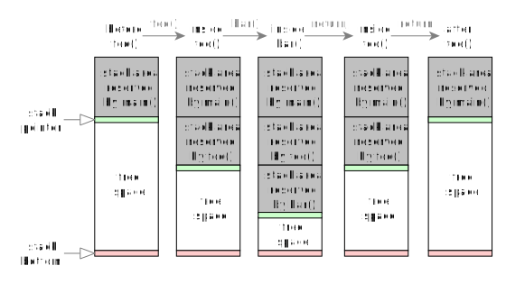
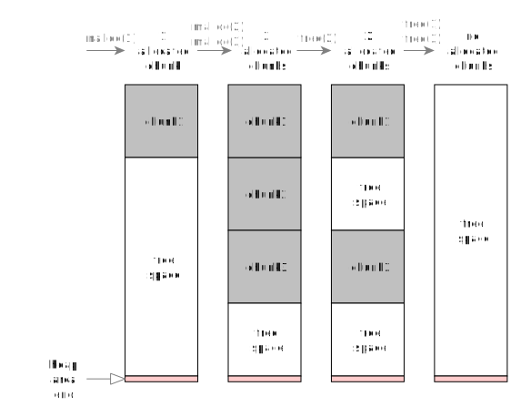

# Руководство по Кросс-Платформенному Системному Программированию для UNIX и Windows: Уровень 1

> by Simon Zolin, Mar 2023

С помощью этого учебного материала мы научимся писать кросс-платформенный код на Си, используя системные функции популярных ОС (Windows, Linux/Android, macOS и FreeBSD): управление файлами и файловый I/O, консольный I/O, пайпы (неименованные), запуск новых процессов.
Мы напишем свои небольшие вспомогательные функции поверх низкоуровневого системного АПИ (API), для того чтобы наш основной код, используя эти функции, мог работать на любой ОС без изменений.
Этот учебный материал — начального уровня.
Я делю сложные вещи на части, чтобы примеры кода здесь не были слишком заумными для тех, кто только что начал программировать на Си.
Мы обсудим различия между системными АПИ и разберёмся, как создать кросс-платформенный программный интерфейс, который скрывает все эти различия от пользователя этого интерфейса.

*Я давно уже пишу кросс-платформенный софт на Си и хочу поделиться своим опытом с другими.
Я надеюсь, что этот материал будет полезен тем, кто хочет изучить системное программирование или, например, поможет тебе перенести существующее приложение с одной ОС на другую.*

Содержание:

* [Введение](#введение)
* [Основные проблемы программирования под разные ОС](#основные-проблемы-программирования-под-разные-ос)
* [О примерах кода](#о-примерах-кода)
* [Выделение Памяти](#выделение-памяти)
	* [Стэк-память](#стэк-память)
	* [Хип-память](#хип-память)
	* [Недостаточно памяти](#недостаточно-памяти)
	* [Использование хип-буфера](#использование-хип-буфера)
	* [Функции хип-памяти в Windows](#функции-хип-памяти-в-windows)
	* [Функции хип-памяти в UNIX](#функции-хип-памяти-в-unix)
	* [Аллокация объектов в хип-памяти](#аллокация-объектов-в-хип-памяти)
	* [Реаллокация буфера](#реаллокация-буфера)
	* [Результат](#результат)
* [Детектор во время компиляции](#детектор-во-время-компиляции)
* [Стандартный I/O](#стандартный-io)
	* [Простая эхо-программа](#простая-эхо-программа)
	* [Стандартный I/O в UNIX](#стандартный-io-в-unix)
	* [Стандартный I/O в Windows](#стандартный-io-в-windows)
	* [Стандартный I/O: редирект](#стандартный-io-редирект)
	* [Результат](#результат)
* [Кодировки и конвертация данных](#кодировки-и-конвертация-данных)
	* [Результат](#результат)
* [Файловый I/O: простая программа файл-эхо](#файловый-io-простая-программа-файл-эхо)
	* [Файловый I/O в UNIX](#файловый-io-в-unix)
	* [Файловый I/O в Windows](#файловый-io-в-windows)
	* [Функции I/O и курсоры](#функции-io-и-курсоры)
	* [Файловый "Сик" и "Транкейт"](#файловый-сик-и-транкейт)
	* [Файловый "Сик" и "Транкейт" в UNIX](#файловый-сик-и-транкейт-в-unix)
	* [Файловый "Сик" и "Транкейт" в Windows](#файловый-сик-и-транкейт-в-windows)
	* [Результат](#результат)
* [Системные ошибки](#системные-ошибки)
	* [Системные ошибки в UNIX](#системные-ошибки-в-unix)
	* [Системные ошибки в Windows](#системные-ошибки-в-windows)
	* [Установка последней системной ошибки](#установка-последней-системной-ошибки)
	* [Common System Error Codes](#common-system-error-codes)
	* [Результат](#результат)
* [Управление файлами](#управление-файлами)
	* [Создать/переименовать/удалить файлы и каталоги](#создатьпереименоватьудалить-файлы-и-каталоги)
	* [Возвращать 0 в случае успеха - лучше](#возвращать-0-в-случае-успеха-лучше)
	* [Создание/переименование/удаление файлов и каталогов в UNIX](#созданиепереименованиеудаление-файлов-и-каталогов-в-unix)
	* [Создание/переименование/удаление файлов и каталогов в Windows](#созданиепереименованиеудаление-файлов-и-каталогов-в-windows)
	* [Результат](#результат)
	* [Свойства файла](#свойства-файла)
	* [Свойства файла в UNIX](#свойства-файла-в-unix)
	* [Свойства файла в Windows](#свойства-файла-в-windows)
	* [Результат](#результат)
* [Листинг каталога](#листинг-каталога)
	* [Различные подходы к проектированию](#различные-подходы-к-проектированию)
	* [Листинг каталога (продолжение)](#листинг-каталога-продолжение)
	* [Листинг каталога в UNIX](#листинг-каталога-в-unix)
	* [Листинг каталога в Windows](#листинг-каталога-в-windows)
	* [Результат](#результат)
* [Неименованные пайпы](#неименованные-пайпы)
	* [Неименованные пайпы в UNIX](#неименованные-пайпы-в-unix)
	* [Неименованные пайпы в Windows](#неименованные-пайпы-в-windows)
	* [Результат](#результат)
* [Запуск других программ](#запуск-других-программ)
* [Запуск других программ в UNIX](#запуск-других-программ-в-unix)
* [Запуск других программ в Windows](#запуск-других-программ-в-windows)
	* [Результат](#результат)
* [Запуск других программ и чтение их вывода](#запуск-других-программ-и-чтение-их-вывода)
	* [Запуск других программ и чтение их вывода в UNIX](#запуск-других-программ-и-чтение-их-вывода-в-unix)
	* [Запуск других программ и чтение их вывода в Windows](#запуск-других-программ-и-чтение-их-вывода-в-windows)
	* [Результат](#результат)
* [Получение текущей даты/времени](#получение-текущей-датывремени)
	* [Получение информации о местном часовом поясе](#получение-информации-о-местном-часовом-поясе)
	* [Результат](#результат)
* [Приостановка выполнения программы](#приостановка-выполнения-программы)
	* [Результат](#результат)
* [Заключение](#заключение)


## Введение

Есть одна неудобная вещь в программировании на Си — поддержка нескольких ОС, ведь каждая ОС имеет свой оригинальный системный АПИ.
Например, если мы хотим, чтобы наше приложение работало на Linux и Windows, нам нужно будет написать 2 разные программы на Си.
Как мы можем решить эту проблему:

* Переключиться на другой язык (Go, Python, Java и т.д.), который предоставляет нам (почти) полную кросс-платформенную системную библиотеку.
Однако, не для всех возможных сценариев это будет правильным решением.
Что, если мы хотим написать высокопроизводительный сервер, как nginx?
Нам абсолютно необходим Си.
Что, если нам нужно строить логику нашей программы вокруг нескольких низкоуровневых сишных библиотек?
Да, конечно мы можем сами написать необходимую обвязку этой библиотеки для другого языка, но вместо этого мы можем просто взять и использовать Си.
А что, если мы хотим, чтобы наше приложение работало на встроенных системах с ограниченными аппаратными ресурсами (ЦП, память)?
Опять же, нам нужен Си.

* Вставлять препроцессорные ветки `#if` в наш код, чтобы компилятор использовал отдельную логику для каждой ОС.
Основная проблема с этим подходом заключается в том, что такой код выглядит всё таки некрасиво.
Когда у всех наших функций по несколько веток `#ifdef` внутри, такой код становится слишком сложно читать и поддерживать.
При этом увеличивается вероятность, что каждая новая правка может сломать что-то где-то там, где мы меньше всего этого ожидаем.
Да, иногда препроцессорная ветка - прямо таки палочка-выручалочка, но мы никогда не должны злоупотреблять этой технологией, тут нужно соблюдать баланс.

* Использовать **библиотеку, которая скрывает от нас принципиальные различия между системными АПИ**.
Другими словами, мы используем библиотеку, которая предоставляет нам простой в использовании кросс-платформенный интерфейс.
А пользовательский код, построенный поверх этой библиотеки, просто компилируется и работает на разных ОС.
Это и является главной темой данного учебника.


## Основные проблемы программирования под разные ОС

Первое, что нам надо обсудить здесь — чем на самом деле различаются системные АПИ в разных ОС, и какие проблемы нам приходится решать при написании кода под разные ОС.

* Самое главное: Linux, macOS и FreeBSD — всё это UNIX-системы.
В большинстве случаев у них похожий системный АПИ (т.е. POSIX), и это значительно сокращает время, необходимое для переноса кода Си между ними.
К сожалению, иногда системные функции с одним и тем же именем (напр. `sendfile()`) имеют разные параметры.
Иногда флажки, которые мы передаём функциям, ведут себя иначе (напр. `O_NONBLOCK` для сокетов).
Иногда код, написанный для Linux, не может быть легко перенесён на другую ОС, из-за того что в Linux есть много специфичных системных вызовов, которых просто нет в macOS (напр. `sem_timedwait()`).
Мы должны быть очень аккуратны при прямом использовании системных функций в нашем коде.
Держать всегда в голове все эти детали - трудно, поэтому всегда хорошо оставлять комментарии где-нибудь в коде, чтобы мы могли быстро вспомнить эти нюансы по прошествии времени.
В итоге, нам нужна тонкая прослойка между кодом нашего приложения и системным АПИ.
Кросс-платформенная библиотека — это именно тот программный слой, который будет решать проблемы, что я только что описал.
В то же время, скрывая от нас детали реализации для каждой ОС, хорошая библиотека должна также описывать эти различия в своей документации, чтобы мы понимали, как именно она будет работать в конкретной ОС.
Иначе мы можем получить код, который на некоторых системах работает плохо или вовсе неправильно.

* Продолжая упомянутую выше проблему совместимости АПИ, давай предположим, что наше приложение уже использует какую-нибудь Linux-специфичную функцию, но мы хотим, чтобы оно работало ещё и на macOS.
Нам нужно решить: 1) должны ли мы написать аналогичную функцию вручную для macOS или 2) должны ли мы переосмыслить наш подход на более высоком уровне.
Вариант 1 хороший, но здесь нужно быть осторожным: например, если мы попытаемся реализовать нашу собственную `sem_timedwait()` для macOS, мы скорее всего будем использовать `pthread_cond_timedwait()` для эмуляции её логики, но тогда мы должны быть уверены, что всё остальное (включая обработку сигналов UNIX) работает аналогично реализации в Linux.
И даже если так, а как насчёт именованных семафоров, будет ли наша функция их поддерживать?
И этот код нам самим ещё придётся поддерживать...
На мой взгляд, иногда лучше просто переделать логику приложения и использовать какое-то альтернативное решение, если есть возможность.

* Теперь поговорим о Windows.
Windows — это не UNIX, её АПИ полностью отличается почти во всех аспектах, включая (но не ограничиваясь): файлы, сокеты, таймеры, процессы и т.д.
И хотя Microsoft через свою Си-рантайм ("C runtime") библиотеку предоставляет функции (напр. `_open()`), которые аналогичны POSIX, их поведение всё равно может не полностью совпадать с тем что в UNIX.
Имей в виду, что ты можешь столкнуться с некоторыми неожиданными проблемами, если не прочиташь 100% документации из Microsoft Docs и не поймёшь, как именно такие функции работают внутри.
Теоретически `_open()` должен быть простой тонкой оболочкой для `CreateFileW()`, но я не буду в этом уверен, пока не увижу код.
Однако, зачем вообще пытаться учиться правильно использовать все эти функции-обёртки, когда у нас уже есть очень хорошо расписанная и чёткая документация для всех функций WinAPI низкого уровня (напр. `CreateFileW()`)?
Поэтому я в своей работе всегда по возможности стараюсь использовать функции WinAPI напрямую, а не какие-то обёртки вокруг них.

* В UNIX используется символ `/` для путей к файлам, а в Windows обычно используется `\`.
Однако большинство функций WinAPI также принимают и `/` в путях и работают при этом корректно.
Поэтому можно сказать, что Windows поддерживает как `\`, так и `/` в качестве символа разделителя пути, но просто помни, что `/` может не сработать в некоторых редких случаях.

* При компиляции кода для разных платформ возможен конфликт имён.
Иногда наш совершенно корректный код не компилируется на другой ОС из-за очень странной ошибки компиляции, которую поначалу довольно сложно понять.
Это может произойти например когда мы используем какое-то имя переменной или функции в своём коде, но это имя уже используется в одном из системных заголовочных файлов, которые мы подключаем через `#include`.
Проблема усугубляется, если это имя используется препроцессором - в этом случае компилятор может сойти с ума, и его сообщения об ошибках мало чем помогут.
Чтобы предотвратить эту проблему, я рекомендую тебе всегда использовать префикс, уникальный для твоего проекта.
Некоторое время назад я начал использовать префикс `ff` для всех имён в коде моей библиотеки, и с тех пор у меня не было ни одного конфликта в именах.
nginx, например, везде использует префикс `ngx_`, так что это обычная практика для проектов Си.
Заметь, что `namespace`-ы в Си++ не сильно помогают в решении описанной выше проблемы, потому что мы по-прежнему не можем использовать то, что уже зарегистрировано через `#define` в системном заголовочном файле - всё равно сначала нужно сделать `#undef`.

	Стоит сказать, что если ты компилируешь свой код для Windows с помощью MinGW, помни, что инклуд файлы MinGW не идентичны файлам, поставляемым в комплекте с Microsoft Visual Studio.
	Могут быть дополнительные конфликты вокруг глобальных имен — это будет зависеть от того, какие инклуды используются.

* Ещё одно различие между системными функциями Windows и UNIX заключается в кодировке текста.
Когда я хочу открыть файл с именем, содержащим нелатинские символы, мне нужно использовать правильную кодировку текста, иначе система меня не поймёт и либо откроет неправильный файл, либо вернёт ошибку "файл не найден".
По умолчанию в системах UNIX обычно используется кодировка UTF-8, а в Windows — UTF-16LE.
И уже одно только это отличие мешает нам удобно использовать системные функции напрямую из нашего кода.
Если мы попытаемся это сделать, то получим сплошные `#ifdef` внутри наших функций.
Поэтому наша библиотека должна не только обрабатывать имена и параметры системных АПИ-функций, но и автоматически преобразовывать текст в правильную кодировку.
Я использую UTF-8 для своих проектов и всем рекомендую делать так же.
UTF-16LE неудобен во многих смыслах, включая и тот факт, что он гораздо менее популярен среди текстовых документов, которые ты можешь найти в Интернете.
UTF-8 почти всегда лучше и к тому же более популярен.

* Ещё одно отличие UNIX от Windows — это юзерспейс (userspace) библиотеки, которые мы используем для доступа к системе.
В системах UNIX наиболее важная - либ-си (libc).
В Linux наиболее широко используемой libc является *glibc*, но есть и другие реализации (напр. *musl libc*).
libc — это прослойка между нашим кодом и ядром.
В этом руководстве все системные функции UNIX, которые мы используем, реализованы внутри libc.
Обычно libc передаёт наши запросы в ядро ОС, но иногда и обрабатывает их сама.
Без libc нам пришлось бы писать гораздо больше кода для каждой ОС (выполняя системные вызовы самостоятельно), а это было бы очень сложно, отняло бы много времени и всё равно не дало бы нам никаких реальных преимуществ.
Поэтому мы остановимся на уровне выше libc и тут разместим наш тонкий кросс-платформенный слой, нам не нужно копать глубже.

	В Windows есть библиотека `kernel32.dll`, которая предоставляет функции для доступа к системе.
	kernel32 — это прослойка между юзерспейсом и ядром.
	Как и в случае с libc для UNIX, без kernel32 нам пришлось бы писать намного больше кода (над `ntdll.dll`), и как правило у нас нет необходимости этого делать.

Так что в целом при написании кросс-платформенного кода нам приходится учитывать довольно много деталей одновременно.
Использование вспомогательных функций или библиотек необходимо, чтобы избежать слишком сложного кода с большим количеством `#ifdef`.
Нам нужно найти хорошую библиотеку или написать свою.
Но в любом случае мы должны полностью понимать, что происходит под капотом, и как код нашего приложения взаимодействует с системой, какие системные вызовы мы используем и как.
Когда мы двигаемся вперёд по такой методике, мы расширяем свои знания в области разработки ПО, а также пишем в итоге более качественный софт.


## О примерах кода

Прежде чем мы начнём углубляться в процесс, несколько слов о примерах кода, которые мы будем обсуждать в этом документе.

* Мы пишем код в функции `main()` один раз, и он работает на всех ОС.
Это ключевая идея.
* Код в `main()` использует функции-обёртки для каждого семейства ОС - именно здесь обрабатывается вся сложность и все различия системных АПИ.
* Я намеренно уменьшаю эти функции-обёртки в размере и сложности для этого руководства — я включаю только тот минимум, который необходим для конкретного примера, не более того.
* Приведённые здесь примеры никоим образом не являются реальным и готовым к использованию кодом.
Я делаю их простыми и прямолинейными.
Моя идея в том, что сначала нужно понять ключевой механизм работы с системными функциями и как располагать кросс-платформенный код.
Тебе пришлось бы читать гораздо больше кода, а мне было бы сложнее объяснить всё сразу, если бы я выбрал другой подход.
* Чтобы собрать файлы примеров в UNIX, просто запусти `make`.
Бинарные файлы будут созданы в том же каталоге.
Тебе необходимо установить `make` и `gcc` или `clang`.
В Windows необходимо скачать пакет MinGW и установить его, а затем запустить `mingw64-make.exe`.
* Если ты захочешь проанализировать полную и настоящую реализацию каждой функции-обёртки, которую мы здесь обсуждаем, ты всегда можешь посмотреть/склонировать мои библиотеки [ffbase](https://github.com/stsaz/ffbase) и [ffsys](https://github.com/stsaz/ffsys), они полностью свободные.
Для твоего удобства я помещаю прямую ссылку на них после каждого раздела в этом руководстве.
* При чтении примеров советую также ознакомиться с официальной документацией по каждой функции.
Для систем UNIX есть ман-страницы (man-pages), а для Windows — сайт Microsoft Docs.


## Выделение Памяти

Самое главное, что нам нужно при написании программ — уметь выделять память под наши переменные и массивы.
Мы можем использовать стэковую память для небольших операционных данных или же динамически выделять большие области памяти, используя хип-память ("heap").
libc предоставляет для этого простой интерфейс, и мы разберёмся как его использовать.
Но перед этим мы должны понять, чем стэк-память отличается от хип-памяти.

### Стэк-память

Стэк-память — это буфер, выделяемый ядром для нашей программы до того момента, как она начнёт выполняться.
Сишная программа резервирует ("выделяет") область памяти на стэке следующим образом:

```C
	int i; // зарезервировать +4 байта на стэке
	char buffer[100]; // зарезервировать +100 байт на стэке
```

В процессе компиляции компилятор резервирует некоторое пространство стэка, необходимое для правильной работы функции.
Он помещает парочку процессорных инструкций в начало каждой функции.
Эти инструкции вычитают необходимое количество байт из указателя на область стэка (stack pointer).
Компилятор также добавляет некоторые инструкции, которые восстанавливают указатель стэка в предыдущее состояние, когда наша функция завершает работу — таким образом мы освобождаем область стэка, зарезервированную нашей функцией, чтобы эта же область могла использоваться какой-либо другой функцией после нас.
Это также означает, что наша функция не может надёжно возвращать указатели на любой буфер, выделенный на стэке, потому что та же самая область стэка может быть повторно использована/перезаписана после нас.

Предположим, у нас есть такая программа:

```C
void bar()
{
	int b;
	return;
}

void foo()
{
	int f;
	bar();
	return;
}

void main()
{
	int m;
	foo();
}
```

Для приведённой выше программы вот 5 состояний того, как будет выглядеть наша стэковая память во время выполнения программы (очень упрощённо):



1. Мы внутри `main() `функции в строке `foo();`.
Компилятор уже зарезервировал область на стэке для нашей переменной `m`, она показана серым цветом.
Зелёная линия — это текущий указатель стэка, который перемещается вниз, когда мы резервируем ещё несколько байт на стэке, и перемещается вверх, когда мы освобождаем эти зарезервированные области.
Мы вызываем `foo()`.
2. Мы находимся внутри функции `foo()`, и теперь больше места на стэке зарезервировано для нашей переменной `f`.
Все данные, зарезервированные под `main()`, хранятся в области стэка над нами.
Мы вызываем `bar()`.
3. Внутри `bar()` для хранения нашей переменной `b` используется ещё одна область на стэке.
При этом, области, зарезервированные всеми родительскими функциями, сохраняются.
Мы возвращаемся из функции через `return`.
В этот момент область стэка, зарезервированная для переменной `b`, сбрасывается и теперь может быть повторно использована другой функцией после нас.
4. Мы вернулись обратно в `foo()` и теперь возвращаемся и из неё.
То же самое теперь происходит с областью стэка `foo()` - область, зарезервированная для нашей `f`, сбрасывается.
5. Мы вернулись в `main()`.
Теперь всё что у нас осталось на стэке в данный момент - только область для переменной `m`.

Стэк-память ограничена, и её размер не очень большой (максимум несколько мегабайт).
Если ты зарезервируешь очень большое количество байт на стэке, твоя программа может запросто упасть, в момент когда ты попытаешься обратиться к области за пределами стэк-памяти (т.е. области ниже красной линии).
И мы не можем добавить больше пространства нашему стэку во время работы нашей программы.
Кроме того, небрежное использование стэка для массивов и строк может привести к серьёзным проблемам с безопасностью (переполнение стэка, используемое злоумышленником, может легко привести к выполнению произвольного кода).

### Хип-память

Нам нужен механизм, который позволит нам динамически выделять большие буферы памяти и изменять их размер - для этого мы воспользуемся хип-памятью.
Чем хип-память отличается от стэка:

* Мы можем без боязни выделять большой хип-буфер, пока на то есть достаточно системных ресурсов.
* Мы можем изменить размер хип-буфера в любое время.
* Наша функция может безопасно возвращать указатель на любой хип-буфер, и эта область не будет автоматически повторно использоваться/перезаписываться следующей выполняемой функцией.

3 шага, как использовать динамическую память:

* Мы просим libc выделить нам немного памяти.
libc, в свою очередь, просит ОС зарезервировать область памяти из ОЗУ или свопа (swap).
* Затем мы можем использовать этот буфер столько времени, сколько нам нужно.
* Когда он нам больше не нужен, мы освобождаем область памяти, выделенную под наш буфер, уведомляя об этом libc.
Тот возвращает буфер обратно в ОС, чтобы она потом могла предоставить ту же область памяти какому-то другому процессу.

Алгоритм libc обычно достаточно умный и не будет пробиваться в ядро каждый раз, когда мы выделяем или освобождаем хип-буферы.
Вместо этого он может зарезервировать один большой буфер и разбить его на куски, а затем вернуть эти куски нам по отдельности.
Кроме того, когда наша программа освобождает небольшой буфер, это не обязательно означает, что он возвращается обратно в ядро, он вначале остаётся в кэше внутри libc.

Предположим, у нас есть такой код:

```C
#include <stdlib.h>

void main()
{
	void *m1 = malloc(1);
	void *m2 = malloc(2);
	void *m3 = malloc(3);
	free(m2);
	free(m1);
	free(m3);
}
```

Вот как может выглядеть реальная область хип-памяти (очень упрощенно):



1. Когда мы выделяем новый блок (chunk), libc просит ОС выделить для нас область памяти.
Затем libc резервирует необходимое количество места и возвращает нам указатель на этот кусок.
2. Когда мы запрашиваем дополнительные буферы, libc находит свободные фрагменты внутри всей уже выделенной области и возвращает нам новые указатели.
libc не будет просить ОС выделить нам больше памяти до тех пор, пока это действительно не станет необходимо.
3. Когда мы просим освободить буфер, libc просто помечает его как "свободный".
Остальные буферы остаются как есть.
4. После освобождения всех буферов libc может вернуть область памяти обратно ОС (но не обязательно).

Как libc выделяет или освобождает буферы, как находит свободный блок и т.д. — это для нас не имеет особого значения, у нас есть простой интерфейс, который скрывает от нас всю сложность.

### Недостаточно памяти

Когда мы просим ОС выделить для нас объём памяти, превышающий физически доступный объём в данный момент, ОС может вернуть нам ошибку, указывающую на то, что наш запрос на такой большой буфер не может быть исполнен.
В этой ситуации, если мы пишем хорошее для юзера приложение, нам наверное следует напечатать красивое сообщение об ошибке и спросить юзера, что делать дальше.
Однако на самом деле это случается так редко, и требуется слишком много усилий для правильной обработки случаев нехватки памяти, что обычно приложения просто выводят сообщение об ошибке, а затем вылетают.
Однако было бы очень досадно, если бы пользователь потерял несколько часов несохранённой работы (напр. несохранённый текстовый файл) при использовании нашего приложения.
Нам требуется соблюдать осторожность.

Когда Linux резервирует для нас какую-либо область памяти, он не сразу резервирует весь этот объём на физической памяти.
Проверь и убедись сам, что объём реальной памяти, потребляемой процессом, который только что выделил буфер размером 4 ГБ, сильно не меняется.
Linux предполагает, что хотя наш процесс может запросить большой буфер, в действительности нам может не понадобиться столько места.
Пока мы не запишем данные в эту область памяти, блоки физической памяти не будут выделены для нас.
Это означает, что несколько процессов, параллельно работающих в системе, могут запрашивать большие блоки памяти, и все их запросы будут удовлетворены, даже если физической памяти недостаточно для хранения всех их данных.
Но что тогда произойдёт, если все процессы сразу начнут записывать в свои буферы настоящие данные?
Подсистема Out-Of-Memory (OOM, "недостаточно памяти"), работающая внутри ядра, просто убьёт один из них, когда будет достигнут предел физической памяти.
А что тогда это означает для нас?
Просто помни, что когда мы выделяем большие буферы в Linux, наш процесс иногда может быть принудительно убит, если мы попытаемся заполнить эти буферы данными.
Обычно наши приложения должны уважать все другие приложения, работающие в данный момент на системе, и если нам требуется очень большой объём памяти для нашей работы, мы должны быть осторожны, чтобы избежать таких ситуаций OOM, особенно если у юзера есть несохранённая работа.

### Использование хип-буфера

Хорошо, теперь давай рассмотрим пример, который выделяет буфер, а затем сразу же освобождает его.

[heap-mem.c](samples-sys/heap-mem.c)

Прокрути вниз до нашей функции `main()`.
Вот строка, где мы выделяем буфер размером 8МБ:

```C
	void *buf = heap_alloc(8*1024*1024);
```

Мы вызываем нашу собственную функцию `heap_alloc()` (мы обсудим её реализацию ниже) с одним параметром - количеством байт, которое мы хотим выделить.
Результатом является указатель на начало этого буфера.
Это означает, что у нас есть область памяти размером 8МБ `[buf..buf+8M)`, доступная для чтения и записи.
Обычно этот указатель уже выровнен по крайней мере до 4 или 8 байт (в зависимости от архитектуры процессора).
Например, мы можем напрямую разадресовывать указатели `short*` или `int*` по этому адресу даже на 32-битном ARM:

```C
	int *array = heap_alloc(8*1024*1024);
	array[0] = 123; // должно нормально работать на ARM
```

Ещё один важный момент: никто не мешает нам читать или даже записывать какие-то данные за границы буфера.
Например, в нашем примере мы действительно можем попытаться записать в этот буфер более 8МБ данных, и скорее всего нам это удастся.
Однако в любой момент может произойти авария, потому что мы случайно можем перезаписать данные соседних буферов.
После этого может быть повреждена вся область выделенной нам хип-памяти.
А если мы попытаемся получить доступ к данным ещё дальше, мы можем перейти ту критическую линию, где начинается неразмеченное пространство памяти (красная линия на схемке).
В этом случае процессор пошлёт сигнал на исключение, и наша программа упадёт.
Таким образом, это означает, что при работе с буферами в Си мы всегда должны передавать их размер в качестве параметра функции (или внутри `struct`), чтобы ни одна из наших функций не могла получить доступ к данным за пределами буфера.
Если ты пишешь программу, и она периодически случайно падает, то скорее всего, твой код перезаписал где-то буфер на хипе или на стэке.
Если это так, ты можешь попробовать скомпилировать своё приложение с параметром `-fsanitize=address`, после чего программа в случае такого сбоя напечатает нормальное сообщение о том, где ты допустил ошибку.
Обычно это помогает.

Следующая строка:

```C
	assert(buf != NULL);
```

Эта операция принудительно уронит нашу программу, если буфер не будет выделен из-за того, что недостаточно системной памяти.
В простых программах нам действительно больше нечего делать, нам этот буфер очень необходим...
А вот в серверной программе в этом случае не надо падать, а вместо этого писать предупреждение об этой ситуации в лог-файл и потом просто продолжить нормальную работу.
В конечном счёте, мы решаем, что делать.
Программы на Си очень гибкие, когда случаются неожиданные вещи, наша программа имеет почти абсолютный контроль над ресурсами.
Многие другие языки программирования не обеспечивают такой гибкости, они просто завершат процесс, и при этом не будет возможности сохранить работу юзера или сделать какие-то другие важные вещи перед выходом.

Предположим, что мы какое-то время используем наш буфер и делаем какую-то важную работу (хотя здесь в нашем примере на самом деле делать нечего).
Затем мы освобождаем буфер, возвращая выделенную область памяти обратно в libc.
Если мы не освободим выделенные буферы, ОС автоматически освободит их, когда наш процесс завершится.
Из-за этого для простых программ на Си тебе не требуется освобождать все указатели на хип-буферы.
Но если ты пишешь серьёзную программу, и использование памяти для твоего приложения будет продолжать расти и расти, пользователь не будет этим доволен.
И скорее всего, твоё приложение через какое-то время упадёт из-за OOM.
**Освобождение выделенных буферов является обязательным для нормального софта.**  Иногда кажется очень сложным отслеживать каждый указатель на выделенный буфер, но это цена, которую мы платим за 100% контроль над нашим приложением.
Благодаря этому, программы на Си могут работать на системах с очень ограниченным объёмом доступной памяти, тогда как программы на других языках не выдерживают таких условий.
Я предполагаю, что ты уже знаком с техникой `goto end` в Си или `auto_ptr<>` в Си++ для эффективной обработки ситуаций освобождения буфера без каких-либо проблем.

Вот и всё, наш пользовательский код написан!
Теперь давай обсудим платформо-зависимый код отдельно для UNIX и Windows.
Во-первых, обрати внимание, как я разделил код с помощью веток `#ifdef-#else`:

```C
#ifdef _WIN32

static inline void func()
{
	...код для Windows...
}

#else // UNIX:

static inline void func()
{
	...код для UNIX...
}

#endif
```

Я использую один и тот же подход во всех примерах кода здесь.
В течение нескольких лет я перепробовал много разных подходов к управлению кросс-платформенным кодом... Теперь моё последнее решение на самом деле самое простое и прямолинейное: я просто использую статические инлайн функции (чтобы они не компилировались внутрь бинарника, если я их не использую) и реализовываю их в одном файле, разделённом на 1 ветку `#ifdef` верхнего уровня.
Я хочу, чтобы каждый пример был единым отдельным файлом без лишних директив `#include`, и в то же время чтобы код внутри `main()` был без каких-либо веток препроцессора.

Препроцессорный `_WIN32` устанавливается автоматически, когда мы компилируем для Windows — так компилятор узнаёт, какую ветку выбрать, а какую игнорировать.

### Функции хип-памяти в Windows

Ладно, теперь прокрути вверх до ветки `#ifdef _WIN32`.

```C
#include <windows.h>
```

Это единый инклуд файл верхнего уровня для системного АПИ в Windows (он, в свою очередь, включает в себя множество других файлов, но нам это уже не важно).
Почти все необходимые функции и константы становятся нам доступны после инклуда `windows.h`.
Не самый эффективный способ с точки зрения скорости компиляции (для каждой единицы компиляции препроцессор анализирует десятки инклуд файлов Windows), но способ очень простой и его трудно забыть - это может сэкономить некоторое время программистам при написании кода.
Так что, может быть, это в действительности большое преимущество?

Вот функция для выделения буфера в Windows:

```C
void* heap_alloc(size_t size)
{
	return HeapAlloc(GetProcessHeap(), 0, size);
}
```

`HeapAlloc()` выделяет область памяти необходимого размера и возвращает указатель на начало буфера.
Первый параметр — это дескриптор (т.е. идентификатор) хип-памяти.
Обычно мы просто используем `GetProcessHeap()`, который возвращает дескриптор хип-памяти по умолчанию для нашего процесса.
Обрати внимание, что параметр `size` должен иметь тип `size_t`, а не `int`, потому что в 64-битных системах мы можем захотеть выделить огромную область памяти >4ГБ.
32-битного целочисленного типа для этого недостаточно, поэтому `size_t`.

Вот как мы освобождаем наш буфер:

```C
void heap_free(void *ptr)
{
	HeapFree(GetProcessHeap(), 0, ptr);
}
```

Указатель, который мы передаём в `HeapFree()`, должен быть точно таким же, каким его нам изначально вернула функция `HeapAlloc()`.
Не делай никаких арифметических операций с указателями на хип-буфер, ведь, потеряв его, ты не сможешь правильно его потом освободить.
Если тебе нужно заинкрементить (увеличить) этот указатель, сделай это с его копией (или сохрани оригинал где-нибудь).
Если ты попытаешься освободить неправильный указатель, программа может упасть.

> Как видишь, названия наших функций почти такие же, как и у функций Windows.
> Я везде следую одному и тому же правилу: каждая функция начинается с названия своего контекста (в нашем случае — `heap_`), затем следует глагол, который определяет, что мы делаем с этим контекстом.
> В программировании на Си очень удобно полагаться на автоматические подсказки, которые показывают наши редакторы кода, когда мы пишем код.
> Когда я хочу что-то сделать с хип-памятью, я пишу `heap`, и мой редактор кода сразу показывает мне все функции, которые начинаются с этого префикса.
> У Microsoft на самом деле тут такая же логика, и у них тут правильные имена для обеих функций `HeapAlloc()/HeapFree()`.
> Но, к сожалению, это всего лишь исключение из правил.

### Функции хип-памяти в UNIX

Теперь давай посмотрим, как работать с хип-памятью в UNIX.

```C
#include <stdlib.h>
```

В системах UNIX нет единого инклуд-файла как в Windows.
А этот конкретный файл включает в себя лишь объявления для функций динамической памяти, а также некоторых основных типов (`size_t`).

Функция выделения памяти очень простая и понятная:

```C
void* heap_alloc(size_t size)
{
	return malloc(size);
}
```

Функция возвращает `NULL` при ошибке, но в Linux не всегда полагайся на это поведение, потому что твоё приложение может аварийно завершить работу при записи фактических данных в буфер, возвращаемый `malloc()`.

Освобождение указателя буфера:

```C
void heap_free(void *ptr)
{
	free(ptr);
}
```

Как и в Windows, попытка освободить неправильный указатель может привести к падению процесса.
Зато можно освобождать указатель `NULL`, это абсолютно безвредно.

> Как видишь, имена функций в UNIX сильно отличаются от того что в Windows.
> Тут не используется кэмэл-кейс (camel-case), имена функций часто очень короткие (иногда слишком короткие), они даже не имеют одного и того же префикса или суффикса.
> На мой взгляд, мы должны привнести сюда некоторые правила и логику...
> Я думаю, что мои имена функций, начинающиеся с префикса, лучше и понятнее для меня, а также для тех, кто читает мой код.
> Поэтому я выбрал эту схему именования для всех своих функций, структур и других объявлений — всё следует одному и тому же правилу.

### Аллокация объектов в хип-памяти

Когда мы выделяем массивы простых данных на хипе, нам обычно всё равно, содержат ли они какие-то мусорные данные, потому что мы всегда отдельно храним переменную для индекса/длины массива, которая всегда вначале равна `0` (у массива ещё нет активных элементов).
Затем, пока мы заполняем массив, мы равномерно увеличиваем индекс, например так:

```C
	int *arr = heap_alloc(100 * sizeof(int));
	size_t arr_len = 0;
	arr[arr_len++] = 0x1234;
```

Здесь нам в целом не важно, что в данный момент в нашем массиве есть 99 неиспользуемых элементов, содержащих мусор.
Однако когда мы выделяем новые объекты структуры, это уже может стать проблемой:

```C
struct s {
	void *ptr;
};
...

	struct s *o = heap_alloc(sizeof(struct s));
	...
	// Осторожно, не используй случайно `o->ptr`, так как пока он содержит мусор!
	...
	o->ptr = ...;
```

На первый взгляд это может показаться не таким уж важным, но в реальном и сложном коде это очень и очень раздражает - случайное использование некоторых ещё не инициализированных данных внутри объекта Си.
Чтобы нейтрализовать эту потенциальную проблему, мы можем использовать функцию, которая в момент аллокации автоматически очищает буферы за нас:

```C
#ifdef _WIN32

void* heap_zalloc(size_t n, size_t elsize)
{
	return HeapAlloc(GetProcessHeap(), HEAP_ZERO_MEMORY, n * elsize);
}

#else

void* heap_zalloc(size_t n, size_t elsize)
{
	return calloc(n, elsize);
}

#endif
```

1-й параметр — это количество объектов, которые мы хотим выделить, а 2-й параметр — это размер 1 объекта.
Мы используем флаг `HEAP_ZERO_MEMORY` в Windows, при котором ОС занулит содержимое буфера, прежде чем вернуть его нам.

Теперь мы можем использовать нашу функцию для создания объекта и немедленного обнуления его содержимого:

```C
	struct s *o = heap_zalloc(1, sizeof(struct s));
	...
	// Если мы случайно обратимся к `o->ptr`, программа либо упадёт, либо ничего плохого не сделает.
```

Поверь, автоматическая инициализация нулями содержимого **всех** объектов Си, которые ты выделяешь на стэке или в хипе, никогда не повредит, и этот маленький трюк может сэкономить тебе многие часы отладки и защитить твой код от потенциальных проблем с безопасностью.

### Реаллокация буфера

Иногда бывает необходимо добавить ещё несколько элементов в массив, выделенный из хип-памяти, т.е. мы хотим, чтобы наш массив вырос.
Но если мы попытаемся сделать это сразу, не спрашивая разрешения у libc, мы случайно можем обратиться к содержимому наших соседних буферов, что приведёт к падению (в лучшем случае).
Итак, первое, что мы должны сделать, это попросить libc предоставить нам новый указатель на буфер, достаточно большой для хранения всех нужных нам данных.
Нам нужна функция `heap_realloc()`, которая принимает 2 параметра: указатель на наш существующий массив, который мы хотим увеличить, а также его новый размер.

```C
#ifdef _WIN32

void* heap_realloc(void *ptr, size_t new_size)
{
	if (ptr == NULL)
		return HeapAlloc(GetProcessHeap(), 0, new_size);
	return HeapReAlloc(GetProcessHeap(), 0, ptr, new_size);
}

#else

void* heap_realloc(void *ptr, size_t new_size)
{
	return realloc(ptr, new_size);
}

#endif
```

libc сохраняет наши старые данные в диапазоне `[0..new_size)`, даже если ей понадобится внутри скопировать данные из одного места в другое.
Обрати внимание, что наша функция также поддерживает случай, когда `ptr == NULL`, что означает, что в этом случае просто будет выделен новый буфер.

Распространённой ошибкой при использовании `realloc()` является перезапись указателя на буфер одной операцией, например:

```C
	void *old = heap_alloc(...);
	old = heap_realloc(old, new_size);
	// ОШИБКА, что, если теперь old == NULL?
```

В приведённом выше коде у нас есть утечка памяти, потому что функция `heap_realloc()` вернула нам ошибку и указатель `NULL`.
Но буфер, на который ссылается `old` указатель, по-прежнему выделен внутри libc, и теперь никто не может его освободить, потому что мы только что установили наш указатель в `NULL`.
Вот правильный код использования функции реаллока:

```C
	void *old = heap_alloc(...);
	void *new_ptr = heap_realloc(old, new_size);
	if (new_ptr == NULL) {
		// обработка ошибки
		return;
	}
	old = new_ptr;
```

Выглядит немного неуклюже, но зато безопасно.

### Результат

Итак, мы написали несколько функций, которые предоставляют кросс-платформенный интерфейс для работы с хип-буферами, и мы использовали их для написания нашего кода в `main()` как для Windows, так и для UNIX без `#ifdef`-ов.
Мы научились выделять буфер в хип-памяти, перераспределять и освобождать его — это самые важные вещи для любой программы.

См. также: функции `ffmem_*()` в [ffbase/base.h](https://github.com/stsaz/ffbase/master/ffbase/base.h)


## Детектор во время компиляции

В предыдущем примере мы использовали определение препроцессора `_WIN32` для ветвления между Windows и UNIX.
А вот ещё таблица для некоторых внутренних констант времени компиляции, которые позволяют нам определять целевой ЦП и ОС.

Обнаружение целевого процессора:

	Тест             Код
	=================================
	ЦП - AMD64?      #ifdef __amd64__
	ЦП - x86?        #ifdef __i386__
	ЦП - ARM64?      #ifdef __aarch64__
	ЦП - ARM?        #ifdef __arm__

Определить целевую ОС:

	Тест             Код
	=================================
	ОС - Windows?    #ifdef _WIN32
	ОС - macOS?      #if defined __APPLE__ && defined __MACH__
	ОС - Linux?      #ifdef __linux__
	ОС - Android?    #if defined __linux__ && defined ANDROID
	ОС - UNIX?       #ifdef __unix__


## Стандартный I/O

Для вывода текста на экран в консольных приложениях обычно используются функции libc, такие как `puts()` и `printf()`.
Эти функции передают наши данные в систему (напр. через `write()` в UNIX), а система уже передаёт эти данные другому процессу, который отвечает за отображение текста на экране.
Чтение и запись данных из/в консоль осуществляется через стандартные дескрипторы.
По умолчанию для каждого процесса их 3:

* стандартный входной дескриптор (stdin) - используется для чтения входных данных;
* стандартный выходной дескриптор (stdout) - используется для записи выходных данных;
* стандартный дескриптор ошибки (stderr) - используется для записи выходных данных (обычно, предупреждений или сообщений об ошибках).

Их не нужно как-либо подготавливать перед использованием.
Когда наша программа запущена, эти дескрипторы уже готовы к использованию.

### Простая эхо-программа

Это очень простая программа, которая считывает некоторый текст от юзера, а затем выводит тот же текст обратно на экран.
 Чтобы закрыть запущенную программу, пользователь может нажать `Ctrl+C`.

[std-echo.c](samples-sys/std-echo.c)

Прокрути вниз до `main()`.
Сначала мы читаем некоторый текст от юзера:

```C
	char buf[1000];
	ssize_t r = stdin_read(buf, sizeof(buf));
	if (r <= 0)
		return;
```

У нас есть буфер на стэке, и мы передаём его в `stdin_read()`, которая является нашей кросс-платформенной функцией для чтения из stdin.
Наша функция возвращает количество прочитанных байт; `0`, когда все входные данные прочитаны; или `-1` в случае ошибки.
Если юзер нажимает `Ctrl+C`, пока мы ждем от него текста, функция вернёт ошибку.
Если юзер в UNIX нажмёт `Ctrl+D`, функция вернёт `0`.
Кроме того, можно проверять наличие ошибок с помощью `<0`, а не `==-1`, потому что невозможно заставить нижнюю системную функцию `read()` вернуть любое другое отрицательное число.

Теперь мы просто выводим те же данные обратно пользователю, записывая их в стандартный вывод:

```C
	const char *d = ...;
	while (r != 0) {
		ssize_t w = stdout_write(d, r);
```

Функция возвращает количество записанных байт или `-1` в случае ошибки.
Обрати внимание, что когда `stdout_write()` возвращается с меньшим количеством записанных байт, чем мы первоначально запросили, мы должны повторить процедуру снова, пока не запишем все байты из нашего буфера `buf`.
Вот почему нам нужен цикл здесь.

Теперь давай разберём реализацию наших вспомогательных функций.

### Стандартный I/O в UNIX

Прокрути код до ветки UNIX.
Тут код очень простой:

```C
ssize_t stdin_read(void *buf, size_t cap)
{
	return read(STDIN_FILENO, buf, cap);
}

ssize_t stdout_write(const void *data, size_t len)
{
	return write(STDOUT_FILENO, data, len);
}
```

Здесь мы используем 2 системных вызова: `read()` и `write()`, для них первым параметром мы передаём стандартный дескриптор stdin или stdout.
У stderr - значение `STDERR_FILENO`, но в нашем примере мы его не затрагиваем.

### Стандартный I/O в Windows

Теперь перейди к ветке Windows.
Как видишь, код для Windows не такой лёгкий, как для UNIX.
Это связано с тем, что в Windows нам приходится вручную конвертировать текст между кодировками — мы хотим, чтобы наша программа вела себя правильно, когда пользователь вводит Юникодный (Unicode) текст.
Внутри нашей реализации `stdin_read()` первое, что нам нужно, это получить стандартный дескриптор ввода:

```C
	HANDLE h = GetStdHandle(STD_INPUT_HANDLE);
```

Затем нам нужен отдельный `wchar_t` буфер (назовём его "широким") для чтения Юникодных данных от юзера:

```C
	DWORD r;
	wchar_t w[1000];
	if (!ReadConsoleW(h, w, 1000, &r, NULL))
		// ошибка чтения из консоли
```

Здесь я использую жёстко заданный размер для нашего буфера и даже не использую константу - это лишь для простоты.
В реальном коде мы скорее всего использовали бы макрос (превращающийся в код `sizeof(w) / sizeof(*w)`), который возвращает максимальное количество широких символов в нашем буфере.
Из-за того, что функция `ReadConsoleW()` работает с широкими символами, а не с байтами, мы передаём размер нашего буфера в широких символах (не байтах), поэтому использование одного лишь `sizeof(w)` было бы ошибкой.
По возвращении функция заполняет наш буфер данными от юзера и выставляет количество прочитанных широких символов. (Дополнительная информация о широких символах в Windows будет в следующей главе.)  Если функция не сработает, она вернёт `0`.

В Windows некоторые функции, такие как `ReadConsoleW()`, используют неправильный тип данных для параметра размера буфера - `DWORD`, т.е. `unsigned long`.
В 64-битных системах это неверно, потому что размер этого типа всего лишь 32-бита.
Почему это является проблемой?
Потому что если мы выделяем большую область памяти, например ровно 4ГБ, то когда мы передаём это число в `ReadConsoleW()`, компилятор просто обрежет наше значение до `0`.
В результате в некоторых случаях наш код вообще не будет работать — это зависит от размера буфера, который мы иногда не можем полностью контролировать в рантайме.
Поэтому, когда мы передаём в функцию Windows количество байт, доступных в нашем буфере, и если тип параметра — `DWORD`, а не `size_t`, мы всегда должны использовать код `min(cap, 0xffffffff)`, чтобы избежать каких-либо проблем.
Мне кажется, что на самом деле лишь немногие заботятся об этом, но если мы пишем библиотеку, мы должны быть готовы ко всем видам сценариев, а не полагаться только на свою удачу.
А вот ещё один совет: не используй `long` тип в своём коде, потому что он не кросс-платформенный.
Для размера буфера всегда есть `size_t`, который является 32-битным (т.е. `unsigned int`) или 64-битным (т.е. `unsigned long long`) в зависимости от ЦП, но независимо от ОС.

Следующим шагом является преобразование текста, возвращаемого `ReadConsoleW()`, т.е. `wchar_t[]`, в наш формат `char[]`.
Для этого мы можем использовать встроенную функцию Windows, нам не нужно самим писать код конвертера.

```C
	WideCharToMultiByte(CP_UTF8, 0, w, r, buf, cap, NULL, NULL);
```

Мы передаём этой функции наш широкий буфер, заполненный данными от юзера.
Мы также передаём буфер, который мы выделили ранее в нашей функции `main()` - именно в этот буфер мы хотим, чтобы `WideCharToMultiByte()` записывала текст с правильной кодировкой.
Функция возвращает количество записанных байт или `0` в случае ошибки.
Я объясню эту функцию более подробно чуть позже.

Теперь рассмотрим функцию `stdout_write()`.
Алгоритм тут заключается в том, что сначала мы конвертируем данные из UTF-8 в UTF-16 внутрь отдельного буфера, а затем вызываем функцию записи в консоль, чтобы вывести текст на экран.
Но перед этим мы должны получить от системы необходимые дескрипторы.
Чтобы получить дескриптор стандартного вывода, мы делаем:

```C
	HANDLE h = GetStdHandle(STD_OUTPUT_HANDLE);
```

А это для stderr (не рассматривается в этом примере):

```C
	HANDLE h = GetStdHandle(STD_ERROR_HANDLE);
```

Мы конвертируем данные из UTF-8 в широкий буфер следующим образом:

```C
	wchar_t w[1000];
	int r = MultiByteToWideChar(CP_UTF8, 0, data, len, w, 1000);
```

И передаём полученный широкий текст в систему:

```C
	DWORD written;
	if (!WriteConsoleW(h, w, r, &written, NULL))
		// ошибка записи в консоль
```

А почему мы игнорируем `written` значение?
Потому что для нас было бы несколько проблематично использовать это значение в случае, если `WriteConsoleW()` вернётся до записи всех наших данных.
Мы не можем быстро получить позицию в нашем UTF-8 тексте по какому-либо конкретному значению количества широких символов.
Однако на практике система не вернётся из этой функции, пока не запишет все наши данные успешно.
Дизайн нашей функции `stdout_write()` в любом случае не подходит для других случаев использования.
Так что в конце концов, я думаю, что вполне нормально принять это поведение и просто игнорировать `written` значение.


### Стандартный I/O: редирект

Теперь ещё раз посмотри на нашу реализацию `stdin_read()` и `stdout_write()` для Windows - мы ещё не весь код обсудили.
Дополнительный код необходим для правильной обработки редиректа (перенаправления) стандартных дескрипторов.
Для начала давай разберёмся, как этот механизм работает на высоком уровне в UNIX.

Сначала скомпилируем и запустим наш пример:

	./std-echo

Программа ожидает текста от нас.
Вводим `привет!` и нажимаем Enter:

	привет!
	привет!

Мы видим, что программа тут же напечатала нам ту самую строку, которую мы только что ввели.
Пока всё отлично.
Но иногда мы хотим соединить две программы вместе, чтобы одна могла передавать текст другой.
В этом случае мы используем оператор `|` следующим образом:

	$ echo привет | ./std-echo
	привет

Здесь мы запускаем 2 программы, и первая (`echo привет`) передаёт текст `привет` нашей программе, которая печатает его в консоль.
Наша программа не читает ввод от юзера, а вместо этого вычитывает его из другой программы.
На диаграмме показано, как на самом деле перенаправляются данные:

	                              [bash]
	                     -> pipe(W) -> pipe(R) -
	      [echo]        /                       \     [std-echo]
	"привет" -> stdout -                         -> stdin -> "привет"

bash — это программа оболочки, которая использует пайп для передачи данных из `echo` в нашу `std-echo`.
Мы ещё ничего не знаем о пайпах, они будут объяснены позже.

Теперь более сложный пример с тремя связанными программами:

	$ echo привет | ./std-echo | cat
	привет

На этот раз наша программа не будет печатать текст в консоль, а вместо этого её вывод будет перенаправлен другой программе (`cat`).

Когда мы редиректим стандартные дескрипторы, эти дескрипторы становятся указателями на пайпы, а не в консоль.
В UNIX нас это вообще не беспокоит, потому что наш код работает для всех случаев автоматически.
Однако в Windows мы должны выполнить конвертацию текста для поддержки Юникода, когда стандартным дескриптором является консоль, но нам не нужно выполнять конвертацию, если стандартный дескриптор указывает на пайп.
Вот алгоритм:

* когда stdin является консолью - мы используем `ReadConsoleW()`
* когда stdin является пайпом - мы используем `ReadFile()`
* когда stdout/stderr является консолью - мы используем `WriteConsoleW()`
* когда stdout/stderr является пайпом — мы используем `WriteFile()`

Хотя это требует от нас некоторого дополнительного кода, всё это всё равно скрыто в нашей библиотеке от пользователя, так что в итоге это не большая проблема.
Вот как мы проверяем, является ли дескриптор консольным или нет:

```C
	DWORD r;
	HANDLE h = GetStdHandle(...);
	if (GetConsoleMode(h, &r))
		// это дескриптор консоли
```

Функция `GetConsoleMode()` возвращает `1`, если мы передаём ей дескриптор консоли; и `0`, если дескриптор является пайпом.
После того, как функция подтвердит, что это консоль, мы продолжаем вызывать `ReadConsoleW()`, как я подробно описал выше.
Но когда наш дескриптор стандартного ввода представляет собой пайп, мы должны использовать другую функцию:

```C
	void *buf = ...;
	size_t cap = ...;
	DWORD read;
	if (!ReadFile(h, buf, cap, &read, 0))
		// ошибка чтения из пайпа
```

`ReadFile()` — это общая функция, которая считывает некоторые данные из любого дескриптора файла (или пайпа), она корректно передаст данные UTF-8 файла юзера в нашу программу.
Функция устанавливает количество фактически прочитанных байт и возвращает `1` в случае успеха или `0` в случае ошибки.

Вот как мы пишем в stdout/stderr, если они ссылаются на пайп:

```C
	const void *data = ...;
	size_t len = ...;
	DWORD written;
	if (!WriteFile(h, data, len, &written, 0))
		// ошибка записи в пайп
```

`WriteFile()` - это общая функция, которая записывает какие-нибудь данные в любой дескриптор файла (или пайпа) без конвертации текста.
Иными словами, если мы передаём ему данные UTF-8, эти данные будут правильно записаны в дескриптор, например, в файл UTF-8 или пайп.
Функция устанавливает количество фактически записанных байт и возвращает `1` в случае успеха или `0` в случае ошибки.

### Результат

Мы научились использовать стандартные дескрипторы для чтения или записи данных в/из консоли или других программ.

См. также: [ffsys/std.h](https://github.com/stsaz/ffsys/blob/main/ffsys/std.h)


## Кодировки и конвертация данных

Как ты уже знаешь, кодировка текста по умолчанию в Windows — UTF-16LE, а в UNIX — обычно UTF-8, что намного лучше.
Хорошо это или плохо, нам всё равно нужен идентичный и кросс-платформенный интерфейс.
Поэтому, в Windows нам нужно написать некоторый код для преобразования текста в/из UTF-16LE внутри **каждой** функции, которая работает с текстом.

> Если бы мы выделяли новый буфер в хип-памяти для каждого вызова функций нашей библиотеки, производительность  программы скорее всего немного снизилась бы из-за чрезмерного использования аллокатора libc.
> Поэтому, чтобы уменьшить расходы, в моей библиотеке ffsys я сначала пытаюсь использовать небольшой фиксированный буфер на стэке, а затем, если его недостаточно, я выделяю буфер необходимого размера в хипе.
> Ты можешь проанализировать этот механизм, если хочешь, но пока нас не волнует производительность, и поэтому наши примеры очень простые — мы берём и используем буферы на стэке и не заботимся о том, достаточно ли их размера для хранения всех наших данных или нет.

Хорошо, так что же такое UTF-16LE?
Это кодировка, в которой каждый символ занимает 2 или 4 байта.
Суффикс `LE` означает, что его числа - в формате ло-эндиан (low-endian).
Low-endian означает, что младшие 8 бит записываются в первый байт, а старшие 8 бит - во второй байт (напр. код символа пробела `0x20`, или `0x0020`, а в UTF-16LE он будет представлен как `0x20 0x00`).
Очевидно, что эта кодировка не соответствует UTF-8, поэтому нам нужен конвертер.
Для простоты будем использовать функции, которые Windows предоставляет из коробки.

Этот код преобразует наш текст UTF-8 в UTF-16LE:

```C
	char *utf8_data = ...;
	unsigned int utf8_data_len = ...;
	wchar_t w[1000];
	int wide_chars = MultiByteToWideChar(CP_UTF8, 0, utf8_data, utf8_data_len, w, 1000);
```

Мы резервируем широкий буфер на стэке и просим Windows преобразовать наши данные из кодировки UTF-8 `utf8_data` длиной `utf8_data_len`.
Результат будет сохранён в буфере `w` размером `1000` широких символов.
Возвращаемое значение — это фактическое количество широких символов, записанных функцией, или `0` в случае ошибки.

Будь осторожен: байты, символы и широкие символы — это всё разные термины:

* Для UTF-8 используется тип `char`, но он просто представляет один байт, а не полный символ.
* Символ UTF-8 состоит из 1..7 байт (хотя при преобразовании из UTF-16 максимальное число байт в UTF-8 составляет всего 4 байта).
* Символ UTF-16 имеет размер 2 или 4 байта.
* `wchar_t` - это тип Си, который я тут называю "широким символом": в Linux его размер составляет 4 байта, в Windows - 2 байта.
`wchar_t` не имеет отношения к UTF-16 или любой текстовой кодировке — это просто тип для доступа к данным.

А вот код, который выполняет обратное преобразование текста Windows UTF-16LE в UTF-8:

```C
	wchar_t w[1000];
	unsigned int w_len = SomeWindowsFunctionW(..., w, 1000);
	char *utf8_buf[1000 * 4];
	int bytes = WideCharToMultiByte(CP_UTF8, 0, w, w_len, utf8_buf, sizeof(utf8_buf), NULL, NULL);
```

Мы:
* Резервируем на стэке широкий буфер.
* Вызываем какую-нибудь функцию Windows, которая запишет какие-то данные в этот буфер; такие функции обычно возвращают количество фактически записанных широких символов, мы сохраняем его в `w_len`.
* Резервируем буфер UTF-8, который может содержать до `1000` символов из UTF-16.
* Затем мы конвертируем UTF-16LE в UTF-8: буфер `w` длиной `w_len` в буфер `utf8_buf`.
Возвращаемое значение — это фактическое количество байт, записанных функцией, или `0` в случае ошибки.

Иногда удобно работать со строками, оканчивающимися NULL-символом, без необходимости заранее определять их длину.
Обе функции `WideCharToMultiByte()` и `MultiByteToWideChar()` поддерживают это.
Когда мы хотим, чтобы они преобразовали строки, заканчивающиеся NULL, мы просто передаём `-1` вместо фактической длины строки, и функции автоматически останавливают свою работу после записи символа NULL.
В этом случае возвращаемое значение также будет содержать символ NULL.

### Результат

Ты узнал, как правильно обрабатывать Юникод текст в Windows и преобразовывать его в/из UTF-8.

См. также: [ffbase/unicode.h](https://github.com/stsaz/ffbase/master/ffbase/unicode.h)


## Файловый I/O: простая программа файл-эхо

Файл — это объект, содержащий некоторые данные, хранящиеся в файловой системе.
Файловая система (ФС) — это совокупность файловых данных и метаданных (свойства файла, разрешения на доступ, время файла и т.д.), которые обычно хранятся на каком-нибудь диске.
Самая популярная ФС для Linux — ext4, для Windows — NTFS.
Впрочем, для нас это не имеет большого значения, т.к. мы используем системные АПИ-функции, одинаковые для всех ФС.
Файлы могут быть разных типов: обычные файлы, директории, символьные и жёсткие ссылки.
Мы можем создавать/удалять файлы, выполнять над ними операции чтения/записи, получать/устанавливать их свойства, изменять их имена...
Директории/папки/каталоги — это специальные файлы, которые содержат набор идентификационных номеров других файлов; мы не можем выполнять I/O над директориями.

Вот очень простая программа, которая считывает некоторые данные из файла, а затем записывает те же данные в этот файл.
Юзер должен создать небольшой текстовый файл, и наша программа добавит к нему тот же текст, например:

	$ echo hello! >file-echo.log
	$ ./file-echo
	$ cat file-echo.log
	hello!
	hello!

[file-echo.c](samples-sys/file-echo.c)

Прокрути вниз до `main()`.
Первый шаг — открыть существующий файл для чтения и записи:

```C
	file f = file_open("file-echo.log", FILE_READWRITE);
	assert(f != FILE_NULL);
```

У нашей функции есть 2 параметра: полный путь (или просто имя) для файла, который мы хотим открыть, и то, как мы хотим его открыть (т.е. для чтения и записи).
Функция возвращает файловый дескриптор, который мы собираемся использовать для I/O, или возвращает константу `FILE_NULL` при ошибке (мы поговорим о системных ошибках в следующей главе).
Обрати внимание, что если мы попытаемся выполнить `file-echo` без предварительного создания файла `file-echo.log`, то сработает наш ассерт.

Далее мы читаем некоторые данные из этого файла.
I/O для файлов практически аналогичен стандартному I/O.

```C
	char buf[1000];
	ssize_t r = file_read(f, buf, sizeof(buf));
```

Функция возвращает количество фактически прочитанных байт или `-1` в случае ошибки.
Функция возвращает `0`, если достигнут конец файла, и в нём больше нет данных, доступных для чтения.
Обрати внимание, что мы используем небольшой буфер и выполняем лишь один вызов функции чтения.
Это нормально для нашего небольшого примера, но в реальном деле мы должны быть готовы к работе с файлами размером и более 1000 байт.

Далее мы записываем данные в этот же файл:

```C
	size_t buf_len = ...;
	ssize_t r = file_write(f, buf, buf_len);
```

После того, как мы закончили работу с файловым дескриптором, мы закрываем его, чтобы система могла освободить выделенные ресурсы:

```C
	file_close(f);
```

После того, как мы закрыли файловый дескриптор, мы больше не можем его использовать.
Если мы попробуем сделать это, системные функции просто вернут ошибку.

### Файловый I/O в UNIX

Здесь всё очень просто.
Во-первых, мы объявляем наш собственный кросс-платформенный тип для файлового дескриптора:

```C
typedef int file;
```

Да, в UNIX это просто целое число, начинающееся с `0`, и оно обычно просто увеличивается на 1 с каждым новым файловым дескриптором (значения `0..2` обычно зарезервированы для трёх стандартных дескрипторов).
Как только мы закроем некоторые из открытых дескрипторов, их значения могут быть повторно использованы позже, но мы не контролируем это — ОС решает, какой номер использовать.
Все функции, создающие новый дескриптор, при ошибке возвращают `-1`.
И для этого нам нужна специальная константа:

```C
#define FILE_NULL  (-1)
```

Функция, открывающая файл в UNIX, называется `open()`.
Первый параметр — это путь к файлу (абсолютный или относительный к текущему рабочему каталогу).
Второй параметр — это набор флагов, определяющих, как мы хотим открыть файл.
В этом примере мы хотим открыть файл для чтения и записи, поэтому мы используем значение `O_RDWR`.
Мне не нравятся короткие имена системных флагов в UNIX, поэтому я стараюсь использовать имена, более понятные среднему программисту.

```C
#define FILE_READWRITE  O_RDWR

file file_open(const char *name, unsigned int flags)
{
	return open(name, flags, 0666);
}
```

Напоминаю, что в этом примере функция открытия файла не создаст новый файл, если он не существует.
Создание файла обсуждается в следующей главе.

Остальной код простой:

```C
int file_close(file f)
{
	return close(f);
}

ssize_t file_read(file f, void *buf, size_t cap)
{
	return read(f, buf, cap);
}

ssize_t file_write(file f, const void *data, size_t len)
{
	return write(f, data, len);
}
```

### Файловый I/O в Windows

Как обычно, нам требуется чуть больше кода в каждой функции для Windows.
Полная реализация `file_open()` в Windows немного больше, чем эта.
Во-первых, мы создаем новый тип для наших файловых дескрипторов:

```C
typedef HANDLE file;
```

Значения файловых дескрипторов в Windows не являются небольшими возрастающими числами, как в UNIX.
Просто представляй тип `HANDLE` как указатель, который однозначно идентифицирует наш файловый дескриптор.

Когда функция открытия файла по какой-либо причине ломается, она возвращает специальное значение, указывающее на ошибку - `INVALID_HANDLE_VALUE`.
Внутри это просто `-1`, приведенный к типу указателя, поэтому не путай его с `NULL`, который равен `0`.
Мы переопределяем его следующим образом:

```C
#define FILE_NULL  INVALID_HANDLE_VALUE
```

Вот функция, которая открывает существующий файл в Windows:

```C
#define FILE_READWRITE  (GENERIC_READ | GENERIC_WRITE)

file file_open(const char *name, unsigned int flags)
{
	wchar_t w[1000];
	if (!MultiByteToWideChar(CP_UTF8, 0, name, -1, w, 1000))
		return FILE_NULL;

	unsigned int creation = OPEN_EXISTING;
	unsigned int access = flags & (GENERIC_READ | GENERIC_WRITE);
	return CreateFileW(w, access, 0, NULL, creation, FILE_ATTRIBUTE_NORMAL, NULL);
}
```

Поскольку мы используем кодировку UTF-8 для имён файлов, нам необходимо преобразовать их в UTF-16 перед передачей в Windows.
Итак, мы конвертируем текст из `name` в новый буфер `w`, который затем передаём в Windows.
Флаг `OPEN_EXISTING` означает, что мы хотим открыть существующий файл, а не создавать новый.
Значение `access` указывает, как мы хотим получить доступ к файлу.
Обрати внимание, чтобы открыть файл как для чтения, так и для записи, нам нужно объединить 2 флага вместе.
Поэтому мы берём значение по маске из входного параметра `flags`.

Мы уже знаем, как работает `ReadFile/WriteFile` в Windows, так что здесь особо объяснять нечего:

```C
int file_close(file f)
{
	return !CloseHandle(f);
}

ssize_t file_read(file f, void *buf, size_t cap)
{
	DWORD rd;
	if (!ReadFile(f, buf, cap, &rd, 0))
		return -1;
	return rd;
}

ssize_t file_write(file f, const void *data, size_t len)
{
	DWORD wr;
	if (!WriteFile(f, data, len, &wr, 0))
		return -1;
	return wr;
}
```

### Функции I/O и курсоры

Мы должны понимать, как системные функции I/O отслеживают текущую позицию для каждого открытого файлового дескриптора.
Предположим, у нас есть файл с содержимым `Hello!`, и мы запускаем наш `std-echo`.
Мы читаем из него 6 байт с помощью `file_read()`, и после того, как мы записали те же данные с помощью `file_write()`, наши данные в файле становятся `Hello!Hello!`.
Но почему новые данные добавились в конец, и наш `hello` просто не перезаписался теми же самыми данными?
Потому, что ядро внутри себя хранит и обновляет курсор для нашего файлового дескриптора.
Когда мы читаем или пишем из/в файл, этот курсор всегда перемещается вперёд на количество переданных байт.
Иными словами, если мы читаем из файла всего 1 байт, курсор файла будет перемещаться на 1 байт после каждой операции.
Таким образом, мы можем прочитать весь файл по одному байту в цикле, и хотя это было бы очень неэффективно, такой принцип сработает.
То же самое относится и к записи в файл: при каждой операции записи курсор перемещается вперёд на количество записанных байт.
Позиция курсора называется *оффсетом* и представляет собой просто 64-битное беззнаковое целое число.
Мы можем установить оффсет в любое нужное нам положение, если захотим.

После того, как мы открыли файл, содержащий данные `Hello!`, позиция его курсора изначально равна `0`, что означает, что мы находимся в начале файла, и курсор указывает на байт `H`:

	Hello!
	^

Если бы мы прочитали, например, 2 байта, курсор переместится вперёд на 2 и будет указывать на байт `l`:

	Hello!
	  ^

Мы читаем ещё и, наконец, достигаем конца файла, где курсор равен `6` и указывает на пустое место:

	Hello!
	      ^

В этот момент чтение из файла всегда будет возвращать `0` — мы не можем прочитать больше данных, потому что данных больше нет.
После того, как мы запишем некоторые данные в этот файл, курсор также подвинется вперёд вместе с нами:

	Hello!Hello!
	            ^

Теперь предположим, что мы приказали системе снова установить курсор в позицию `2`:

	Hello!Hello!
	  ^

И ещё раз запишем тот же самый `Hello!`:

	HeHello!llo!
	        ^

Видишь, что мы только что перезаписали старые данные новыми данными, и файловый курсор обновился соответственно.
Поэтому при работе с файлами мы можем представлять его как одну очень большую строку, в которой мы можем двигать текущую позицию курсора вперёд и назад, читать и записывать данные по любому оффсету, при этом перезаписывая старые данные, если хотим.
Когда мы записываем данные в файл, ядро делает всё возможное, чтобы не отставать от нас и фактически обновлять содержимое файла на физическом устройстве хранения (наши данные не обязательно передаются на диск в тот же момент, когда мы вызываем функции записи, а кэшируются на некоторое время внутри ядра).

А вот для стандартных I/O дескрипторов и пайпов ситуация хоть и похожая, но всё же немного другая.
Как и с файлами, после того как мы прочитали некоторое количество данных из консоли или пайпа, следующая операция чтения не вернёт нам старые данные, потому что система перемещает внутренний курсор вперёд после каждой I/O операции.
Однако после того, как мы прочитали из стандартного дескриптора или пайпа, мы уже не можем переместить курсор назад, как мы могли бы сделать это с файлами, потому что эти данные уже прочитаны, мы не можем прочитать их снова.
То же самое относится и к записи в stdout/stderr или пайп: как только мы записали какие-то данные, мы не можем переместить курсор назад и изменить их, потому что они уже были переданы.
Предположим, юзер ввёл "Hello!" и нажал Enter.

	Hello!<LF>
	^

Когда мы читаем 2 байта с помощью, например, нашего `stdin_read()`, курсор также перемещается на 2 байта вперёд, но, в отличие от файлов, считанные данные становятся недействительными, поэтому мы не можем повторно их прочитать.

	..llo!<LF>
	  ^

Как и в случае с файлами, как только курсор достигает конца, функция чтения стандартного ввода возвращает нам `0`, указывая на то, что данных больше нет:

	.......
	       ^

Когда юзер введёт ещё какой-нибудь текст, в этом буфере нам станет доступно больше данных, но курсор, из которого мы читаем, конечно же, не изменится (потому что мы ещё не прочитали эти новые данные).

	.......Какой-то новый текст<LF>
	       ^

Для нас, программеров уровня юзерспейс, этот внутренний буфер - как одна длинная неограниченная строка, в которой курсор всегда движется вперёд, когда мы читаем буквы из буфера.
Для ядра, понятное дело, буфер имеет определённый предел и, скорее всего, реализован как кольцевой буфер, что означает, что как только курсор достигает нижнего края буфера, курсор сбрасывается в начало буфера.

### Файловый "Сик" и "Транкейт"

Теперь, когда мы поняли, как работают файл оффсеты, мы готовы к новому примеру кода.
Он немного отличается от предыдущего примера: мы собираемся перезаписать некоторые из существующих данных в файле и обрезать файл, чтобы его размер стал меньше, чем раньше.
Предположим, что у нас есть файл со строкой `Hello!`.
Мы читаем её в наш буфер, затем перемещаем курсор обратно в начало и перезаписываем данные второй половиной строки, т.е. `lo!`.
Затем мы вызываем системную функцию, чтобы она обрезала наш файл.
В результате остальные данные в нашем файле будут удалены.

[file-echo-trunc.c](samples-sys/file-echo-trunc.c)

Прокрути до `main()` и пропусти код для `file_open()` и `file_read()`, так как мы уже знаем, как они работают.
Вот код, который перемещает файловый курсор в начало файла:

```C
	long long offset = file_seek(f, 0, FILE_SEEK_BEGIN);
	assert(offset >= 0);
```

Эта операция называется "сик" (seek).
Первый параметр - дескриптор файла.
Затем идёт абсолютное значение оффсета и флаг `FILE_SEEK_BEGIN`, который означает, что мы хотим установить абсолютную позицию с начала файла.
Мы также можем устанавливать оффсет относительно текущего значения курсора или от конца файла, но они не рассматриваются в этом примере (я вообще думаю, что использование этих подходов является плохим решением).
Функция возвращает новый абсолютный оффсет или `-1` в случае ошибки.

Затем мы записываем данные в файл и усекаем его:

```C
	long long offset = ...;
	assert(0 == file_trunc(f, offset));
```

Эта операция называется "транкейт" (truncate).
Функция удаляет все данные в файле после этого оффсета, оставляя только `[0..offset)` байт.
Соответственно устанавливается новый размер файла.
Если наш оффсет больше текущего размера файла, файл будет расширен.
Эта функция также полезна, когда ты заранее знаешь размер файла перед тем как фактически записываешь содержимое файла — это может помочь ФС лучше оптимизировать I/O в некоторых случаях.

> Когда я записываю данные в новый файл, но заранее не знаю его размер, я обычно выделяю место через умножение размера файла на 2 - этот трюк минимизировал фрагментацию файла для меня при записи в NTFS на обычный (на шпинделе) диск (в Windows).

### Файловый "Сик" и "Транкейт" в UNIX

Вот функция для установки оффсета:

```C
#define FILE_SEEK_BEGIN  SEEK_SET

long long file_seek(file f, unsigned long long pos, int method)
{
	return lseek(f, pos, method);
}
```

Возможно также установить здесь позицию, превышающую текущий размер файла, но правда это редко требуется.

Транкейтить (обрезать) файл довольно просто:

```C
int file_trunc(file f, unsigned long long len)
{
	return ftruncate(f, len);
}
```

### Файловый "Сик" и "Транкейт" в Windows

Функция файл-сика для Windows:

```C
#define FILE_SEEK_BEGIN  FILE_BEGIN

long long file_seek(file f, unsigned long long pos, int method)
{
	long long r;
	if (!SetFilePointerEx(f, *(LARGE_INTEGER*)&pos, (LARGE_INTEGER*)&r, method))
		return -1;
	return r;
}
```

`SetFilePointerEx()` требует значений типа `LARGE_INTEGER` в качестве параметров, которые без проблем кастятся (приводятся/конвертируются) к 64-битному целому числу.

Функция транкейта тут немного усложнена, она не будет надёжно работать, если мы её будем неосторожно использовать (в многопоточной среде).
Вот почему я всегда говорю, что ты должен полностью понимать, как всё работает внутри, а не слепо что-то использовать.

```C
int file_trunc(file f, unsigned long long len)
{
	long long pos = file_seek(f, 0, FILE_CURRENT); // получаем текущий оффсет
	if (pos < 0)
		return -1;
	if (0 > file_seek(f, len, FILE_BEGIN)) // устанавливаем нужный оффсет
		return -1;

	int r = !SetEndOfFile(f);

	if (0 > file_seek(f, pos, FILE_BEGIN)) // восстанавливаем оригинальный оффсет
		r = -1;
	return r;
}
```

Функция состоит из 4 шагов:

* Получить текущий оффсет
* Установить курсор на позицию, указанную нашим пользователем
* Обрезать файл по текущей позиции
* Восстановить оригинальный оффсет

Для того чтобы `SetEndOfFile()` отработала правильно, мы должны сначала установить нужный нам оффсет.
Но по возвращении из нашей функции пользовательский код ожидает, что текущий курсор не должен измениться.
Обрати внимание, что для выполнения этой операции нам требуется 4 переключения контекста "юзерспейс - ядро", поэтому небезопасно использовать эту функцию из нескольких потоков, если они используют один и тот же файловый дескриптор.

### Результат

Мы научились открывать файлы и выполнять над ними операции чтения/записи/сик/транкейт.

См. также: [ffsys/file.h](https://github.com/stsaz/ffsys/blob/main/ffsys/file.h)


## Системные ошибки

Многие системные функции могут не сработать корректно по разным не зависящим от нас причинам.
Когда это происходит, функции обычно устанавливают код ошибки, чтобы мы могли определить, почему именно произошёл сбой.
В реальных приложениях правильная обработка ошибок и вывод сообщений о них для юзера — это наименьшее, что мы можем сделать.
В следующем примере мы заставим систему вернуть нам код ошибки, затем получим сообщение об ошибке и покажем его юзеру.

[err.c](samples-sys/err.c)

Во-первых, вот как мы можем заставить системную функцию вернуть нам ошибку:

```C
	int r = file_close(FILE_NULL);
	DIE(r != 0);
```

Мы намеренно используем неправильный файловый дескриптор и пытаемся работать с ним.
Очевидно, что функция отваливается и возвращает ненулевое значение.
При этом она также устанавливает номер ошибки внутри некой глобальной переменной.
Наш макрос `DIE()` проверяет состояние ошибки, и если да, то считывает последний номер ошибки из глобальной переменной, печатает сообщение об ошибке и завершает процесс.
Чтобы получить сообщение об ошибке, мы должны сначала получить номер последней ошибки:

```C
	int e = err_last();
```

Функция возвращает *последний* номер ошибки, установленный *последней* системной функцией, которую мы вызвали (следующая системная функция, которую мы вызываем, может перезаписать номер ошибки).
Далее мы переводим номер ошибки в удобочитаемый текст:

```C
	const char *err = err_strptr(e);
```

Наша функция возвращает указатель на статически выделенный буфер, который мы не должны изменять.
Текст содержит сообщение об ошибке, и мы показываем его юзеру вместе с другой полезной информацией (имя функции, имя исходного файла и номер строки).

### Системные ошибки в UNIX

Чтобы получить последний код ошибки, мы просто возвращаем значение глобальной переменной `errno`:

```C
#include <errno.h>

int err_last()
{
	return errno;
}
```

И чтобы получить сообщение об ошибке:

```C
#include <string.h>

const char* err_strptr(int code)
{
	return strerror(code);
}
```

### Системные ошибки в Windows

У нас нет прямого доступа к глобальной переменной кода ошибки в Windows.
Вместо этого мы используем функцию для чтения:

```C
int err_last()
{
	return GetLastError();
}
```

Чтобы получить сообщение об ошибке, мы должны преобразовать его в UTF-8:

```C
const char* err_strptr(int code)
{
	static char buf[1000];

	wchar_t w[250];
	unsigned int flags = FORMAT_MESSAGE_FROM_SYSTEM | FORMAT_MESSAGE_IGNORE_INSERTS | FORMAT_MESSAGE_MAX_WIDTH_MASK;
	int n = FormatMessageW(flags, 0, code, 0, w, 250, 0);
	if (n == 0) {
		buf[0] = '\0';
		return buf;
	}

	WideCharToMultiByte(CP_UTF8, 0, w, -1, buf, sizeof(buf), NULL, NULL);
	return buf;
}
```

Обрати внимание, что хотя для нашего примера использование `static` буфера совершенно нормально, эта реализация не будет надёжно работать в многопоточных приложениях, так что используй её с осторожностью.

### Установка последней системной ошибки

Иногда нам требуется вручную установить или изменить код последней ошибки.
Нам это может понадобиться, например, при передаче номера ошибки в родительскую функцию.
Когда дочерняя функция сталкивается с каким-либо условием ошибки, она может сама обработать эту конкретную ошибку и установить другой код ошибки, понятный для родительской функции.
Затем, когда родительская функция увидит этот номер ошибки, она сможет выполнить какие-то определённые операции или просто вывести сообщение об ошибке и продолжить нормальную работу.
Кроме того, мы можем захотеть использовать наши собственные коды ошибок, специфичные для нашего приложения — почему бы не использовать ту же самую глобальную переменную, которая у нас уже есть по умолчанию?

Вот как мы устанавливаем код ошибки в UNIX:

```C
void err_set(int code)
{
	errno = code;
}
```

То же самое для Windows:

```C
void err_set(int code)
{
	SetLastError(code);
}
```

### Common System Error Codes

Вот небольшая таблица наиболее важных системных кодов ошибки, если вдруг тебе понадобится их обрабатывать в своём коде:

	UNIX        Windows                  Значение
	=================================================================
	EINVAL      ERROR_INVALID_PARAMETER  Ты передал неправильный параметр в функцию
	EBADF       ERROR_INVALID_HANDLE     Ты передал неправильный файловый дескриптор
	EACCES      ERROR_ACCESS_DENIED      У тебя нет прав для выполнения этой операции
	ENOENT      ERROR_FILE_NOT_FOUND     Такого файла/каталога не существует, или путь
	            ERROR_PATH_NOT_FOUND      неправильный
	            ERROR_INVALID_NAME
	            ERROR_NOT_READY
	EEXIST      ERROR_FILE_EXISTS        Такой файл/каталог уже существует
	            ERROR_ALREADY_EXISTS
	EAGAIN      WSAEWOULDBLOCK           Операция не может быть выполнена прямо сейчас
	EWOULDBLOCK

Чтобы узнать, какие номера ошибок может возвращать конкретная функция UNIX, выполни `man FUNCTION_NAME` и перейди к разделу `ERRORS`.

### Результат

Мы узнали, как получать и установливать код системной ошибки и как получить сообщение с описанием ошибки для определённого номера ошибки.

См. также: [ffsys/error.h](https://github.com/stsaz/ffsys/blob/main/ffsys/error.h)


## Управление файлами

В этой главе мы узнаем, как:

* создать новый файл
* создать новый каталог
* получить свойства файла
* установить свойства файла
* переименовать файл
* получить список файлов в каталоге
* удалить файл
* удалить каталог

### Создать/переименовать/удалить файлы и каталоги

В этом примере мы создаём каталог, создаем файл внутри, переименовываем файл, затем удаляем и файл, и каталог.

[file-man.c](samples-sys/file-man.c)

Прокрути вниз до `main()`. Во-первых, так мы создаем новый каталог:

```C
	int r = dir_make("file-man-dir");
	assert(r == 0);
```

Создаём новый пустой файл:

```C
	file f = file_open("file-man-dir/file.tmp", _FILE_CREATE | FILE_WRITE);
	assert(f != FILE_NULL);
	file_close(f);
```

Мы используем флаг `_FILE_CREATE`, чтобы система создала файл, если он ещё не создан; а если он уже существует, то мы откроем существующий.
Правда, иногда бывает полезно при создании файла сделать так, чтобы функция возвращала ошибку, если файл уже существует.
Например, мы хотим быть уверены, что мы не перезапишем случайно другой важный файл на системе юзера.
Я покажу эту логику в следующем примере.
Флаг `FILE_WRITE` означает, что мы хотим открыть этот файл только для записи.
Если мы попытаемся читать из файла, то операции вернутся с ошибкой.
Хотя мы в этом примере не будем писать никаких реальных данных в файл, всё равно, для того чтобы система позволила нам этот файл создать, мы должны использовать флаг `FILE_WRITE`, иначе система вернёт ошибку.

Переименовать файл:

```C
	int r = file_rename("file-man-dir/file.tmp", "file-man-dir/newfile.tmp");
	assert(r == 0);
```

Удалить файл:

```C
	int r = file_remove("file-man-dir/newfile.tmp");
	assert(r == 0);
```

Удалить каталог:

```C
	int r = dir_remove("file-man-dir");
	assert(r == 0);
```

### Возвращать 0 в случае успеха - лучше

Все приведённые выше функции возвращают `0` в случае успеха, за исключением `file_open()`, т.к. она должна возвращать дескриптор файла.
Возврат `0` в случае успеха и `!=0` в случае ошибки - такой подход лучше чем возврат `1` в случае успеха и `0` в случае ошибки (то есть возвращать булевый код).
Первое преимущество - так устроено большинство функций UNIX.
Во-вторых, мы можем усложнить нашу функцию в любое время, чтобы она могла возвращать несколько разных кодов ошибок, а родительской функции может быть необходима эта информация.
В-третьих, мы можем даже использовать код возврата с тремя значениями, иногда это полезно в циклах, где мы хотим либо продолжить итерацию, либо остановиться:

```C
	for (;;) {
		int r = func();

		if (r < 0) {
			// ошибка
			break;

		} else if (r > 0) {
			// успех
			break;
		}

		// r == 0: продолжаем цикл
	}
```

* Возвращаем `0` в случае успеха: продолжаем цикл
* Возвращаем `1` (или любое значение `>0`) в случае успешного завершения операции: выходим из цикла
* Возвращаем `-1` (или любое значение `<0`) в случае ошибки: выходим из цикла
* В результате логика простая: мы продолжаем цикл, пока функция продолжает возвращать `0`, иначе прерываем цикл.

### Создание/переименование/удаление файлов и каталогов в UNIX

Для создания файла мы используем флаг `O_CREAT` для `open()`.
Без него функция завершится ошибкой, если файл не существует.
Мы используем значение `0666`, чтобы выставить права доступа к новому файлу.
Это означает, что созданный нами файл, хранящийся на диске, будет доступен для чтения и записи для любого юзера в системе.
Однако, если глобальная маска для новых файлов, например, равна `0002` (например это возвращает команда `umask` на моей Linux-машине), в результате права доступа для нашего файла будут `0664`, что означает, что только наш юзер и юзеры из этой же группы смогут записывать данные в этот файл.
Остальные могут только читать.
Эти разрешения применяются файловой системой.
Наконец, флаг `O_WRONLY` означает, что мы хотим открыть файл только для записи.

```C
#define _FILE_CREATE  O_CREAT
#define FILE_WRITE  O_WRONLY

file file_open(const char *name, unsigned int flags)
{
	return open(name, flags, 0666);
}
```

Остальное довольно просто:

```C
int file_rename(const char *oldpath, const char *newpath)
{
	return rename(oldpath, newpath);
}

int file_remove(const char *name)
{
	return unlink(name);
}

int dir_make(const char *name)
{
	return mkdir(name, 0777);
}

int dir_remove(const char *name)
{
	return rmdir(name);
}
```

Обрати внимание, что для `mkdir()` также требуется указывать права доступа для каталога.
Мы используем `0777`, чтобы каждый мог читать, писать, заходить в этот каталог и просматривать его содержимое.
Для `umask` со значением `0002` итоговый режим для нашего каталога будет `0775` — другие пользователи могут только читать содержимое каталога, но не смогут, например, создавать новые файлы внутри каталога.

### Создание/переименование/удаление файлов и каталогов в Windows

Чтобы создать файл мы используем флаг `OPEN_ALWAYS`.
Обрати внимание, что мы улучшили нашу функцию `file_open()` по сравнению с прошлым разом: теперь мы читаем младшие 4 бита из значения `flags` пользователя, и если значение равно `0`, мы используем `OPEN_EXISTING`, чтобы открывать только те файлы, которые уже существуют.
Это эмулирует поведение UNIX.
Например, если мы вызываем `file_open(..., FILE_WRITE)`, это означает, что мы просто хотим открыть существующий файл.
Если же мы вызываем `file_open(..., _FILE_CREATE | FILE_WRITE)` - это означает, что мы дополнительно хотим создать файл, если он не существует.

```C
#define _FILE_CREATE  OPEN_ALWAYS
#define FILE_WRITE  GENERIC_WRITE

file file_open(const char *name, unsigned int flags)
{
	wchar_t w[1000];
	if (!MultiByteToWideChar(CP_UTF8, 0, name, -1, w, 1000))
		return FILE_NULL;

	unsigned int creation = flags & 0x0f;
	if (creation == 0)
		creation = OPEN_EXISTING;

	unsigned int access = flags & (GENERIC_READ | GENERIC_WRITE);
	return CreateFileW(w, access, 0, NULL, creation, FILE_ATTRIBUTE_NORMAL, NULL);
}
```

Для остального кода используется тот же шаблон: конвертируем имена файлов из UTF-8 в UTF-16 и передаём широкие строки в Windows.
Стоит сказать разве что про флаг `MOVEFILE_REPLACE_EXISTING` для `MoveFileExW()`. Когда мы переименовываем файл, если целевой файл уже существует, обычно функция возвращается с ошибкой.
Но этот флаг заставляет Windows молча перезаписать целевой файл.
Это эмулирует поведение UNIX.

```C
int file_rename(const char *oldpath, const char *newpath)
{
	wchar_t w_old[1000];
	if (!MultiByteToWideChar(CP_UTF8, 0, oldpath, -1, w_old, 1000))
		return -1;

	wchar_t w_new[1000];
	if (!MultiByteToWideChar(CP_UTF8, 0, newpath, -1, w_new, 1000))
		return -1;

	return !MoveFileExW(w_old, w_new, MOVEFILE_REPLACE_EXISTING);
}

int file_remove(const char *name)
{
	wchar_t w[1000];
	if (!MultiByteToWideChar(CP_UTF8, 0, name, -1, w, 1000))
		return -1;

	return !DeleteFileW(w);
}

int dir_make(const char *name)
{
	wchar_t w[1000];
	if (!MultiByteToWideChar(CP_UTF8, 0, name, -1, w, 1000))
		return -1;

	return !CreateDirectoryW(w, NULL);
}

int dir_remove(const char *name)
{
	wchar_t w[1000];
	if (!MultiByteToWideChar(CP_UTF8, 0, name, -1, w, 1000))
		return -1;

	return !RemoveDirectoryW(w);
}
```

### Результат

Отлично!  Мы узнали, как выполнять основные операции с файлами/каталогами.

См. также: [ffsys/file.h](https://github.com/stsaz/ffsys/blob/main/ffsys/file.h), [ffsys/dir.h](https://github.com/stsaz/ffsys/blob/main/ffsys/dir.h)


### Свойства файла

В этом примере мы создаем новый файл, получаем его метаданные, затем обновляем время модификации файла и атрибуты.

[file-props.c](samples-sys/file-props.c)

Прокрути вниз до функции `main()`.
Здесь мы создаём новый файл, но, в отличие от предыдущего примера, мы не хотим перезаписывать его, если он уже существует.
Если файл уже существует, ОС вернёт нам ошибку.
Мы форсим это поведение, используя флаг `FILE_CREATENEW`.

```C
	file f = file_open("file-props.tmp", FILE_CREATENEW | FILE_WRITE);
```

Теперь получим свойства файла: размер, время модификации, атрибуты.
Нам нужна наша собственная структура для хранения этих свойств — `fileinfo`.
Мы передаём этот объект в нашу `file_info()`, которая заполнит его данными и вернет `0` в случае успеха.

```C
	fileinfo fi = {};
	assert(0 == file_info(f, &fi));
```

Затем мы используем функции `fileinfo_*()` для получения свойств.
Помни, что мы не должны обращаться к его полям напрямую (для поддержания кросс-платформенного интерфейса), поэтому нам нужно читать свойства файла с помощью небольших вспомогательных функций.
Чтобы получить размер файла:

```C
	unsigned long long file_size = fileinfo_size(&fi);
```

Для работы с временем нам также нужен собственный кросс-платформенный объект, назовём его `datetime`.
У него 2 отдельных поля: одно для количества секунд от года 1, а другое — число наносекунд.

```C
typedef struct {
	long long sec;
	unsigned int nsec;
} datetime;
```

Вот как мы берём время последней модификации файла:

```C
	datetime t = fileinfo_mtime(&fi);
```

Атрибуты:

```C
	unsigned int attr = fileinfo_attr(&fi);
```

Чтобы проверить, является ли файл каталогом или нет:

```C
	unsigned int its_a_directory = file_isdir(attr);
```

Чтобы обновить время последней модификации файла:

```C
	datetime t = ...;
	assert(0 == file_set_mtime(f, t));
```

Атрибуты файлов в UNIX и Windows — это две совершенно разные вещи.
Вот почему фактические значения атрибутов мы здесь должны устанавливать внутри веток препроцессора.
В UNIX мы устанавливаем права доступа `0600`, что означает, что мы ограничиваем доступ к этому файлу для всех, кроме нас (нашей учётной записи).
А в Windows мы устанавливаем флаг `только-чтение`.
Повторяю: это не одно и то же, это просто для примера.

```C
	unsigned int attr = ...;
	assert(0 == file_set_attr(f, attr));
```

### Свойства файла в UNIX

Вот как мы определяем наш флаг `FILE_CREATENEW` в UNIX:

```C
#define FILE_CREATENEW  (O_CREAT | O_EXCL)
```

Наша `fileinfo` - это алиас к `struct stat`.
А `fstat()` — это функция, которая заполняет структуру данными для указанного файла.

```C
#include <sys/stat.h>

typedef struct stat fileinfo;

int file_info(file f, fileinfo *fi)
{
	return fstat(f, fi);
}
```

Чтобы получить размер и атрибуты файла:

```C
unsigned long long fileinfo_size(const fileinfo *fi)
{
	return fi->st_size;
}

unsigned int fileinfo_attr(const fileinfo *fi)
{
	return fi->st_mode;
}

int file_isdir(unsigned int file_attr)
{
	return ((file_attr & S_IFMT) == S_IFDIR);
}
```

Получить время модификации файла немного сложнее, потому что на macOS у этого поля другое имя, не как в Linux.

```C
#define TIME_1970_SECONDS  62135596800ULL

datetime datetime_from_timespec(struct timespec ts)
{
	datetime t = {
		.sec = TIME_1970_SECONDS + ts.tv_sec,
		.nsec = (unsigned int)ts.tv_nsec,
	};
	return t;
}

datetime fileinfo_mtime(const fileinfo *fi)
{
#if defined __APPLE__ && defined __MACH__
	return datetime_from_timespec(fi->st_mtimespec);
#else
	return datetime_from_timespec(fi->st_mtim);
#endif
}
```

Здесь мы также используем вспомогательную функцию `datetime_from_timespec()` для преобразования между временем UNIX и нашим собственным представлением.
Формат времени в UNIX — это количество секунд, прошедших с 1 января 1970 года, с отдельным полем для количества наносекунд.
Мы конвертируем это в нашу структуру времени, которая представляет собой количество секунд от года 1.
Количество наносекунд для нас то же самое.

Для установки времени модификации файла нам требуется функция обратного преобразования времени (с 1-ого года в 1970-ый год):

```C
struct timeval datetime_to_timeval(datetime t)
{
	struct timeval tv = {
		.tv_sec = t.sec - TIME_1970_SECONDS,
		.tv_usec = t.nsec / 1000,
	};
	return tv;
}

int file_set_mtime(file f, datetime last_write)
{
	struct timeval tv[2];
	tv[0] = datetime_to_timeval(last_write);
	tv[1] = datetime_to_timeval(last_write);
	return futimes(f, tv);
}
```

`futimes()` принимает 2 значения времени: массив из 2-х объектов timeval, первый из которых является временем доступа к файлу, а второй – временем модификации файла.
Здесь мы просто обновляем их оба одновременно.
Но если ты хочешь оставить время доступа как есть, тебе потребуется создать новую функцию, например, `file_set_amtime(file f, datetime access, datetime last_write)`.

И наконец, установка атрибутов файла:

```C
int file_set_attr(file f, unsigned int mode)
{
	return fchmod(f, mode);
}
```

Ты можешь найти все возможные значения, которые поддерживает `fchmod()`, выполнив `man fchmod` на своей UNIX машине.

### Свойства файла в Windows

Чтобы создать всегда только новый файл в Windows, мы используем флаг `CREATE_NEW`:

```C
#define FILE_CREATENEW  CREATE_NEW
```

Чтобы получить свойства файла по дескриптору файла:

```C
typedef BY_HANDLE_FILE_INFORMATION fileinfo;

int file_info(file f, fileinfo *fi)
{
	return !GetFileInformationByHandle(f, fi);
}
```

Получение размера файла путём объединения двух 32-битных значений:

```C
unsigned long long fileinfo_size(const fileinfo *fi)
{
	return ((unsigned long long)fi->nFileSizeHigh << 32) | fi->nFileSizeLow;
}
```

Получение атрибутов файла и проверка, является ли он каталогом:

```C
unsigned int fileinfo_attr(const fileinfo *fi)
{
	return fi->dwFileAttributes;
}

int file_isdir(unsigned int file_attr)
{
	return ((file_attr & FILE_ATTRIBUTE_DIRECTORY) != 0);
}
```

Установка атрибутов файла:

```C
int file_set_attr(file f, unsigned int attr)
{
	FILE_BASIC_INFO i = {};
	i.FileAttributes = attr;
	return !SetFileInformationByHandle(f, FileBasicInfo, &i, sizeof(FILE_BASIC_INFO));
}
```

Получить время последней модификации файла немного сложновато, потому что внутреннее время представляет собой интервал в 100 наносекунд с 1600 года.
Мы должны преобразовать этот формат в наш `datetime`.

```C
#define TIME_100NS  116444736000000000ULL // 100-нс интервалы с 1600 по 1970

datetime datetime_from_filetime(FILETIME ft)
{
	datetime t = {};
	unsigned long long i = ((unsigned long long)ft.dwHighDateTime << 32) | ft.dwLowDateTime;
	if (i > TIME_100NS) {
		i -= TIME_100NS;
		t.sec = TIME_1970_SECONDS + i / (1000000 * 10);
		t.nsec = (i % (1000000 * 10)) * 100;
	}
	return t;
}

datetime fileinfo_mtime(const fileinfo *fi)
{
	return datetime_from_winftime(fi->ftLastWriteTime);
}
```

Установка времени последней модификации производится обратным действием:

```C
FILETIME datetime_to_filetime(datetime t)
{
	t.sec -= TIME_1970_SECONDS;
	unsigned long long d = t.sec * 1000000 * 10 + t.nsec / 100 + TIME_100NS;
	FILETIME ft = {
		.dwLowDateTime = (unsigned int)d,
		.dwHighDateTime = (unsigned int)(d >> 32),
	};
	return ft;
}

int file_set_mtime(file f, datetime last_write)
{
	FILETIME ft = datetime_to_filetime(last_write);
	return !SetFileTime(f, NULL, &ft, &ft);
}
```

3-й и 4-й параметры `SetFileTime()` - это время доступа к новому файлу и время последней модификации.
Если бы мы не хотели менять время доступа, мы могли бы просто установить параметр в `NULL` (но это будет неправильно, потому что `file_set_mtime()` для UNIX не поддерживает такое поведение).

### Результат

Мы научились получать свойства файла и изменять некоторые из них.

См. также: [ffsys/file.h](https://github.com/stsaz/ffsys/blob/main/ffsys/file.h)


## Листинг каталога

В этом примере мы открываем текущий каталог для просмотра его содержимого и печатаем все файлы/каталоги, которые он содержит.

[dir-list.c](samples-sys/dir-list.c)

Прокрути вниз до `main()`.
Чтобы открыть каталог, мы используем объект структуры типа `dirscan`.
Наш объект содержит некоторые данные, необходимые для листинга каталога.
Давай представим, что это как наш собственный дескриптор листинга каталога.
Второй параметр — это путь к каталогу (абсолютный или относительный).
Функция возвращает `0` в случае успеха.

```C
	dirscan ds = {};
	assert(0 == dirscan_open(&ds, "."));
```

### Различные подходы к проектированию

Мы могли бы спроектировать нашу `dirscan_open()` так, чтобы она возвращала копию объекта `dirscan`, но в этом случае компилятор может сгенерировать неэффективный код при копировании данных объекта, да и указатели внутри `dirscan` могут испортиться:

```C
// ПЛОХО (копирование данных; неудобно возвращать ошибку)
dirscan dirscan_open(const char *path) { ... }
```

Мы также могли бы динамически выделить указатель `dirscan*` внутри функции и вернуть его, но в этом случае мы не позволяем пользователю решать, в какой области памяти должны храниться данные:

```C
// ПЛОХО (пользователь не может указать нам, какую область памяти использовать)
dirscan* dirscan_open(const char *path) { ... }
```

Таким образом, подход, который я выбираю - это пользовательский объект в качестве параметра, потому что тут нет копирования данных, и это гибкое решение для управления памятью:

```C
int dirscan_open(dirscan *d, const char *path) { ... }
```

Единственное требование – при использовании этого шаблона нам нужно сначала очистить область памяти, занулив её.
`dirscan d = {};` делает это автоматически во время создания объекта.
Однако, если мы хотим повторно использовать его позже, тогда нам нужно вручную очистить его данные с помощью `memset()` (либо после каждого `dirscan_close()`, либо перед каждым `dirscan_open()`):

```C
	// используем объект `d` в первый раз
	dirscan d = {};
	dirscan_open(&d, ...);
	dirscan_close(&d);

	// Нам нужно сбросить данные внутри `d` перед передачей его в dirscan_open()
	// Неудобно, но можно легко заменить макросом MEM_ZERO_OBJ(&d)
	memset(&d, 0, sizeof(d));

	// используем тот же объект `d` снова
	dirscan_open(&d, ...);
	dirscan_close(&d);
```

Таким образом мы избегаем потенциальных проблем и непреднамеренных утечек информации.
В коде моей библиотеки ffsys я обычно предполагаю, что входной объект уже подготовлен таким образом, иначе мне пришлось бы использовать `memset()` в начале каждой функции, такой как `dirscan_open()`.
Но это не всегда сработает, потому что иногда я хочу сначала подготовить некоторые поля в моём объекте, прежде чем передать его в функцию:

```C
typedef struct {
	int some_option;
} dirscan;

int dirscan_open(dirscan *d, const char *path)
{
	memset(d, 0, sizeof(*d)); // НЕПРАВИЛЬНО (пользователь не может настроить входной объект dirscan)
	...
}

void main()
{
	// используем объект `d` без инициализации в 0
	dirscan d;
	d.some_option = 1; // НЕ СРАБОТАЕТ, потому что настройка будет сброшена внутри `dirscan_open()`
	dirscan_open(&d, ...);
	...
}
```

Мы могли бы решить вышеуказанную проблему, используя отдельную структуру для конфигурации:

```C
struct dirscan_conf {
	int some_option;
};

int dirscan_open(dirscan *d, const struct dirscan_conf *conf, const char *path)
{
	memset(d, 0, sizeof(*d));
	...
}

void main()
{
	// Примечание: `d = {}` необходимо в любом случае,
	//  иначе он будет содержать мусор, пока мы не вызовем dirscan_open()
	dirscan d = {};

	struct dirscan_conf dconf = {
		.some_option = 1,
	};
	dirscan_open(&d, &dconf, ...);
	...
}
```

И хотя это хорошее решение, мне не нравится что у нас 2 структуры вместо 1.
Я также не хотел бы, чтобы мой объект содержал мусор (я могу по ошибке обратиться к его данным, а затем буду страдать во время отладки).
Поэтому `dirscan d = {};` по-прежнему является необходимостью.
Но в любом случае, я только что показал тебе несколько подходов к проектированию функций — *ты* сам выбираешь то, что лучше всего подходит для твоих сценариев, не слушай других.

### Листинг каталога (продолжение)

Вернёмся к нашему примеру кода.
Следующий шаг - чтение имён файлов из каталога одно за другим и запись их в консоль:

```C
	const char *name;
	while (NULL != (name = dirscan_next(&ds))) {
		puts(name);
	}
```

После того, как наша `dirscan_next()` вернёт `NULL`, что означает, что либо обход каталога успешно завершён, либо во время процесса произошла ошибка, мы проверяем, какой это случай, сравнивая последнюю системную ошибку с нашим специальным кодом ошибки `ERR_NOMOREFILES`:

```C
	assert(err_last() == ERR_NOMOREFILES);
```

Наконец, закрываем наш дескриптор:

```C
	dirscan_close(&ds);
	// memset(&d, 0, sizeof(d)); // мы можем занулить его здесь
```

Ты можешь очистить данные внутри `ds` сразу после его закрытия, и тогда не придётся делать это перед повторным использованием объекта в `dirscan_open()`.

### Листинг каталога в UNIX

Сначала нам нужно объявить нашу собственную Си-структуру для хранения дескриптора листинга каталога:

```C
#include <dirent.h>

typedef struct {
	DIR *dir;
} dirscan;
```

Наша реализация `dirscan_open()` возвращает `0` в случае успеха и сохраняет указатель `DIR*` внутри нашего объекта:

```C
int dirscan_open(dirscan *d, const char *path)
{
	DIR *dir = opendir(path);
	if (dir == NULL)
		return -1;
	d->dir = dir;
	return 0;
}
```

Когда мы вызываем `dirscan_next()`, мы ожидаем, что она вернет `NULL`, что означает, что обход (т.е. цикл в пользовательском коде) должен быть остановлен.
Функция `readdir()` обновит `errno`, если она свалилась с ошибкой.
В противном случае `errno` останется без изменений, что в нашем случае равно `0` - это означает, что в каталоге больше нет новых записей.
`struct dirent` содержит несколько полей, но нас интересует только одно — `d_name`, которое представляет собой имя файла (без пути), завершающееся нулевым байтом.
Фактические текстовые данные для имени файла размещаются внутри libc, и мы не должны использовать их после закрытия нашего дескриптора каталога.

```C
#define ERR_NOMOREFILES  0

const char* dirscan_next(dirscan *d)
{
	const struct dirent *de;
	errno = ERR_NOMOREFILES;
	if (NULL == (de = readdir(d->dir)))
		return NULL;
	return de->d_name;
}
```

Закрываем дескриптор, после чего libc освободит свои внутренние буферы, выделенные для нас:

```C
void dirscan_close(dirscan *d)
{
	closedir(d->dir);
	d->dir = NULL;
}
```

Обрати внимание, как мы сбрасываем указатель в `NULL` после его закрытия.
Это необходимо, потому что обычно функция закрытия должна работать корректно, если пользователь вызывает её несколько раз.
В нашем примере, если пользователь вызовет нашу функцию более одного раза, ничего не сломается.
В противном случае при следующем вызове мы попытаемся дважды освободить один и тот же указатель `DIR*`, что может привести к падению.

Ещё одна вещь про шаблоны использования объектов структур.
Возможно, мы хотим защитить себя от неправильного использования наших функций, например, когда пользователь вызывает функции с неправильным указателем объекта или объектом `NULL`.
Ты можешь добавить `assert(d != NULL);` в каждую функцию, чтобы перед сбоем они выводили сообщение об ошибке:

```C
int dirscan_open(dirscan *d, const char *path)
{
	assert(d != NULL);
	...
}
```

Однако это не поможет, когда пользователь вызывает нас с мусорным указателем.
Так что, в конце концов, я думаю, что эти ассерты повсюду в нашем коде не будут особо полезными, но ты делай так, как считаешь правильным сам.

### Листинг каталога в Windows

Вот как мы объявляем нашу структуру для обхода каталога:

```C
typedef struct {
	HANDLE dir;
	WIN32_FIND_DATAW data;
	char name[260 * 4];
	unsigned next;
} dirscan;
```

`dir` - это системный дескриптор листинга.
`data` — это объект, который Windows заполняет для нас информацией о каждом файле/каталоге.
Наш буфер `name` должен содержать имя файла из `WIN32_FIND_DATAW`, но в кодировке UTF-8.

Функция открытия логически разделена на 2 этапа:

* Готовим широкую строку, содержащую путь к каталогу с `\*` в конце.
Тем самым мы указываем Windows включить все файлы в список (вайлд-кард маска `*`).

```C
	wchar_t w[1000];
	int r = MultiByteToWideChar(CP_UTF8, 0, path, -1, w, 1000 - 2);
	if (r == 0)
		return -1;
	r--;
	w[r++] = '\\';
	w[r++] = '*';
	w[r] = '\0';
```

Помни, что `MultiByteToWideChar()` при вызове с размером входного текста `-1` возвращает количество в широких символах, включая последний NULL, поэтому нам нужен `r--` после него.

* Вызываем `FindFirstFileW()`, чтобы открыть список.
Функция заполняет наш `d->data` с информацией по первой записи.

```C
	HANDLE dir = FindFirstFileW(w, &d->data);
	if (dir == INVALID_HANDLE_VALUE && GetLastError() != ERROR_FILE_NOT_FOUND)
		return -1;

	d->dir = dir;
	return 0;
```

`FindFirstFileW()` возвращает ошибку `ERROR_FILE_NOT_FOUND`, если в каталоге нет файлов.
При этом мы не должны отваливаться в нашей функции, чтобы эмулировать поведение UNIX, поэтому мы обрабатываем этот случай.

Хорошо, мы открыли каталог, и теперь у нас уже есть первая запись, готовая к возврату пользователю.
Мы заходим в эту ветку, которая проверяет указанный выше случай ошибки с `ERROR_FILE_NOT_FOUND`, и возвращаем пользователю `NULL`.
Ставим флаг, чтобы в следующий раз не заходить в эту ветку.

```C
	if (!d->next) {
		if (d->dir == INVALID_HANDLE_VALUE) {
			SetLastError(ERROR_NO_MORE_FILES);
			return NULL;
		}
		d->next = 1;
	}
```

Теперь мы просто конвертируем имя файла в UTF-8 и возвращаем его пользователю.

```C
	if (0 == WideCharToMultiByte(CP_UTF8, 0, d->data.cFileName, -1, d->name, sizeof(d->name), NULL, NULL))
		return NULL;
	return d->name;
```

В следующий раз, когда пользователь вызовет нашу функцию, мы войдём во вторую ветку, которая вызывает `FindNextFileW()`, чтобы Windows заполнила наш объект `data` информацией для следующей записи.
Когда записей больше нет, она возвращает `0` и устанавливает код ошибки `ERROR_NO_MORE_FILES`.
После этого мы ожидаем от родительского кода, что в какой-то момент будет вызвана `FindClose()`.

```C
	if (!d->next) {
		...
	} else {
		if (!FindNextFileW(d->dir, &d->data))
			return NULL;
	}
```

### Результат

Мы научились выводить список всех файлов внутри каталога.

См. также: [ffsys/dirscan.h](https://github.com/stsaz/ffsys/blob/main/ffsys/dirscan.h)


## Неименованные пайпы

Помнишь, мы говорили о редиректах стандартных I/O дескрипторов?
Процесс перенаправления на самом деле реализуется через пайпы.
Пайп — это объект, который мы можем использовать для чтения данных из другого процесса или для записи данных в него.
Конечно, мы ещё ничего не знаем о системных процессах, поэтому в этом примере мы просто сами используем оба дескриптора пайпа.

[pipe.c](samples-sys/pipe.c)

Прокрути вниз до `main()`.
Во-первых, нам нужно создать новый пайп и получить его дескрипторы.
У каждого пайпа есть 2 дескриптора (2 конца): тот, из которого мы (или другой процесс) читаем, и тот, в который мы (или другой процесс) пишем.
Наша функция возвращает `0` в случае успеха и присваивает нашим переменным дескрипторы чтения и записи.

```C
	pipe_t r, w;
	assert(0 == pipe_create(&r, &w));
```

Наш пайп готов, и теперь мы записываем в него некоторые данные.
Функция записи, как обычно, возвращает количество записанных байт или `-1` в случае ошибки.
Когда мы пишем в пайп, мы должны понимать, что наши данные не становятся волшебным образом видимыми для другого процесса.
ОС копирует наши данные в свой внутренний буфер (ограниченного размера) и далее функция записи возвращает управление нам.
Мы можем вызывать функцию записи несколько раз, и она всегда будет немедленно возвращаться, если только внутренний буфер не будет полностью заполнен.
Затем, когда другой процесс читает из пайпа, данные из внутреннего буфера копируются в буфер читателя, и курсор соответственно сдвигается вперёд.
Если читатель не читает данные из пайпа, но писатель хочет записать больше, в какой-то момент функция записи заблокируется (не вернётся), пока во внутреннем буфере не появится свободное место.

```C
	ssize_t n = pipe_write(w, "hello!", 6);
	assert(n >= 0);
```

Предположим, что мы не хотим больше записывать данные в пайп, поэтому мы просто закрываем дескриптор записи, потому что он нам больше не нужен.

```C
	pipe_close(w);
```

Теперь мы вычитываем некоторые данные из пайпа, используя дескриптор чтения.
Помни, что в реальных программах мы не знаем, сколько байт вернёт нам функция, поэтому обычно нам нужно выполнять чтение в цикле.
Кроме того, когда в данный момент больше нет данных для чтения, функция заблокирует наш процесс (функция не вернётся) до тех пор, пока какие-либо данные не будут доступны для чтения или не будет получен системный сигнал.
Но в этом простом примере мы не беспокоимся об этом.
Мы ещё не готовы писать идеальный код, мы только изучаем функции, так что пока просто помни об этих нюансах.

```C
	char buf[100];
	ssize_t n = pipe_read(r, buf, sizeof(buf));
	assert(n >= 0);
```

В нашем случае функция фактически вернёт то же количество байт, которое мы записали ранее, и наш буфер будет содержать те же данные, которые мы записали (потому что мы записали меньше байт, чем размер буфера чтения).
Но давай попробуем прочитать ещё несколько байт.

```C
	n = pipe_read(r, buf, sizeof(buf));
	assert(n == 0);
```

Теперь функция вернёт нам `0`, что означает, что в канале больше нет данных, и для этого дескриптора больше никогда не будет данных.
Это потому, что ранее мы закрыли дескриптор записи.
ОС запоминает это и передаёт эти знания процессу, который читает из пайпа.

### Неименованные пайпы в UNIX

Дескриптор пайпа в UNIX также является целым числом, как и файловые дескрипторы.
Мы используем те же функции I/O для пайпов, что и раньше.
Стоит только сказать, что системная функция `pipe()` на самом деле принимает один аргумент, который представляет собой массив из двух целых чисел.
Мне не нравится такой дизайн, потому что я забываю, какой из них дескриптор чтения, а какой дескриптор записи.
Поэтому я использую отдельные значения.

```C
typedef int pipe_t;
#define FFPIPE_NULL  (-1)

int pipe_create(pipe_t *rd, pipe_t *wr)
{
	pipe_t p[2];
	if (0 != pipe(p))
		return -1;
	*rd = p[0];
	*wr = p[1];
	return 0;
}

void pipe_close(pipe_t p)
{
	close(p);
}

ssize_t pipe_read(pipe_t p, void *buf, size_t size)
{
	return read(p, buf, size);
}

ssize_t pipe_write(pipe_t p, const void *buf, size_t size)
{
	return write(p, buf, size);
}
```

### Неименованные пайпы в Windows

Дескриптор пайпа имеет тот же тип, что и файловые дескрипторы.
Функции I/O аналогичны файловым с одним исключением: мы должны эмулировать поведение UNIX в нашей функции чтения и возвращать `0`, когда дескриптор записи пайпа закрывается.
В этом случае `ReadFile()` возвращает код ошибки `ERROR_BROKEN_PIPE`.

```C
typedef HANDLE pipe_t;
#define FFPIPE_NULL  INVALID_HANDLE_VALUE

int pipe_create(pipe_t *rd, pipe_t *wr)
{
	return !CreatePipe(rd, wr, NULL, 0);
}

void pipe_close(pipe_t p)
{
	CloseHandle(p);
}

ssize_t pipe_read(pipe_t p, void *buf, size_t cap)
{
	DWORD rd;
	if (!ReadFile(p, buf, cap, &rd, 0)) {
		if (GetLastError() == ERROR_BROKEN_PIPE)
			return 0;
		return -1;
	}
	return rd;
}

ssize_t pipe_write(pipe_t p, const void *data, size_t size)
{
	DWORD wr;
	if (!WriteFile(p, data, size, &wr, 0))
		return -1;
	return wr;
}
```

### Результат

Мы научились создавать пайпы, читать и записывать данные из/в них.

См. также: [ffsys/pipe.h](https://github.com/stsaz/ffsys/blob/main/ffsys/pipe.h)


## Запуск других программ

Я думаю, это будет тебе интересно - мы научимся запускать другие программы.
Когда мы запускаем новый процесс, обычно говорят, что мы становимся для него *родительским процессом*, а новый процесс является для нас *дочерним процессом*.
В следующем примере мы выполним наш бинарь `dir-list`.

[ps-exec.c](samples-sys/ps-exec.c)

Прокрути вниз до `main()`.
Поскольку имена файлов несколько различаются, мы используем ветку препроцессора для установки пути к исполняемому файлу (`path`).
Ещё мы указываем значение первого аргумента командной строки `arg0`, который будет отображаться как `argv[0]` во вновь созданном процессе.

```C
	const char *path = ..., *arg0 = ...;
	const char *args[] = {
		arg0,
		NULL,
	};
	ps p = ps_exec(path, args);
	assert(p != PS_NULL);
```

Первый аргумент - это полный путь к исполняемому файлу.
ОС откроет этот файл, выполнит процесс загрузки бинарного файла, а затем запустит его для нас.
Второй параметр — это массив аргументов командной строки для нового процесса.
Первый элемент всегда является именем исполняемого файла, а последний элемент всегда должен быть `NULL`.
Функция возвращает дескриптор процесса или `PS_NULL` в случае ошибки.

Как только новый процесс создан, мы можем использовать этот дескриптор, чтобы послать ему какой-нибудь сигнал или дождаться его завершения.
В нашем примере нам это на самом деле не важно, поэтому мы просто закрываем дескриптор процесса, чтобы избежать утечки памяти:

```C
	ps_close(p);
```

## Запуск других программ в UNIX

Сначала мы объявляем внешнюю глобальную переменную для среды окружения нашего процесса:

```C
extern char **environ;
```

Это массив строк `key=value`, каждая пара завершается байтом `NULL`.
Последний указатель строки также должен быть `NULL`. Например:

	key1=value1 \0
	key2=value2 \0
	\0

По умолчанию для каждого процесса, выполняемого в системе, задано множество переменных окружения, и некоторые программы полагаются на них в своей работе.
Итак, первое, что мы должны понять, пытаясь выполнить другие программы — нам нужно передать (обычно) тот же набор переменных окружения, с которым был выполнен наш процесс.
В противном случае некоторые программы могут работать некорректно.

И вот как мы создаем новые процессы в UNIX:

```C
typedef int ps;
#define PS_NULL  (-1)

ps ps_exec(const char *filename, const char **argv)
{
	pid_t p = vfork();
	if (p != 0)
		return p;

	execve(filename, (char**)argv, environ);
	_exit(255);
	return 0;
}
```

Концепция выполнения других программ через форк (разветвление процесса):

	Родительский         ОС                       Дочерний
	процесс                                       процесс
	===============================================================
	...
	Вызываем vfork() -->
	[заморожен]          ОС создаёт и запускает
	                     новый процесс        -->
	                                              vfork() возвращает 0
	                                              execve(...)
	[разморозка]
	vfork() возвращает PID:
	  pid = vfork()

Первая функция, `vfork()`, делает быструю копию нашего запущенного в данный момент процесса и возвращает нам новый идентификатор процесса (PID).
С другой стороны, функция возвращает `0` для нашего процесса-клона.
Программист пишет 2 ветки кода, используя это возвращаемое значение, как показано в коде выше.
Другими словами, после вызова `vfork()` родительский процесс блокируется (замораживается во времени) до тех пор, пока дочерний процесс не разблокирует его.
В то же время дочерний процесс получает управление, и `vfork()` возвращает ему `0`.

Теперь мы находимся внутри дочернего процесса и вызываем `execve()`, чтобы передать параметры для нового исполняемого файла: путь к файлу, аргументы командной строки и среду окружения.
Обычно эта функция не возвращается, потому что новый исполняемый файл загружается в память и получает управление, и мы тут больше ничего не можем сделать.
Однако, если что-то пойдёт не так, функция всё таки вернёт ошибку, и мы вызовем `_exit()`, чтобы выйти из нашего дочернего процесса с ошибкой.
Когда система передала управление нашим дочерним процессом другому исполняемому файлу, наш родительский процесс, зависший во времени и ожидающий возврата `vfork()`, наконец просыпается, получает дочерний PID и продолжает свою работу.
Понятно, что PID никогда не может быть равен `0`.

На самом деле не требуется закрывать дескриптор процесса (PID), возвращаемый `vfork()` в UNIX, но нам всё равно нужно это делать в Windows, поэтому здесь мы просто используем для этого пустую функцию:

```C
void ps_close(ps p)
{
	(void)p;
}
```

Операция `(void)p` необходима для подавления предупреждения компилятора `параметр не используется`.

## Запуск других программ в Windows

Сначала мы создаём алиас для типа дескриптора процесса и объявляем свою константу неправильного дескриптора:

```C
typedef HANDLE ps;
#define _PS_NULL  INVALID_HANDLE_VALUE
```

В нашем `ps_exec()` мы должны преобразовать в UTF-16 не только путь к исполняемому файлу, но и все аргументы командной строки.
Кроме того, Windows принимает аргументы командной строки не как массив, а как одну строку.
Поэтому, мы ещё должны преобразовать массив в строку.
После завершения подготовки мы вызываем `CreateProcessW()`:

```C
	STARTUPINFOW si = {};
	si.cb = sizeof(STARTUPINFO);

	PROCESS_INFORMATION info;
	if (!CreateProcessW(wfn, wargs, NULL, NULL, 0
		, 0, NULL, NULL, &si, &info))
		return _PS_NULL;
```

7-й аргумент - это указатель на массив переменных окружения.
Мы используем `NULL`, чтобы новый процесс автоматически наследовал среду окружения нашего текущего процесса.
9-й аргумент — это объект `STARTUPINFOW`, который позволяет нам задать некоторые дополнительные параметры.
Нам они сейчас не нужны, поэтому мы просто инициализируем его размер (поле `cb`) и всё.
Последний параметр — это объект `PROCESS_INFORMATION`, в котором функция устанавливает для нас новый дескриптор процесса – `hProcess`, который мы возвращаем пользователю.

```C
	CloseHandle(info.hThread);
	return info.hProcess;
```

Функция также устанавливает поле `hThread` - дескриптор потока для нового процесса.
Но он нам не нужен, поэтому во избежание утечек памяти мы его просто закрываем.

### Результат

Мы научились запускать нативные бинарные файлы.
Конечно, здесь ты можешь изменить пути к файлам в нашей маленькой программе и добавить/изменить аргументы командной строки.
Пока ты не используешь очень большие строки, всё должно работать как положено.

См. также: [ffsys/process.h](https://github.com/stsaz/ffsys/blob/main/ffsys/process.h)


## Запуск других программ и чтение их вывода

А теперь в качестве последнего примера для учебника уровня 1 я хочу показать хоть что-то крутое.
Давай улучшим наш предыдущий пример: создадим новый процесс и самостоятельно прочитаем его вывод, но позволим ему напрямую взаимодействовать с консолью юзера.
На этот раз мы запустим наш бинарь `std-echo`.
После того, как мы прочитали некоторые данные из дочернего процесса, мы можем делать с ними всё, что захотим, но здесь мы просто запишем данные в стандартный вывод.

[ps-exec-out.c](samples-sys/ps-exec-out.c)

Прокрути до `main()`.
Первое, мы создаём пайп, который будет являться мостиком между нашим процессом и дочерним процессом.
Мы уже знаем, как это работает.

```C
	pipe_t r, w;
	assert(0 == pipe_create(&r, &w));
```

Теперь мы создаём новый процесс, который будет использовать наш пайп для stdout/stderr.
Мы не можем использовать нашу предыдущую функцию `ps_exec()`, потому что у неё нет нужного нам интерфейса.
Поэтому, мы создаём новую функцию с новым параметром, который мы используем для указания входных опций.
В нашем случае это дескриптор записи нашего пайпа.
Мы устанавливаем `.in = PIPE_NULL`, потому что мы хотим, чтобы дочерний процесс наследовал наш стандартный ввод (консоль юзера) — наша функция специально обработает этот случай.

```C
typedef struct {
	const char **argv;
	file in, out, err;
} ps_execinfo;

...

	const char *args[] = {
		arg0,
		NULL,
	};
	ps_execinfo info = {
		args,
		.in = PIPE_NULL,
		.out = w,
		.err = w,
	};
	ps p = ps_exec_info(path, &info);
	assert(p != _PS_NULL);
```

Теперь, когда дочерний процесс запущен или уже завершился, мы можем прочитать какие-то данные из нашего пайпа и передать их как есть в наш стандартный вывод.
Помни, что мы можем зависнуть внутри `pipe_read()`, пока дочерний процесс не запишет что-нибудь в свой stdout или stderr.

```C
	char buf[1000];
	ssize_t n = pipe_read(r, buf, sizeof(buf));
	assert(n >= 0);

	stdout_write(buf, n);
```

Обрати внимание, что если ты удалишь строку с помощью `stdout_write()`, ничего не будет напечатано, потому что, в отличие от предыдущего примера, дочерний процесс больше не имеет прямого доступа к консольному выводу.

### Запуск других программ и чтение их вывода в UNIX

Улучшенная функция `ps_exec_info()` выглядит следующим образом:

```C
ps ps_exec_info(const char *filename, ps_execinfo *info)
{
	pid_t p = vfork();
	if (p != 0)
		return p;

	if (info->in != -1)
		dup2(info->in, 0);
	if (info->out != -1)
		dup2(info->out, 1);
	if (info->err != -1)
		dup2(info->err, 2);

	execve(filename, (char**)info->argv, environ);
	_exit(255);
	return 0;
}
```

После того, как дочерний процесс получает управление, ему необходимо сделать некоторые приготовления перед вызовом `execve()`, потому что нам нужно настроить редирект стандартных дескрипторов, если родительский код приказал это сделать.
В нашем случае родительский код использует один и тот же дескриптор пайпа как для stdout, так и для stderr — это означает, что когда дочерний процесс записывает в свой stdout/stderr, данные фактически будут записаны во внутренний буфер нашего пайпа.
Как ты уже знаешь, в системах UNIX значение дескриптора для stdout равно `1`, а для stderr — `2`.
Используя функцию `dup2()`, мы приказываем ОС заменить старый дескриптор новым дескриптором, который мы предоставляем.
Например, строка `dup2(info->out, 1)` означает, что ОС закрывает старый дескриптор `1` и назначает на его место дескриптор `info->out`, который является нашим пайпом.
Таким образом, дочерний процесс думает, что пишет в стандартный вывод, а на самом деле он пишет в наш дескриптор пайпа.

### Запуск других программ и чтение их вывода в Windows

Внутри нашей реализации `ps_exec_info()` мы должны установить значения для нескольких полей объекта `STARTUPINFOW`.
ОС соединяет наш дескриптор пайпа со стандартным дескриптором дочернего процесса.
Если мы устанавливаем значение хотя бы для одного дескриптора, мы также должны установить флаг `STARTF_USESTDHANDLES`, иначе ОС просто проигнорирует эти поля.
Мы также должны вызывать `SetHandleInformation()` с флагом `HANDLE_FLAG_INHERIT` для каждого дескриптора - иначе дочерний процесс не сможет использовать наши дескрипторы.

```C
ps ps_exec_info(const char *filename, ps_execinfo *ei)
{
	...
	STARTUPINFOW si = {};
	si.cb = sizeof(STARTUPINFO);
	if (ei->in != INVALID_HANDLE_VALUE || ei->out != INVALID_HANDLE_VALUE || ei->err != INVALID_HANDLE_VALUE) {
		si.hStdInput = GetStdHandle(STD_INPUT_HANDLE);
		si.hStdOutput = GetStdHandle(STD_OUTPUT_HANDLE);
		si.hStdError = GetStdHandle(STD_ERROR_HANDLE);
		si.dwFlags |= STARTF_USESTDHANDLES;

		if (ei->in != INVALID_HANDLE_VALUE) {
			si.hStdInput = ei->in;
			SetHandleInformation(ei->in, HANDLE_FLAG_INHERIT, 1);
		}
		if (ei->out != INVALID_HANDLE_VALUE) {
			si.hStdOutput = ei->out;
			SetHandleInformation(ei->out, HANDLE_FLAG_INHERIT, 1);
		}
		if (ei->err != INVALID_HANDLE_VALUE) {
			si.hStdError = ei->err;
			SetHandleInformation(ei->err, HANDLE_FLAG_INHERIT, 1);
		}
	}

	PROCESS_INFORMATION info;
	if (!CreateProcessW(wfn, wargs, NULL, NULL, /*наследовать дескрипторы*/ 1
		, 0, /*окружение*/ NULL, NULL, &si, &info))
		return _PS_NULL;
```

Параметр "наследовать дескрипторы" установлен в `1`, чтобы дочерний процесс правильно наследовал наши дескрипторы.

### Результат

Мы научились запускать новые программы и читать то, что они записывают в стандартный вывод.
Пока выходные данные не слишком большие по объёму, наша программа будет работать нормально.

См. также: [ffsys/process.h](https://github.com/stsaz/ffsys/blob/main/ffsys/process.h)


## Получение текущей даты/времени

Ещё одна важная вещь - получение текущей системной даты и время.
Вот реализация `time_now()`, которая возвращает время UTC.

```C
#ifdef _WIN32

#define TIME_100NS  116444736000000000ULL // 100-нс интервалы с 1600 по 1970

datetime datetime_from_filetime(FILETIME ft)
{
	datetime t = {};
	unsigned long long i = ((unsigned long long)ft.dwHighDateTime << 32) | ft.dwLowDateTime;
	if (i > TIME_100NS) {
		i -= TIME_100NS;
		t.sec = TIME_1970_SECONDS + i / (1000000 * 10);
		t.nsec = (i % (1000000 * 10)) * 100;
	}
	return t;
}

datetime time_now()
{
	FILETIME ft;
	GetSystemTimePreciseAsFileTime(&ft);
	return datetime_from_filetime(ft);
}

#else

datetime datetime_from_timespec(struct timespec ts)
{
	datetime t = {
		.sec = TIME_1970_SECONDS + ts.tv_sec,
		.nsec = (unsigned int)ts.tv_nsec,
	};
	return t;
}

/** Получить UTC время */
datetime time_now()
{
	struct timespec ts = {};
	clock_gettime(CLOCK_REALTIME, &ts);
	return fftime_from_timespec(&ts);
}

#endif
```

Мы уже знакомы с функциями `datetime_from_*()` (см. раздел [Свойства файла](#свойства-файла)), поэтому давай сосредоточимся на том, как работает `time_now()`.
В UNIX мы вызываем `clock_gettime()` с флагом `CLOCK_REALTIME`.
В Windows мы вызываем `GetSystemTimePreciseAsFileTime()`.
Обе функции вернут время UTC, настроенное на нашем ПК.
Время UTC лучше всего использовать для программной логики или для хранения значения времени в базе данных.
Поскольку UTC время универсально, оно не меняется независимо от того, где (географически) работает наша программа в данный момент.
Однако, когда мы показываем время юзеру, скорее всего, ему будет удобнее, если мы будем печатать местное время.

### Получение информации о местном часовом поясе

Вот как мы можем получить смещение местного часового пояса (UTC+XX):

```C
#include <time.h>

typedef struct {
	int real_offset; // смещение (в секундах) с учётом летнего времени
} time_zone;

#ifdef _WIN32

void time_local(time_zone *tz)
{
	time_t gt = time(NULL);
	struct tm tm;
	gmtime_s(&tm, &gt);
	time_t lt = mktime(&tm);
	tz->real_offset = gt - lt;
}

#else // UNIX:

/** Получить локальный часовой пояс */
void time_local(time_zone *tz)
{
	time_t gt = time(NULL);
	struct tm tm;
	gmtime_r(&gt, &tm);
	time_t lt = mktime(&tm);
	tz->real_offset = gt - lt;
}

#endif
```

Идея этого кода заключается в том, что мы получаем отметку времени UTC и отметку местного времени, а затем вычисляем их разницу:

* Получить время UTC (`time()`)
* Получить местное время (`gmtime_*()`)
* Преобразовать его в локальную отметку времени (`mktime()`)
* Вычесть метки времени, и теперь у нас есть смещение местного часового пояса.

Теперь, чтобы преобразовать UTC в местное время, мы берём время UTC и добавляем к нему смещение часового пояса.
Например, если сейчас `2:00` в UTC, и наш часовой пояс - CET (`UTC+01`, на 1 час впереди, когда летнее время не активно), наше местное время `3:00`.

### Результат

Мы узнали, как получить системное время и как получить текущее смещение местного времени.

См. также: [ffsys/time.h](https://github.com/stsaz/ffsys/blob/main/ffsys/time.h)


## Приостановка выполнения программы

Иногда полезно приостановить выполнение нашей программы на некоторое время прежде чем управление перейдёт к следующему оператору в нашем коде.
Например, ты можешь захотеть печатать информацию о каком-нибудь состоянии для юзера каждую секунду.
Вот как это можно сделать:

```C
	for (;;) {
		const char *status = do_something();
		puts(status);
		thread_sleep(1000);
	}
```

Мы можем реализовать `thread_sleep()` следующим образом:

```C
#ifdef _WIN32

void thread_sleep(unsigned int msec)
{
	Sleep(msec);
}

#else

void thread_sleep(unsigned int msec)
{
	usleep(msec * 1000);
}

#endif
```

Обе системные функции работают одинаково: они блокируют выполнение нашей программы до тех пор, пока не пройдёт указанное количество времени (в миллисекундах).
Обрати внимание, что эти функции не являются точными.
Они могут немного опоздать, потому что единственное, что они гарантируют, это то, что должно пройти не менее N миллисекунд, прежде чем наш процесс проснётся.
Но на самом деле может пройти ещё немного времени, прежде чем наша программа получит управление.
Просто помни про это.

### Результат

Мы научились приостанавливать нашу программу на некоторое время.
Однако, более сложные приложения обычно не используют этот подход, а вместо этого используют объект очереди ядра, который пробуждает программу каждый раз, когда необходимо обработать важное событие.
Использование `thread_sleep()` - плохое решение, но мы пока что не умеем делать по-другому, так что на данный момент это нормально, если ты будешь использовать его для своих небольших программ.


## Заключение

Вот и всё по материалу для уровня 1.
Я очень надеюсь, что ты узнал что-то новое и интересное.
Есть ещё много вещей, которые мы не рассмотрели, и я постараюсь написать следующий учебник уровня 2, в котором мы обсудим более сложные темы кросс-платформенного системного программирования.
